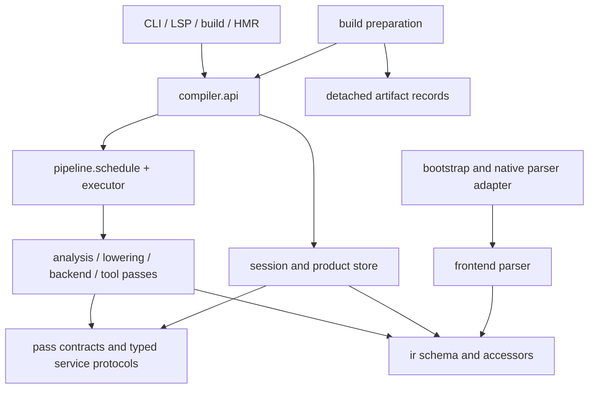
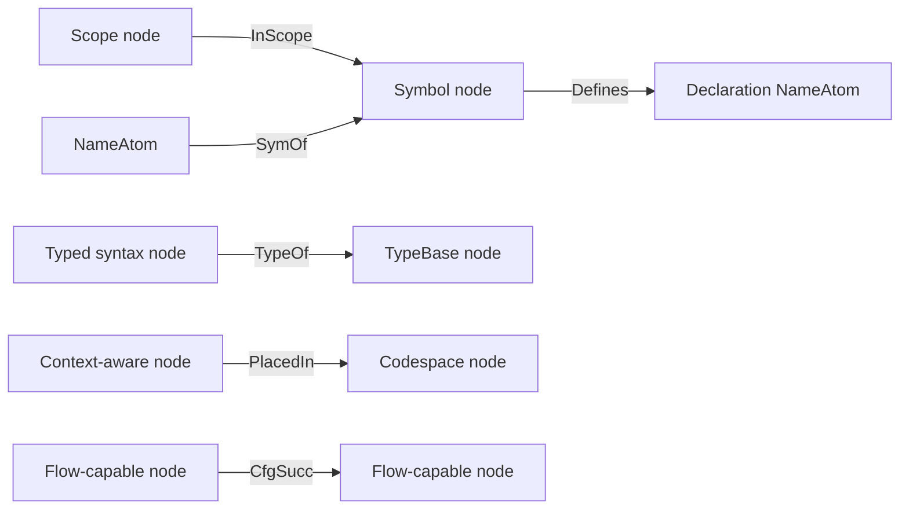
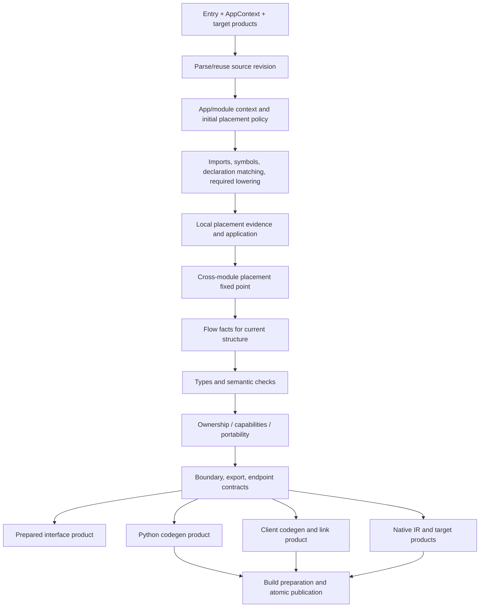
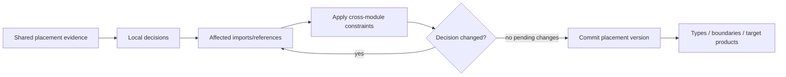
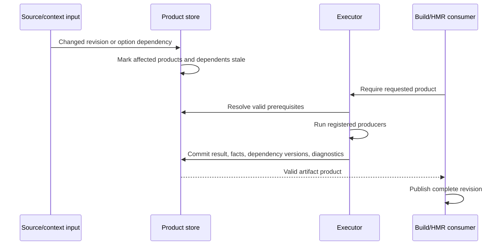

**Compiler reorganization specification: one scheduler, one typed IR schema, explicit analysis products**

This is the clean-break reorganization specification for #9109, approved against baseline `a20fb1344c929170ed536086780fe53b2c1d54c1`. The implementation map is in [the compiler README](../../jac/jaclang/compiler/README.md). The acceptance gates below define required verification; this document is not a record of completed test runs.

The goal is a compiler whose execution order, graph vocabulary, semantic producers, and invalidation rules are discoverable without following scattered driver callbacks. Preserve Jac's shared graph IR and target-specific outputs. Complete the separation of schema, analysis, orchestration, persistence, and runtime initialization.

**1. Architectural decisions.** The following are requirements of the final organization:

- One authoritative scheduling module declares phases, registered passes, products, prerequisites, and supported bootstrap/target variants. All semantic work, including demand queries and cross-module worklists, executes through that scheduler.
- One central `ir/` package defines the compiler graph. Domain modules divide its vocabulary; there is no second symbol, placement, or type graph maintained elsewhere.
- Every compiler IR edge declares Jac source and target endpoint types. Relation metadata additionally declares multiplicity, ordering, lifetime, and write authority.
- Pass implementations live with their algorithms under `analysis/`, `lowering/`, `backends/`, or `tools/`. Central scheduling does not require a flat directory containing every pass implementation.
- One product store owns task state, result versions, dependency tracking, and invalidation. Storage caches serialize committed products; they do not initiate semantic analysis.
- Syntax revisions are shared. Mutable analyzed graphs and products are scoped to the selected application/context and source revision.
- Application preparation consumes compiler products and publishes artifacts before ordinary runtime initialization. Scheduled compile-time evaluation remains an explicit language feature, with its inputs and dependencies recorded.
- There are no permanent compatibility re-export packages, old scheduler entry points, parallel HMR emitters, or blanket `any` fallbacks left after the migration.

**2. Target directory layout.** Paths below are relative to `jac/jaclang/compiler/` unless otherwise noted. Each directory has a narrow responsibility; additional implementation annexes follow the same domain boundary.

```text
compiler/
├── api.jac                     Public compile/check/product-query entry points
├── pipeline/
│   ├── schedule.jac            Sole pass/product/phase registration and ordering
│   ├── contracts.jac           PassId, ProductKey[T], requirements, outcomes
│   ├── executor.jac            Execute plans, record dependencies, cancel, commit
│   ├── products.jac            Product store, versions, task state, invalidation
│   ├── pass_base.jac           Pass/walker base and typed execution context
│   └── progress.jac            Structured progress and timing events
├── session/
│   ├── session.jac             CompilationSession and typed service interfaces
│   ├── context.jac             AppContext, target/options identity
│   ├── workspace.jac           Declared apps, dotted entries, configuration
│   ├── sources.jac             SourceId, RevisionId, pristine syntax storage
│   ├── modules.jac             Contextual module instances and lifetime
│   ├── resolver.jac            Filesystem/package resolution; no execution
│   ├── imports.jac             Scheduled dependency-load requests and cycles
│   ├── diagnostics.jac         Diagnostic records, policy, revision attribution
│   └── cache/
│       ├── keys.jac            Shared artifact/context identity construction
│       ├── interface_codec.jac Encode/decode prepared interface records
│       ├── artifact_codec.jac  JIR and target artifact serialization
│       └── store.jac           Atomic reads/writes, compatibility, eviction
├── ir/
│   ├── schema.jac              Central relation/schema catalog and validation
│   ├── identity.jac            GraphId, NodeId, schema/version identifiers
│   ├── base.jac                Minimal common graph/syntax capabilities
│   ├── mutation.jac            Checked relation/structure mutation and generations
│   ├── syntax/
│   │   ├── nodes.jac          Expressions, statements, declarations, tokens
│   │   ├── edges.jac          Kid and typed structural role edges
│   │   └── accessors.jac      Typed structural navigation and builders
│   ├── symbols/               Symbol/scope nodes, binding edges, accessors
│   ├── types/                 Type nodes, type relations, accessors
│   ├── flow/                  Flow capabilities, CFG edges, accessors
│   ├── placement/             Codespace nodes, placement edges, accessors
│   ├── ownership/             Memory-analysis relation/record schema
│   └── boundaries/            Cross-context contract schema where graph identity is needed
├── frontend/
│   ├── lexer.jac              Lexical analysis
│   ├── parser.jac             Source -> syntax graph
│   ├── annexes.jac            Source/implementation annex composition
│   ├── source_locations.jac   Positions, spans, source text references
│   └── kernel/                Native parser adapter and graph materialization
├── analysis/
│   ├── binding/               Import, symbol, declaration/implementation passes
│   ├── placement/             Initial context, evidence, solver, work queue, reports
│   ├── types/                 Type checker, evaluator, operations, type-query pass
│   ├── flow/                  CFG/dataflow analysis passes and algorithms
│   ├── ownership/             Borrowing, regions, escape and reference-count facts
│   ├── capabilities/          Native/client/portability checks
│   ├── boundaries/            Interop contracts, exports, endpoint/serving facts
│   ├── interfaces/            Export signature and interface-product preparation
│   └── comptime/              Compile-time imports, evaluation and resolution
├── lowering/                  Graph construction, MTIR, layout and structural lowering
├── backends/
│   ├── common/                Shared artifact contracts and backend utilities
│   ├── py/                    Jac codegen IR -> Python bytecode
│   ├── es/                    ES/JSX generation and client-link product
│   └── native/                Native IR, LLVM, ABI, linkers, WASM generation
├── tools/                     Formatting, linting, documentation and IR inspection
├── bootstrap/
│   ├── selfhost.jac           Compiler-self compilation context and loading lifecycle
│   └── native_scope.jac       Native-kernel build scope/capability description
└── tests/                     Tests mirroring these responsibilities

jaclang/build/
├── preparation.jac            Assemble and publish prepared application revisions
├── inventory.jac              Routes, assets, declared/dynamic build roots
└── manifests.jac              Artifact-manifest assembly from compiler products
```

Within an analysis domain, use `passes.jac`, `facts.jac`, and named algorithm modules such as `solver.jac` or `evaluator.jac`; split genuinely large passes into named modules/annexes. A `facts.jac` file holds that domain's detached records, not another graph schema. Avoid new catch-all `semantic_passes`, `helpers`, or `utils` modules spanning unrelated domains.

The pre-import seed manifest currently implemented in `jaclang/bootstrap_manifest.py` remains a minimal Python bootstrap boundary: it must be usable before Jac modules can load. Kernel/FFI code and that seed boundary are explicit exceptions to the predominantly Jac implementation, not reasons to spread bootstrap conditionals through analyses.

**3. Dependency direction.** This is an import/service dependency diagram, not execution order. `pipeline/contracts` and typed service protocols form the boundary between scheduling and pass implementations.



`ir/` cannot import analysis implementations, the compiler session, scheduler, CLI, server, or backend emitters. Accessing a schema property cannot resolve a module, invoke the type evaluator, or compile code. Passes request prerequisite products through their execution context; they cannot instantiate other pass classes or choose private schedules. Bootstrap loads the minimum dependencies needed by a selected central schedule and then invokes it.

Within `ir/`, node declarations depend only on base capabilities, enums, and type-only references where possible. Edge modules import the node declarations they constrain. Accessor implementations resolve their edge modules at method execution when necessary to avoid eager declaration/edge import cycles. The schema catalog loads declarations before relations. Validate this import layering under both seed and native self-compilation; do not solve cycles with duplicated node classes or untyped endpoint substitutions.

**4. Node, edge, and object model.** Keep the shared IR. Divide it by meaning, rather than creating a separate syntax tree for every analysis.

| Representation | Purpose | Examples | Lifetime |
|---|---|---|---|
| Syntax node | Identity and structure of source constructs | Module, Expr, NameAtom, Ability | Pristine source revision or contextual analyzed clone |
| Semantic node | An entity referenced by multiple compiler relationships | Symbol, scope, TypeBase, Codespace | Explicit compilation/context lifetime; immutable sharing only when safe |
| Typed edge | Structural or semantic relationship | BodyRole, SymOf, TypeOf, PlacedIn | Structural revision or declared semantic product generation |
| Ordinary `obj` | Configuration, product records, diagnostics, temporary work state | CompileOptions, ImportFacts, ServingFacts, PlacementWork | Request, pass, or committed product lifetime |
| Walker/pass | Scheduled computation over IR or detached facts | TypeCheckPass, PlacementSolvePass | One execution/request |

Use `obj` as the default for new ordinary compiler records/services; retain a conventional class only for a documented interoperability or language-semantic reason. Neither queues nor every summary need conversion into OSP nodes.

Remove backend output containers from the syntax base. A node's generated-code lookup becomes a typed query into the target product store. Move temporary native/ownership flags off the universal symbol definition into domain facts unless they are demonstrably persistent symbol properties. Every retained field must be classified as syntax, committed semantic data, derived cache, or pass scratch state.

Keep appropriate syntax capabilities (`Expr`, scope-bearing nodes, context-aware nodes). Do not manufacture inheritance merely to evade meaningful endpoint bounds. Introduce a shared typed-syntax capability for existing expression and annotated-variable nodes if needed to express all legitimate `TypeOf` sources.

**5. Typed edge endpoints are mandatory.** Jac already supports this syntax, and the compiler should use it. For example, these declarations and their typed forward/reverse traversals have been checked in a standalone schema probe:

```jac
edge SymOf: NameAtom --> Symbol {}
edge Defines: Symbol --> NameAtom {}
edge InScope: UniScopeNode --> Symbol {}
edge TypeOf: Expr --> TypeBase {}
edge PlacedIn: ContextAwareNode --> Codespace {}

def bound_symbols(name: NameAtom) -> list[Symbol] {
    return [name ->:SymOf:->];
}

def enclosing_scopes(sym: Symbol) -> list[UniScopeNode] {
    return [sym <-:InScope:<-];
}
```

This excerpt demonstrates the existing syntax; it is not the full production schema. The production `TypeOf` edge must also accommodate `AstTypedVarNode` through the typed-syntax capability described above. Audit actual relation uses before tightening endpoints; do not apply an `Expr`-only restriction to legitimate non-expression typed nodes.



The final schema must cover every current edge in `frontend/roles.jac` and `frontend/relations.jac`, including type relations, structural roles, implementation matching, scope relations, control flow, and placement. No untyped compiler-schema edge remains. Heterogeneous structural edges use a meaningful common base (`UniNode` for a general child relation); specialized role edges narrow it when their actual uses permit. Union endpoint syntax or generic constraints must not be assumed without validating language support.

There is an important enforcement gap to account for: with the current checkout, typed endpoint declarations correctly narrow traversal results, but `jac check` accepted a deliberately invalid `Symbol +>:SymOf:+> TypeBase` connection in a probe whose `SymOf` was declared `NameAtom --> Symbol`. Therefore endpoint annotations alone are not evidence that every graph write is checked. This reorganization requires:

- compiler mutation APIs whose source/target parameters are statically typed;
- endpoint and cardinality validation for dynamic/native/decoded graph writes;
- negative tests for wrong sources and wrong targets;
- explicit static connection checking for statically known endpoint violations, closing the observed checker gap rather than weakening the compiler schema.

The implementation must verify these behaviors in both hosted and native paths. Language support already exists for endpoint declarations; validation coverage is additional work.

**6. Relations have a complete contract.** Endpoint types belong in Jac edge declarations. Do not duplicate them manually in a second string-based registry. The central schema catalog derives endpoint descriptors from those declarations (or from a generated descriptor for the bootstrap/native boundary). Domain metadata supplies the additional rules:

| Relation family | Endpoint rule | Additional invariant | Producer / mutation authority |
|---|---|---|---|
| Structural child/role | Typed syntax owner -> permitted syntax child | Explicit ordering, optional/singular/plural role shape; consistent parent and role membership | Parser builders and declared structural-lowering passes |
| `SymOf` | Name/binding site -> Symbol | At most one binding; required for relevant successfully bound sites | Binding analysis |
| `Defines` / `Uses` | Symbol -> declared definition/use site | Consistent with binding; explicit ordering where semantically required | Binding analysis |
| `InScope` | Scope -> Symbol | Canonical scope membership; alias/export indexes are separate views | Binding analysis |
| CFG relations | Flow-capable node -> flow-capable node | Successor/branch consistency for the current lowered structure | Flow analysis |
| `TypeOf` | Typed syntax capability -> TypeBase | At most one committed type at a given generation | Type analysis |
| Narrowing relations | Typed syntax capability -> TypeBase | Valid for the associated flow/type generation | Type/flow analysis |
| `PlacedIn` | Context-aware syntax -> Codespace | Canonical decision; represent multi-target participation explicitly | Placement analysis |
| Type-internal relations | Specific type/parameter/member capabilities | Explicit list ordering, uniqueness, and optionality per relation | Type builders/evaluator inside scheduled analysis |

Multiplicity is validated at the appropriate stage: partially built syntax and unresolved names are legitimate intermediate states. A mandatory relationship is checked when its producing product commits, not before construction is complete. Errors in user source may produce explicit unresolved/error facts; they must not require corrupting the graph to continue diagnostics.

Give each relation one canonical representation. Reverse navigation should use incoming traversal when it represents the exact inverse. Audit paired edges such as parent/child scope relationships before consolidating them; preserve genuinely different semantics. `Kid` and role edges remain distinct structural views where needed for lexical order versus named slots, with one builder updating both atomically.

Use stable schema identifiers and a schema version. Type/path renames must not silently change materializer identity or confuse unrelated classes with the same short name. Preserve existing ABI tags where valid, otherwise perform an explicit versioned transition. Validate uniqueness, endpoint bounds, inheritance, role ordering, and descriptor completeness at schema initialization/build time.

**7. Mutation, caches, and graph lifetime.** Typed graph accessors are read-only views or checked mutation entry points. They never compute missing semantic facts.

- A scheduled pass receives a mutation capability for its declared relation families. General consumers receive read-only views. Language-level OSP operations may still exist, but compiler convention and structural checks prohibit unsanctioned writes outside builders, mutation infrastructure, and registered producers.
- Mutation replaces/clears a relation through one API that updates all associated indexes and advances its generation. Structural edits also invalidate affected syntax indexes and dependent semantic products.
- Accessor caches such as `_type_cache`, `_acc_cache`, and scope-name indexes are derived accelerators, tagged with the relevant graph/relation generation. They are discardable without changing results and cannot act as independent truth.
- A pass either commits a valid product or leaves its consumers unable to observe that attempted result. For the initial serial executor, discard failed/cancelled contextual work and rebuild affected state from pristine syntax when rollback cannot be proved complete. Do not require a complex general transaction engine in the first implementation.
- Source syntax is immutable after parse/annex composition. Semantic analysis operates on a contextual graph instance. Structural lowering uses an explicit edit scope with invalidation, then freezes structure again.
- Do not share mutable Codespace/type graphs between app contexts. Codespace identifiers are immutable enums; graph instances/anchors have explicit lifetime. Immutable interned types may be shared only with an enforced immutability contract.
- Node IDs are scoped by graph identity. Disk keys never use process `id()` values. Persisted references use codec-defined stable IDs; graph release drops associated products, reverse indexes, diagnostics, and caches together.

**8. Scheduling and strongly typed products.** `pipeline/schedule.jac` is the single authoritative execution specification. Use typed declarative lists and prerequisite relationships, with deterministic serial execution initially. The scheduler's dependency graph is derived infrastructure held in ordinary typed objects; it does not need another OSP graph just because the program IR is one.

The pass registry also declares whether a diagnostic leaves a pass's facts complete. A recovering checker can finish and allow independent diagnostics to run; an interrupted binding pass cannot authorize later type analysis. Exceptions and cancellation still invalidate partial graphs. Native early-pass results survive initial module registration and are consumed by the same executor. An interface producer can successfully report that a graph is not cacheable without invalidating its analysis; cache entries record external interface dependencies and only their owning module's diagnostics. Standalone source-rendering tools copy syntax into one tool context, leaving semantic caches and backend state behind.

Interface hydration schedules source-stub class preparation before consumers decode external type references. The codec only enumerates references and reads prepared types; it never invokes the evaluator to fill a missing class. Call analysis likewise reads ordinary calls and pipe operands through typed views, without constructing temporary syntax that reparents the live graph.

The core contracts are proposed APIs, not claims that these types exist today:

| Type | Required contents |
|---|---|
| `PassSpec` | Explicit PassId, typed factory, required products/facts, provided products/facts, writable relation families, structural-edit capability, module/closure/query scope, host/native support |
| `ProductKey[T]` | Stable ProductId associated with exactly one result type `T` |
| `CompilationRequest` | Resolved entry, app context, source revision, options, requested target products, cancellation |
| `ProductAddress` | ProductId + contextual module/closure identity + relevant source/dependency and target identity |
| `ProductRecord[T]` | Typed outcome/result, actual dependency versions, diagnostics, timings, and validity |
| `PassContext` | Current module/context, declared mutation capability, dependency-product requests, diagnostics, cancellation; no unrestricted compiler service |

Use opaque typed IDs/enums for identities and states. Use `CodespaceKind`, typed target/UI choices, typed dependency records, and domain result objects instead of naked strings and unconstrained dictionaries. A heterogeneous product store may require one internal type-erasure boundary; isolate it, validate key/result pairing, and expose only typed APIs. Native/FFI codecs likewise have one explicitly checked boundary. Do not spread casts or `any` through analyses to satisfy the schema.

A pass is registered once; display names, native adapter IDs, and completion tracking derive from its stable registration. Do not maintain another hand-written class-name schedule elsewhere. Algorithm branches remain inside passes; entry points cannot assemble private pass sequences.

The executor validates schedule coherence before work begins and records dynamic prerequisite requests from providers. Requesting an already valid product returns it. A product is valid only if its result, context, and recorded dependency versions match. Failed, unavailable, and cancelled outcomes remain distinguishable; a pass returning without errors is insufficient proof that its requested output exists.

Source import cycles are not automatically scheduler errors. Binding handles strongly connected import components through staged declarations/interfaces; placement has an explicit fixed-point worklist. A true recursive request for a product that cannot legally be satisfied in stages reports a dependency cycle with its request chain.

**9. Concrete compilation flow.** This diagram is a dependency outline; the final lists preserve the current compiler's necessary ordering constraints and support demand-driven dependency loading.



Flow needed earlier by an existing transform remains an explicit prerequisite there; structural changes force the relevant flow facts to be refreshed. Compile-time execution/resolution is similarly scheduled at its declared prerequisite point. The migration must not reorder these operations merely to fit a visually linear diagram.

Representative requested products: `Syntax`, `ImportFacts`, `Bindings`, `PlacementEvidence`, `Placement`, `Flow`, `Types`, `OwnershipFacts`, `BoundaryContracts`, `ServingFacts`, `Interface`, `ClientArtifact`, `PythonArtifact`, `NativeIR`, and target-specific `NativeArtifact`/`WasmArtifact`. Not every invocation requests all of them. Diagnostics/check-only work stops at the requested checked products; symbol-only loading does not trigger full code generation.

The native parser may fuse supported early passes for performance, but its requested pass mask and completion reports must derive from this same registration. It cannot silently run extra analysis or report an incomplete early pass as complete. If the selected early schedule is unavailable during bootstrap, fall back through the declared bootstrap plan.

**10. Placement is one domain inside compilation.** Move all placement passes, policy, evidence collection, native eligibility, and worklist algorithms into `analysis/placement/`; put its node/edge vocabulary in `ir/placement/`.

- App context comes from CLI/build entry selection and declared cross-app entry boundaries. Ordinary imports inherit context. Dotted entry points and pins retain their existing semantics. Directory membership does not infer an application's semantic ownership.
- Initial context/pin handling and inferred native eligibility are explicit scheduled producers. Pure source/file enumeration does not run type checking or a private parser.
- Placement evidence is produced from the existing syntax/binding graph once per relevant revision. It includes declaration references, explicit pins, backend requirements, server constraints, and recorded reasons.
- Local solving and cross-module propagation are separate stages of one registered placement product. Keep both algorithms if their different scopes require it; consolidate orchestration and facts rather than hiding the work behind renamed wrappers.
- Cross-module changes enqueue only affected import/reference relationships. Continue until stable, with cancellation and diagnostics for unsupported/conflicting requirements. Define a finite decision domain and explicit fallback transition rules so termination is testable.
- Native fallback is an explicit placement revision that invalidates dependent products. It cannot directly patch ES output from a backend catch block.
- Placement results carry typed participating codespaces, decisions, and diagnostic provenance. A singular placement edge cannot secretly stand for a set of placements: either canonical placement plus an explicit participation set, or a dedicated multi-valued relation with its own contract.
- `ownership` is reserved for borrowing/memory analysis. Use `AppContext`, `placement`, and `participation` for application/codespace concepts.



**11. Invalidation is a product-store operation.** Replace scattered changes to `completed_passes`, `product_tasks`, analysis tags, generated outputs, and cache slots with one dependency-aware invalidation path.



Examples: changing an imported API invalidates its recorded consumers; changing placement invalidates affected type/boundary/backend products according to declared dependencies; changing target ABI invalidates target-dependent results; changing a static asset updates build inventory/bundling without forcing unrelated semantic analysis. Dependencies reflect actual compiler inputs rather than assumptions that every option affects every phase.

Persist content/revision identities, including annexes, resolved configuration, compiler/schema version, relevant target settings, and dependency contracts. Timestamps can accelerate discovery, but correctness must survive a same-size edit with restored timestamps. This applies to the prepared-application inventory as well as the source store; fixing only speculative native analysis is insufficient for the final architecture.

Diagnostics are revision/product-scoped and replaced along with their producing result. A failed preparation leaves the last published application intact. Publication stores immutable detached artifacts, never live Unitree references.

**12. Consumer boundaries and remaining semantic work.** The migration inventory must include consumers outside the existing pass directories.

| Consumer | Allowed work | Required scheduled work |
|---|---|---|
| Parser | Tokens, syntax structure, annex composition, syntax diagnostics | Semantic bindings, inferred placement, types |
| CLI/build | Select entries/options, inventory declared roots/assets, request products | Import/placement discovery and all semantic checking |
| LSP | Navigate existing syntax for positions; request typed query products | Type inference, binding resolution and diagnostics |
| Interface cache | Encode/decode/version-check prepared records | Infer exported types or synthesize missing interfaces |
| HMR | Watch files, invalidate inputs, request products, publish and notify | Placement classification, dependency/export validation, code generation |
| Native eligibility consumer | Request eligibility/closure result | AST blocker analysis and dependency closure policy |
| Bundler/preparation | Assemble files, verify artifact integrity, copy assets | Decide runtime export visibility or infer boundary contracts |

In particular, move client import/export validation currently mixed into `driver/client_graph.jac` into a scheduled client-link/contract producer. Resolve all types required by an interface before calling the codec; a serializer invoking a type evaluator is still semantic analysis even when reached from a pass wrapper. Move `ModuleFacts` routines to the appropriate domain and classify each as syntax inspection or scheduled semantic computation. Syntax navigation and graph decoding legitimately walk the IR; the prohibition concerns independently performing semantic work, not every loop over nodes.

**13. Concrete relocation and removal map.** These are responsibility splits, not blind file renames.

| Current source | Final destination/action |
|---|---|
| `driver/pipeline.jac` | Split registrations/order into `pipeline/schedule`, execution into `executor`, product logic into `products`, environment/bootstrap logic into their domains; application-root orchestration through `api`/session |
| `driver/pipeline_runner.jac` | Move request orchestration into `api`/executor; domain policy into registered passes; remove the parallel source of scheduling choices |
| `driver/pipeline_types.jac`, `pass_driver.jac`, `passes/transform.jac` | Consolidate typed contracts, pass execution base, diagnostics and progress under their named owners |
| `driver/semantic_passes.jac`, `context_passes.jac`, `module_context_pass.jac` | Distribute implementations into binding, placement, boundaries, interfaces, types, and comptime domains; remove umbrella modules |
| Semantic `JacCompiler` methods such as absorb resolution and boundary/native stamping | Move implementations into their analysis domains; eliminate service-method forwarding wrappers |
| `driver/program.jac`, `compiler.jac`, `progstate.jac`, `compilation_context.jac` | Narrow session/module/source services plus the single product store; remove duplicate ledgers and mutable result ownership |
| `frontend/unitree.jac` and its large annexes | Split schema nodes/accessors into `ir/` domains while preserving shared identity and compiler semantics |
| `frontend/roles.jac`, `relations.jac` | Typed domain edges under `ir/`; move `ImplOf` into binding relations; central schema catalog validates all |
| `frontend/codeinfo.jac` | Artifact records into backend contracts; resolution into session; policy into placement; target settings into typed context |
| `frontend/module_facts.jac`, `driver/boundary_classify.jac`, scattered symbol helpers | Split by semantic responsibility; retain pure structural helpers with the IR/frontend where appropriate |
| `types/types.jac` and relation accessors | Type schema into `ir/types`; evaluator, operations, builtin typing and stub-catalog resolution into `analysis/types` |
| `placement/*` | Workspace/config into session; graph schema into `ir/placement`; policy/solver/worklist/reports into `analysis/placement` |
| `driver/ifacecache.jac`, `bccache.jac`, `jir.jac` | Pure codecs/store/key handling into session cache; interface preparation and semantic dependency production into analyses |
| `driver/application.jac` | Build preparation/inventory/manifests under `jaclang/build`; compiler requests through public API |
| `driver/client_graph.jac` | Scheduled semantic linking in ES/boundary domain; detached artifact traversal in build/bundling |
| `native_compiler.jac`, `jc_unit.jac`, `jc_materialize.jac` | `frontend/kernel`, consuming central schema and early-pass descriptions |
| `driver/selfhost.jac`, `native_scope.jac` | Bootstrap package with explicit seed/native loading contracts |

Tests should follow these responsibilities where practical. Existing broad language/backend suites remain valuable integration tests; moving every test is not a prerequisite to defining the architecture. Remove hardcoded old-path guards and update them to assert the new invariant.

**14. Clean-break migration plan.** Implement in reviewable stages, with a working build at each stage. Temporary development adapters may exist between commits, but the completed reorganization removes them.

1. **Inventory and baseline.** Enumerate every pass, semantic query, graph edge, IR field, graph mutation site, cache, and consumer. Assign a final module, producer, lifetime, and invalidation rule. Capture current behavior and cold/warm timings before moves.
2. **Strengthen edge contracts.** Add typed endpoint coverage, connection-checking regressions, multiplicity/ordering metadata, and checked mutation APIs. Establish node capability bounds from real usage. Validate inherited endpoints and native materialization before mass relocation.
3. **Extract the IR schema.** Move node/edge/accessor domains; preserve class identity across all imports. Update parser construction, cloning, serialization, native tag registration, and fixtures together. Avoid pulling the type evaluator into the bootstrap schema closure.
4. **Consolidate scheduling and product state.** Introduce the one registry, executor and product store; migrate task completion, diagnostics, dependency tracking and invalidation. Route old entry points through it during the stage, then delete them.
5. **Move semantic implementations.** Split umbrella pass files and compiler-service methods into analysis domains. Replace evaluator-in-codec and semantic bundler logic with prepared typed products. Move placement's complete workflow together.
6. **Separate session/build/runtime.** Narrow module/source/config services; move preparation into build; migrate CLI, LSP, HMR, packaging, and backend consumers to the public product APIs.
7. **Rebuild and remove compatibility.** Update import paths, bootstrap manifests, native scope declarations, payload/precompile inventories and docs. Version affected schema/materializer/cache formats and reject incompatible caches. Rebuild the complete binary from a clean cache and remove all old paths, forwarding methods, duplicated registries and superseded dictionaries.

A directory change is not complete until the native kernel and packaged binary work. The current native bridge registers classes and edges by stable tags, exports role-shape knowledge, and materializes fields/indexes; relocation must preserve or deliberately version those contracts. Test both the source-checkout compiler and the sealed binary to catch split class identities and hidden fallback to checkout sources.

**15. Acceptance gates.** The implementation is complete only when these are demonstrated:

- Every production compiler pass/product is registered centrally; semantic callers cannot bypass its execution path. Bootstrap and fused native passes are covered by the same registry.
- Every compiler IR edge declares endpoint types. Forward/reverse traversals infer the expected types; wrong endpoints, invalid multiplicity, illegal writes and stale-cache scenarios have negative tests.
- IR modules import no analysis/session/backend implementation. Analyses use typed services rather than unrestricted `JacCompiler`. Domain APIs contain no unexplained `any`, naked product dictionaries, or string pass-name dispatch.
- Clearing any accessor/index cache leaves graph meaning unchanged. Structural replacement, graph cloning, scope rebinding, type replacement, and module release preserve relation invariants.
- Cold and warm compilation produce equivalent diagnostics and observable behavior across Python, client, native and WASM targets. Compare normalized products where binary output has legitimate nonsemantic variability.
- Cyclic imports, contextual reuse across apps, shared modules, declared service boundaries, client/native mixed code, native fallback, and cancellation are exercised.
- Interface round trips retain distinct roles when the same provider is imported in different scopes/contexts. No plain import acquires `from`-import serving visibility through merged cache flags.
- Source, annex, config/pin, dependency-interface and target changes invalidate the right products; same-size/restored-mtime changes are detected. Asset-only changes do not rerun unrelated analyses.
- HMR, client builds, application preparation, native eligibility and LSP queries use scheduled products. Failed builds/cancelled analysis do not publish partial state or stale diagnostics.
- Seed bootstrap, native-parser equivalence, early-pass equivalence, graph materialization, clean full-binary build, sealed-package tests, and normal CI all pass.
- The former directory/API surface is removed at the final boundary; no permanent compatibility facades or hidden fallback pipelines remain.

**16. Performance and review evidence.** The reorganization should make the original preparation delay measurable and explainable; it does not guarantee that moving code eliminates 18 seconds of actual work.

Benchmark the same fresh `--awesome` application used for the original complaint, on a recorded binary/toolchain/machine configuration. Separate installer/runtime extraction, compiler bootstrap, project parsing, binding, placement, types/checks, dependency loading, native/client generation, bundling, and runtime startup. Report multiple cold and warm runs, their cache state, median and spread, first-progress latency, time to ready, source parse counts, pass executions, cache hits, product invalidations, and peak memory. Emit progress before expensive preparation and use the executor's events for subsequent activity/timing.

Require no unexplained extra parsing or repeated valid-product execution, no second semantic discovery compilation, and no material performance regression without an identified cause and review. Do not trade correctness checks for a quieter benchmark. Report gross deletions, additions and net production LOC separately: this architecture is justified by enforceable boundaries and reduced duplication, not an assumed deletion target.

**Evidence checked when this specification was written.** Baseline sources: [pipeline](https://github.com/jaseci-labs/jac/blob/a20fb1344c929170ed536086780fe53b2c1d54c1/jac/jaclang/compiler/driver/pipeline.jac), [Unitree](https://github.com/jaseci-labs/jac/blob/a20fb1344c929170ed536086780fe53b2c1d54c1/jac/jaclang/compiler/frontend/unitree.jac), [relations](https://github.com/jaseci-labs/jac/blob/a20fb1344c929170ed536086780fe53b2c1d54c1/jac/jaclang/compiler/frontend/relations.jac), [typed-edge language reference](https://github.com/jaseci-labs/jac/blob/a20fb1344c929170ed536086780fe53b2c1d54c1/jac/jaclang/cli/docs/reference/language/osp.md#4-typed-edge-endpoints), [typed-edge checker fixture](https://github.com/jaseci-labs/jac/blob/a20fb1344c929170ed536086780fe53b2c1d54c1/jac/tests/compiler/passes/fixtures/checker/edge_endpoint_typing.jac), and [native kernel guards](https://github.com/jaseci-labs/jac/blob/a20fb1344c929170ed536086780fe53b2c1d54c1/jac/tests/compiler/test_native_kernel.jac). Local positive endpoint/traversal and deliberately invalid-connection probes were checked with the current source compiler and the PR-built binary; both were accepted, motivating the explicit connection-enforcement requirement above.
