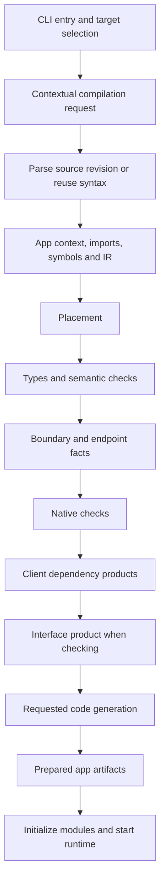

# Unified compilation

The compiler uses typed phase and product lists. The authoritative definitions
and executor live in `jac/jaclang/compiler/driver/pipeline.jac`; phase actions
live in `pipeline_runner.jac`, and the shared enums and contracts live in
`pipeline_types.jac`.

## Entry modules and contexts

```toml
[apps.web]
kind = "web-app"
entry-point = "web.main"

[apps.api]
kind = "service"
entry-point = "core.api"
```

An app declaration identifies an entry module, not a directory. CLI selection
establishes the compilation context. Ordinary imports inherit that context;
another app's declared entry establishes a boundary. `default-app` chooses the
CLI default and does not give shared modules a global app context. A program retains
its entry context across dependency requests; callers select a new entry
explicitly. Imports outside the project's directory retain that context too;
their location does not select a different application. App-level placement
pins choose codespaces and do not establish app context.

A private implementation file imported directly participates in the importing
app's compilation. Use the declared entry as the cross-app contract. The compiler
cannot infer an undeclared private boundary from an entry alone.

The terminology is explicit: **app context** identifies the application a module
is compiled for; **placement** identifies its server, client, or native codespace;
**ownership** refers to memory ownership and borrowing. `Module.app` is the sole
app identity stamp. Entry points are dotted module names resolved locally through
the compiler resolver; no source is executed during resolution.

## Pipeline



The pipeline includes explicit app-context, absorbed-import, boundary-fact, and
native-import-fact passes. Pass requirements and provided facts use `AnalysisFact`.
Products use `CompilationProduct`; demand tasks record running, successful,
failed, or cancelled states. Utility products cover formatting, AST conversion,
and introspection, so these consumers do not select passes independently.

The executor validates requirements before running a pass list, records completed
passes and timings, and observes cancellation. Backend consumers request the
products they need. Client dependency traversal belongs to the compiler driver;
the client emitter writes the returned artifacts and copies their assets.
Boundary analysis is a host pass: requests for provider declarations, boundary
types, and WASM host contracts use the driver's dependency loader. There is no
separate parser or global syntax memo for boundary types.

`compile_application` owns the application import worklist for both preparation
and workspace checking. It starts at declared entries, includes package
initializers and conventional page roots, and advances imported modules in their
selected contexts. Checking does not start a second compiler for every helper.
Sealing an explicitly declared app uses this same compilation closure and its
placement facts. It excludes unrelated apps, retains each dependency's selected
app context, and packages the resulting bytecode. Toolchain and implicit package
seals retain package-wide source enumeration.

An interface is an explicit product. Symbol-only dependency loading stops before
body checking; interface preparation requests the flow facts needed to encode
exported types. Cache persistence writes already prepared products and does not
silently schedule analysis.

Bootstrap remains an explicit constraint: compiler modules needed to construct a
schedule must load before that schedule executes. The seed manifest and bootstrap
dependency declarations keep the compiler from recursively compiling itself with
an unavailable pass. A compiler module finishing its loader import cannot evict
analysis data compiled in an enclosing compilation. These are compiler-loading
constraints, not app discovery.
Nested projects shipped inside `jaclang`, such as the admin UI, retain their app
context instead of sharing the compiler's internal program.

## Source reuse and artifact identity

`SourceStore` in `compilation_context.jac` retains one current syntax revision per
source path, including annex contents. Requests in another context clone the
syntax before semantic mutation. Parsed source is shared; app-specific analyzed
IR and target artifacts are distinct.

Context identity includes the selected entry and app, UI and codespace settings,
and analysis/code-generation options. In-memory programs and disk artifact slots
use that identity. Imported symbol trees can progress through remaining passes
without repeating completed stages. Changed source invalidates the affected
module's products. Placement changes and native fallback invalidate the client
product through the scheduler, clearing its completion record, generated output,
and cached artifact together so emission and diagnostics can run again.

Host and WASM still require different target products. A unified pipeline removes
independent frontends and scheduling; it does not make different ABIs equivalent.

## Preparation and runtime

Preparation completes the selected apps before publishing their revisions. It
collects bytecode imports, manifests, client output and native bindings before
initialization. Web builds compile and bundle without executing application code.
Source apps load in namespaces derived from their entry modules, keeping shared
source instantiated in different apps from sharing mutable module globals.
Sealed images retain their manifest module identities.

The application revision cache retains its source inventory and dependency/output
stamps. This inventory detects added routes, assets, and dynamic roots; it does
not parse files to infer app context. A failed preparation leaves the published
revision intact. Startup progress begins before source compilation.

## Scheduled semantic products

`semantic_passes.jac` produces detached import, serving, placement, and native
eligibility facts. `module_context_pass.jac` applies the configured codespace and
native-default policy after parsing. `semantic_facts.jac` defines the records
consumed by preparation, interface persistence, HMR, and compiler tools.

| Product | Producer | Consumers |
| --- | --- | --- |
| Import edges | `DependencyFactsPass` | Application closure, comptime imports, client closure, interface cache, reverse dependencies |
| Placement summary | `PlacementSummaryPass` | Placement solver and cached placement metadata |
| Program placement | `ProgramPlacementPass` | Module compilation |
| Client dependency closure | `ClientDependenciesPass` | Client code generation |
| Serving facts | `ServingFactsPass` | Application preparation and sealed manifests |
| Placement spaces | `PlacementSpacesPass` | Standalone HMR dispatch |
| Interface | `InterfaceFactsPass` | Interface persistence and verification |
| Native eligibility | `NativeEligibilityPass`, `NativeClosurePass` | Native-default selection and packaging |
| Requested type | `TypeQueryPass` | IDE queries and interface symbol resolution |

The global placement worklist remains necessary: an imported module can change
which declarations are available to a client. It executes inside a scheduled
pass. Placement-only changes retain reference facts; symbol refreshes discard
them. The summary producer supplies the reference graph to both placement
consumers, replacing the solver's duplicate name-resolution walk.

Native dependency analysis uses `SourceStore` syntax units and content revisions.
It does not maintain a second parser or a timestamp-based source cache.
Speculative parse errors remain in the syntax unit; compiling the source itself
still delivers those errors normally.

`PassIdentity` makes contract lookup and completion records explicit. Registering
a new scheduled pass requires adding its identity; unknown names do not silently
receive an empty contract. `PRODUCT_REQUIREMENTS` declares prerequisites in the
same file as the product schedules.

The native parser can execute requested validation and symbol passes before
materializing its tree. `early_pipeline()` selects that schedule; the native
adapter receives its bit mask and returns normal pass results to the driver.
Unsupported syntax falls back to ordinary scheduled execution. During compiler
bootstrap, an unavailable early schedule disables this optimization.

HMR has one standalone client emission path, using the regular client bundle
builder. Prepared applications continue to rebuild and publish a complete
revision before reinitialization. File watching, asset copying, route output,
and browser notification remain outside the semantic passes.

## Boundaries

Syntax parsing and cloning, cache decoding, bytecode dependency inspection,
artifact bundling, and runtime initialization are not semantic-analysis passes.
Helpers called from a pass may traverse Unitree; the relevant boundary is who
requests and executes the analysis, rather than the helper's filename.

Typed lists keep execution order inspectable. An OSP task graph is unnecessary
for this serial implementation. Any future parallel scheduler must preserve
context identity, cycles, cancellation, and failure handling.
