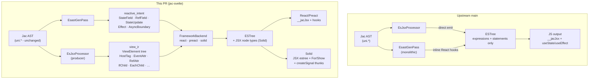
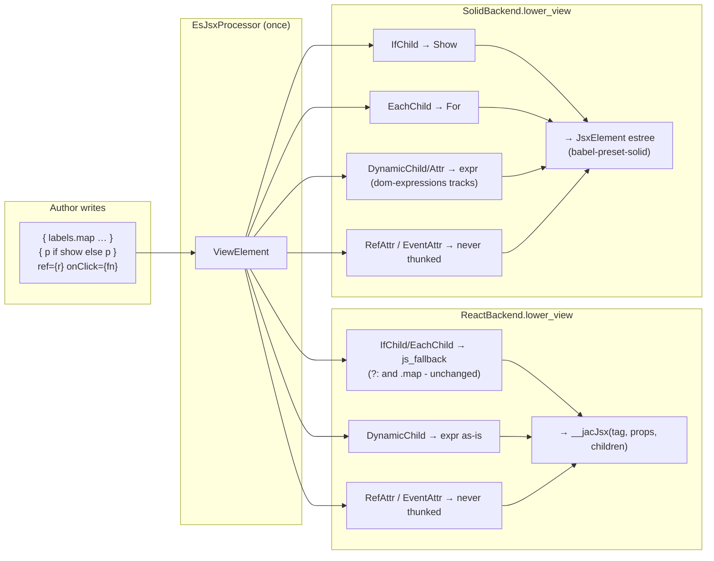
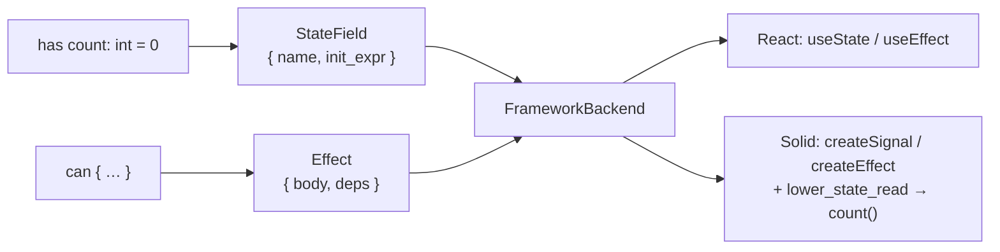

# Compiler IR: upstream main vs jac-svelte

Reference for PR review. Compares the client codegen pipeline at merge-base
`origin/main` with this branch.

**Last updated:** 2026-06-19 (View IR Branch 5 + dom-expressions path landed).

---

## Pipeline overview

On **main**, Jac AST fed a single React-shaped ESTree emitter. This branch
inserts **reactive_intent** and **view_ir** as framework-neutral middle layers;
`FrameworkBackend` lowers the same IR to `__jacJsx` (React/Preact) or JSX
estree with native `<For>` / `<Show>` (Solid).

---

## View IR: same tree, different backends

`EsJsxProcessor` builds one `ViewElement` tree. Classification (host vs
component, event vs ref vs dynamic, control-flow lifts) runs **once** in the
producer. Backends consume the same IR differently.

### View IR node set (`view_ir.jac`)

| Node | Role |
|------|------|
| `ViewElement` | Root: tag + attrs + children |
| `HostTag` / `ComponentTag` / `FragmentTag` / `DynamicTag` | Tag resolved once |
| `StaticAttr` / `DynamicAttr` / `EventAttr` / `RefAttr` / `SpreadAttr` | Attr classified once |
| `TextChild` / `DynamicChild` / `ElementChild` | Children |
| `SlotChild` | `{ stmt; … }` (prebuilt IIFE; Svelte debt) |
| `IfChild` / `EachChild` | Lifted control flow (Branch 4) + `js_fallback` for JS family |

**Invariant:** dynamic values in View IR are neutral `es.Expression`s. Solid
thunks in `lower_view`; React passes through. `ref` and event handlers are
never thunked.

---

## Reactive IR (`reactive_intent.jac`)

Main inlined `useState` / `useEffect` inside `EsastGenPass`. This branch emits
neutral records; the backend lowers them.

---

## What stayed the same

- Jac AST (`uni.*`) and `.cl.jac` syntax
- React emitted JS for non-lifted paths (pinning tests green)
- Most non-JSX lowering still Jac AST → ESTree in `EsastGenPass`

## Known IR debt

- `SlotChild` carries a JS-family IIFE, not template-neutral facts
- `js_fallback` on `IfChild`/`EachChild` is a React-shaped escape hatch
- `&&` short-circuit not lifted (`DynamicChild` only)
- `unsafe_html` has no structured `innerHTML` marker yet

## Related docs

- `docs/framework-view-ir-plan.md` - full View IR plan
- `docs/solid-dom-expressions-plan.md` - Solid JSX / dom-expressions path
- `docs/tanstack-form-migration-gaps.md` - TanStack Form migration (complete)
- `docs/remaining-work.md` - open follow-ups
