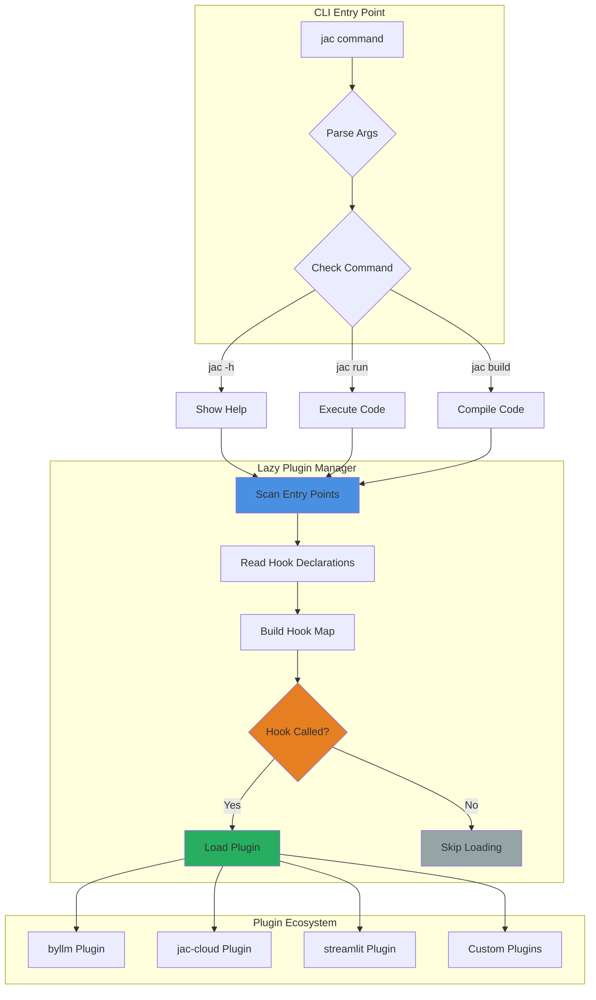
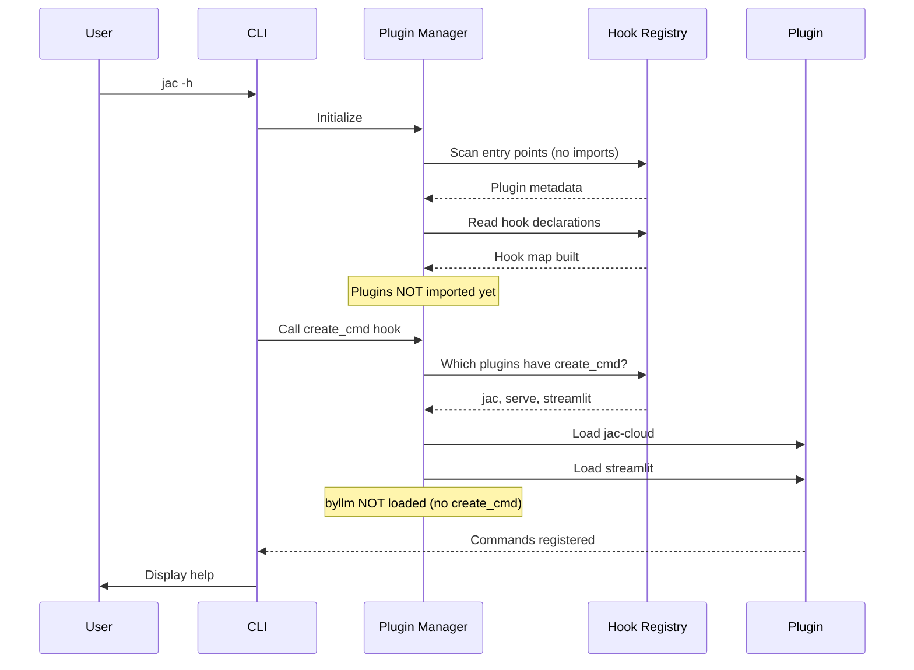
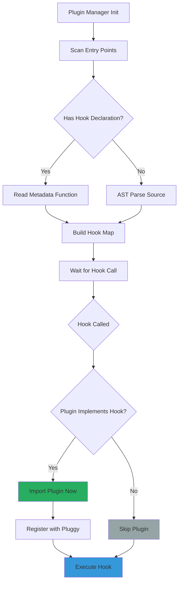
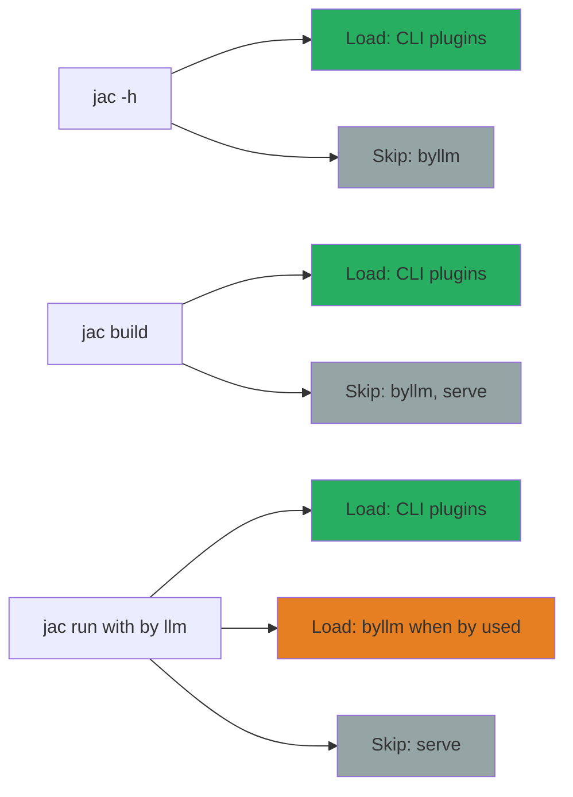

# Plugin System Architecture and Development Guide

This guide provides a comprehensive overview of Jac's plugin system, including the new lazy loading architecture, how to create plugins, and best practices.

---

## Overview

Jac uses a plugin-based architecture powered by [Pluggy](https://pluggy.readthedocs.io/) to extend the language runtime with additional functionality. The plugin system supports:

- **Hook-based extension points** - Plugins implement hooks to add functionality
- **Lazy loading** - Plugins are only loaded when their hooks are actually called
- **Self-declaration** - Plugins declare which hooks they implement for optimal loading
- **Zero overhead** - Commands that don't need plugins run without loading them

---

## Architecture Diagram



---

## Plugin Loading Flow



---

## Creating a Plugin

### Step 1: Plugin Structure

Create a Python package with the following structure:

```
my-jac-plugin/
├── pyproject.toml
├── my_plugin/
│   ├── __init__.py
│   ├── plugin.py          # Main plugin class
│   └── hooks_metadata.py  # Hook declarations
└── README.md
```

### Step 2: Define Your Plugin Class

```python
# my_plugin/plugin.py
from jaclang.runtimelib.machine import hookimpl

class MyJacPlugin:
    """My custom Jac plugin."""

    @staticmethod
    @hookimpl
    def my_hook_name(arg1, arg2):
        """Implement a custom hook."""
        # Your implementation here
        return result
```

### Step 3: Declare Your Hooks

```python
# my_plugin/hooks_metadata.py
def get_hooks():
    """Return list of hooks implemented by this plugin."""
    return [
        "my_hook_name",
        "another_hook",
    ]
```

### Step 4: Register in pyproject.toml

```toml
# pyproject.toml
[project]
name = "my-jac-plugin"
version = "0.1.0"
dependencies = ["jaclang>=0.8.0"]

[project.entry-points.jac]
my_plugin = "my_plugin.plugin:MyJacPlugin"

[project.entry-points."jac.hooks"]
my_plugin = "my_plugin.hooks_metadata:get_hooks"
```

### Step 5: Install and Test

```bash
# Install in development mode
pip install -e .

# Test that your plugin is discovered
python -c "from importlib.metadata import entry_points; print(list(entry_points(group='jac')))"
```

---

## Available Hooks

### Core Language Hooks

#### `get_mtir(caller, args, call_params) -> object`
Called when preparing LLM calls with the `by` syntax.

**Example:**
```python
@hookimpl
def get_mtir(caller, args, call_params):
    """Prepare LLM call metadata."""
    return MTIR.factory(caller, args, call_params)
```

#### `call_llm(model, mtir) -> object`
Called when invoking an LLM.

**Example:**
```python
@hookimpl
def call_llm(model, mtir):
    """Execute LLM call."""
    return model.invoke(mtir=mtir)
```

### CLI Hooks

#### `create_cmd() -> None`
Register custom CLI commands.

**Example:**
```python
@hookimpl
def create_cmd():
    """Register plugin commands."""
    from jaclang.cli.cmdreg import cmd_registry

    @cmd_registry.register
    def my_command(arg1: str):
        """My custom command."""
        print(f"Running with {arg1}")
```

#### `setup() -> None`
Initialize plugin on startup.

**Example:**
```python
@hookimpl
def setup():
    """Setup plugin state."""
    # Initialize resources
    pass
```

### Runtime Hooks

#### `get_context() -> ExecutionContext`
Get the current execution context.

#### `build_edge(edge_spec, source, target) -> EdgeArchetype`
Customize edge creation.

#### `spawn(walker, node) -> None`
Customize walker spawning behavior.

#### `destroy(obj) -> None`
Custom cleanup for objects.

And many more! See [Runtime Plugin Interface](jac_plugins.md) for the complete list.

---

## Plugin Performance Best Practices

### 1. Declare Your Hooks

Always declare which hooks your plugin implements for optimal lazy loading:

```python
# hooks_metadata.py
def get_hooks():
    return ["create_cmd", "setup"]  # Only hooks you implement
```

### 2. Lazy Import Heavy Dependencies

Move heavy imports inside hook implementations:

```python
# ❌ Bad: Import at module level
from heavy_library import BigClass

@hookimpl
def my_hook():
    return BigClass()

# ✅ Good: Import on demand
@hookimpl
def my_hook():
    from heavy_library import BigClass
    return BigClass()
```

### 3. Minimize create_cmd Overhead

If your plugin registers CLI commands, keep the registration code lightweight:

```python
@hookimpl
def create_cmd():
    """Register commands (keep this fast!)."""
    from jaclang.cli.cmdreg import cmd_registry

    @cmd_registry.register
    def my_command(file: str):
        """Command description."""
        # Heavy imports HERE, not at module level
        from my_plugin.heavy_module import process
        process(file)
```

---

## Plugin Loading Internals

### How Lazy Loading Works



### Discovery Strategies

The plugin manager uses a three-tier discovery strategy:

1. **Hook Declarations (Fastest)** - Read metadata from `jac.hooks` entry points
2. **AST Parsing (Fallback)** - Parse source code to find `@hookimpl` decorators
3. **Conservative (Last Resort)** - Load plugin on any hook call

```python
# Strategy 1: Hook Declaration (Recommended)
[project.entry-points."jac.hooks"]
my_plugin = "my_plugin.hooks_metadata:get_hooks"

# Strategy 2: AST Parsing (Automatic)
# Plugin manager parses your source code

# Strategy 3: Conservative (No declaration)
# Plugin loads whenever any hook is called
```

---

## Real-World Examples

### Example 1: byllm Plugin

The byllm plugin provides LLM integration:

```python
# byllm/plugin.py
from jaclang.runtimelib.machine import hookimpl

class JacMachine:
    """Jac's with_llm feature."""

    @staticmethod
    @hookimpl
    def get_mtir(caller, args, call_params):
        """Prepare LLM call."""
        return MTIR.factory(caller, args, call_params)

    @staticmethod
    @hookimpl
    def call_llm(model, mtir):
        """Execute LLM call."""
        return model.invoke(mtir=mtir)
```

**Hook Declaration:**
```python
# byllm/hooks_metadata.py
def get_hooks():
    return ["get_mtir", "call_llm"]
```

**Entry Point:**
```toml
[tool.poetry.plugins."jac.hooks"]
byllm = "byllm.hooks_metadata:get_hooks"
```

### Example 2: jac-cloud Plugin

The jac-cloud plugin provides server functionality:

```python
# jac_cloud/plugin/cli.py
from jaclang.cli.cmdreg import cmd_registry
from jaclang.runtimelib.machine import hookimpl

class JacCmd:
    """Jac Cloud CLI commands."""

    @staticmethod
    @hookimpl
    def create_cmd():
        """Register serve command."""
        @cmd_registry.register
        def serve(filename: str, host: str = "0.0.0.0", port: int = 8000):
            """Serve the jac application."""
            # Import FastAPI only when serve is called
            from ..jaseci.main import FastAPI
            FastAPI.enable()
            # ... rest of implementation
```

**Hook Declaration:**
```python
# jac_cloud/plugin/hooks_metadata.py
def get_cli_hooks():
    return ["create_cmd"]

def get_serve_hooks():
    return ["setup", "get_context", "build_edge", ...]
```

---

## Testing Your Plugin

### Unit Tests

```python
# tests/test_my_plugin.py
import pytest
from my_plugin.plugin import MyJacPlugin

def test_hook_implementation():
    """Test hook works correctly."""
    plugin = MyJacPlugin()
    result = plugin.my_hook_name("arg1", "arg2")
    assert result == expected_value

def test_lazy_loading():
    """Test plugin isn't loaded until hook called."""
    import sys

    # Import jaclang - plugin shouldn't load
    import jaclang
    assert "my_plugin" not in sys.modules

    # Call hook - now plugin loads
    from jaclang import JacMachine as Jac
    Jac.my_hook_name("test", "data")
    assert "my_plugin" in sys.modules
```

### Integration Tests

```python
def test_cli_command():
    """Test custom CLI command."""
    import subprocess

    result = subprocess.run(
        ["jac", "my_command", "test.jac"],
        capture_output=True,
        text=True
    )
    assert result.returncode == 0
    assert "expected output" in result.stdout
```

---

## Performance Metrics

### Impact of Lazy Loading

| Metric | Before Lazy Loading | After Lazy Loading | Improvement |
|--------|---------------------|-------------------|-------------|
| `import jaclang` | 2.57s | 0.30s | **8.6x faster** |
| `jac -h` | 2.87s | 1.10s | **2.6x faster** |
| `jac build` | 2.8s | 1.1s | **2.5x faster** |

### What Gets Loaded When



---

## Troubleshooting

### Plugin Not Discovered

**Problem:** Your plugin doesn't appear in `entry_points(group='jac')`

**Solution:**
1. Check `pyproject.toml` has correct entry point
2. Reinstall plugin: `pip install -e .`
3. Verify with: `python -c "from importlib.metadata import entry_points; print(list(entry_points(group='jac')))"`

### Plugin Loads Too Slowly

**Problem:** Plugin makes CLI slow even with lazy loading

**Solution:**
1. Add hook declarations to avoid conservative loading
2. Move heavy imports inside hook implementations
3. Profile your plugin: `python -m cProfile -s cumtime -m my_plugin`

### Hook Not Being Called

**Problem:** Your hook implementation never executes

**Solution:**
1. Verify hook name matches exactly (check spelling)
2. Ensure `@hookimpl` decorator is applied
3. Check hook is declared in `hooks_metadata.py`
4. Verify plugin is actually loaded: add logging to `__init__.py`

---

## Advanced Topics

### Multiple Hook Implementations

A single plugin can implement multiple hooks:

```python
class MyPlugin:
    @hookimpl
    def hook_one(self, arg):
        return "result1"

    @hookimpl
    def hook_two(self, arg):
        return "result2"

    @hookimpl
    def setup(self):
        """Initialize plugin state."""
        self.state = {}
```

### Conditional Hook Implementations

Use `hookimpl` options for advanced control:

```python
from jaclang.runtimelib.machine import hookimpl

@hookimpl(tryfirst=True)  # Execute before other plugins
def my_hook(arg):
    return process(arg)

@hookimpl(trylast=True)  # Execute after other plugins
def cleanup_hook():
    pass

@hookimpl(optionalhook=True)  # Don't fail if hook not defined
def optional_feature():
    pass
```

### Plugin Dependencies

If your plugin depends on other plugins:

```toml
[project]
dependencies = [
    "jaclang>=0.8.0",
    "other-jac-plugin>=1.0.0",
]
```

Make sure to coordinate hook execution order if needed.

---

## Migration Guide

### Upgrading Existing Plugins

If you have an existing plugin without hook declarations:

**Step 1:** Add hooks_metadata.py
```python
# my_plugin/hooks_metadata.py
def get_hooks():
    return [
        "hook1",
        "hook2",
        # List all @hookimpl methods
    ]
```

**Step 2:** Update pyproject.toml
```toml
[tool.poetry.plugins."jac.hooks"]
my_plugin = "my_plugin.hooks_metadata:get_hooks"
```

**Step 3:** Test
```bash
# Reinstall
pip install -e .

# Verify lazy loading works
time jac -h  # Should be faster
```

---

## Contributing

### Plugin Development Guidelines

1. **Always declare hooks** for optimal performance
2. **Use lazy imports** for heavy dependencies
3. **Document your hooks** with clear docstrings
4. **Test lazy loading** behavior
5. **Follow naming conventions** (hook names should be descriptive)

### Submitting a Plugin

To add your plugin to the Jac ecosystem:

1. Create plugin repository
2. Add comprehensive README
3. Include tests
4. Publish to PyPI
5. Submit PR to add to [official plugin list](https://jac-lang.org/plugins)

---

## Reference

### Plugin Manager API

```python
from jaclang.runtimelib.machine import plugin_manager

# Manually ensure all plugins loaded
plugin_manager.ensure_all_loaded()

# Check if plugin loaded
if "my_plugin" in plugin_manager._loaded_plugins:
    print("Plugin is loaded")

# Call hook
result = plugin_manager.hook.my_hook_name(arg="value")
```

### Hook Specification

Hooks are defined in `JacMachineInterface` (see [jac_plugins.md](jac_plugins.md) for complete spec).

### Related Documentation

- [Runtime Plugin Interface](jac_plugins.md) - Complete hook reference
- [main py plugin Interface](plugin_documentation.md) - Python plugin details
- [Compiler/Runtime Design](internals.md) - Architecture overview

---

## Conclusion

The Jac plugin system with lazy loading provides:

- ✅ **Fast startup** - Only load what's needed
- ✅ **Easy development** - Simple hook-based API
- ✅ **Self-describing** - Plugins declare their capabilities
- ✅ **Backward compatible** - Existing plugins work unchanged

Happy plugin building! 🚀
