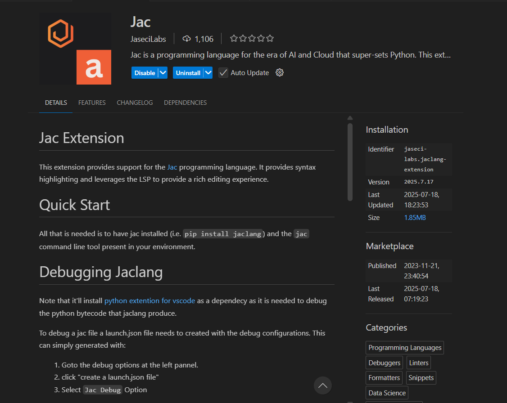
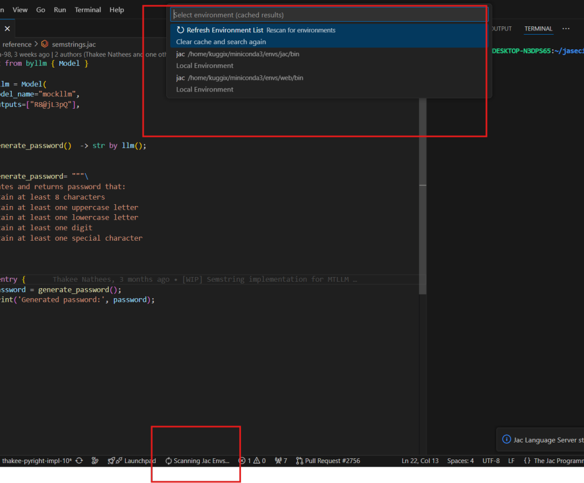
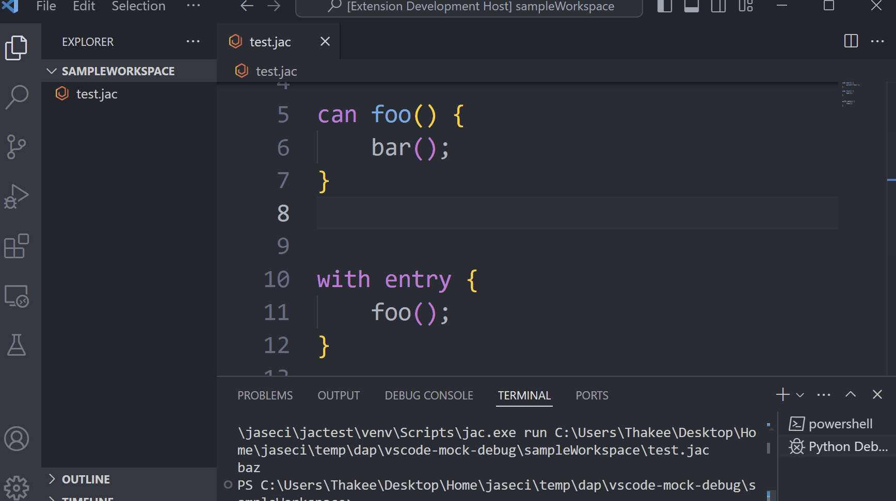
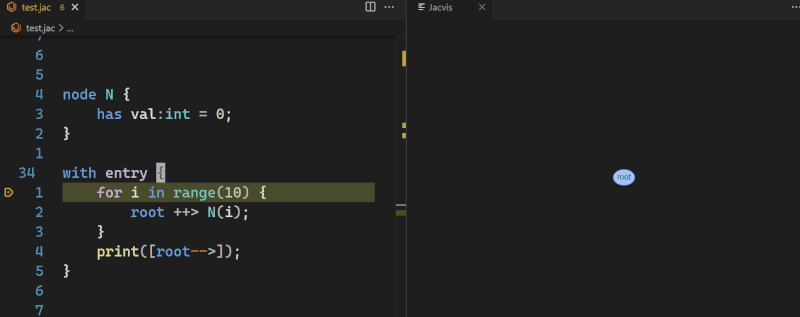
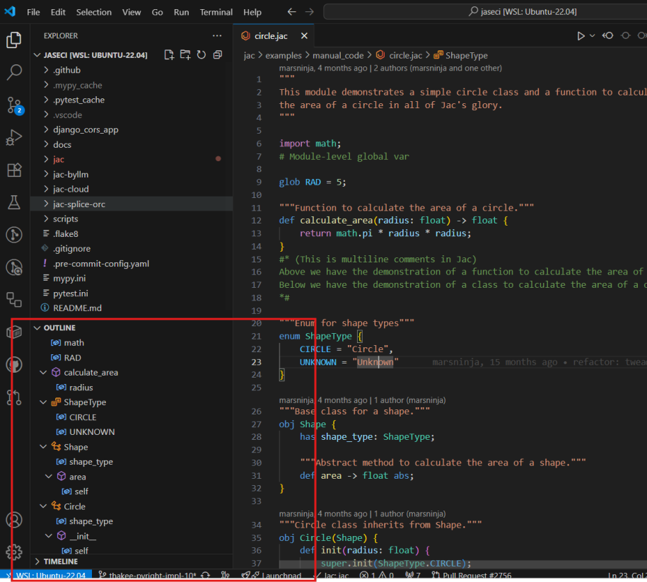
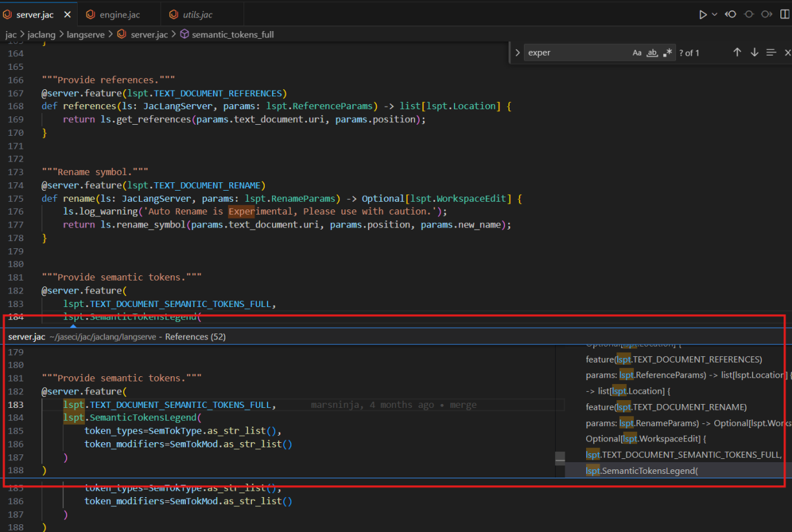

# Jac Extension for Visual Studio Code

Jac is a modern programming language that super-sets Python, designed for the era of AI and cloud computing. It introduces powerful concepts like Object-Spatial Programming and Meaning Typed Programming, while maintaining full interoperability with the Python ecosystem. The Jac extension for Visual Studio Code significantly enhances the development experience by providing rich language support, leveraging the Language Server Protocol.

## Quickstart

Get started with Jac in VS Code with these simple steps:

1.  **Install jaclang**: Make sure you have Python 3.12 or higher, then install `jaclang` using pip.
    ```bash
    pip install jaclang
    ```

2.  **Install the Extension**:
    *   Open Visual Studio Code.
    *   Go to the Extensions view (`Ctrl+Shift+X`).
    *   Search for "Jac" and install the extension from JaseciLabs.




3.  **Select Your Environment**: The extension will automatically scan for environments where `jaclang` is installed. When you open a `.jac` file, you may be prompted to select the appropriate environment. You can also manually select it using the command palette.




4.  **Start Coding**: Open or create a Jac file and start coding!

## Debugging Jaclang

To debug a Jac file, you need to create a `launch.json` file with the necessary debug configurations. This can be easily generated within VS Code.

1.  Navigate to the **Run and Debug** view in the left-hand panel.
2.  Click on "**create a launch.json file**".
3.  Select "**Jac Debug Option**" from the prompt.

This will create a `launch.json` file with a default configuration to run and debug a single Jac file. You can modify this configuration to suit your project's needs.

Here is the default snippet:
```json
{
    "version": "0.2.0",
    "configurations": [
        {
            "type": "debugpy",
            "request": "launch",
            "name": "Run a jac file",
            "program": "${command:extension.jaclang-extension.getJacPath}",
            "args": "run ${file}"
        }
    ]
}
```



## Useful Commands

Access the command palette with `Ctrl+Shift+P` and type "Jac" to see the available commands:

*   **`Jaclang: Select Environment`**: Manually choose the Python environment for the Jac language server.
*   **`Jac: Check`**: Run a syntax and type check on the currently open `.jac` file.
*   **`Jac: Run`**: Execute the current `.jac` file.
*   **`Jac: Serve`**: Serve a Jac application in Jac Cloud.
*   **`jacvis: Visualize Jaclang Graph`**: Generate and view a visual representation of the Jaclang graph from your code.



## Features

The Jac extension provides a comprehensive set of features to boost your productivity:

*   **Go to Definition**: Quickly navigate to the definition of functions, classes, and variables by pressing `F12`.
*   **Hover**: Hover over any code element to see its type information and documentation.
*   **Semantic Colors**: The extension provides syntax highlighting that understands the semantics of your code, making it easier to read and understand.
*   **Diagnostics (Syntax & Type Errors)**: Get real-time feedback on your code with in-line error highlighting and detailed descriptions in the "Problems" panel.
*   **Formatting**: Keep your code clean and consistent with the built-in document formatting capabilities.
*   **Outline Symbols**: The Outline view provides a structured overview of your code, allowing you to quickly navigate between different elements in your file.



*   **Rename (Experimental)**: Use the rename feature (`F2`) to refactor your code. Please note that this feature is experimental and should be used with caution.
*   **References**: Find all references to a symbol by right-clicking and selecting "Find All References".

