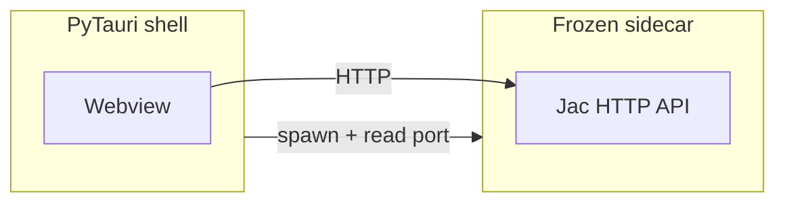

# jac-desktop Reference

**jac-desktop** adds a native desktop build target to Jac full-stack apps. It wraps the same Vite frontend that **jac-client** produces in a [PyTauri](https://pytauri.github.io/) shell and bundles the Jac backend as a PyInstaller **sidecar**; no Rust toolchain required.

Install jac-client first; jac-desktop registers the `desktop` target through jac-client's plugin hook system so `jac setup desktop`, `jac build --client desktop`, and `jac start --client desktop` work once both packages are installed.

---

## Installation

```bash
pip install jac-client jac-desktop
```

| Package | Role |
|---------|------|
| `jac-client` | Vite frontend build, dev server, multi-target CLI (`--client`) |
| `jac-desktop` | PyTauri shell scaffold, sidecar bundling, `jac desktop plugin` CLI |

PyInstaller and `pytauri-wheel` are pulled in as dependencies of the desktop build flow.

!!! note
    Desktop is an **optional** plugin. Web-only projects do not need `jac-desktop`. The jac-client reference documents shared full-stack topics (components, routing, auth); this page covers desktop-specific behavior only.

---

## Architecture

A desktop build has three layers:

1. **Frontend**: same Vite bundle as the web target (`.jac/client/dist/`).
2. **Sidecar**: PyInstaller-frozen executable with Python, jaclang, jac-client, your `.jac` sources, and configured Jac plugins (`src-pytauri/binaries/jac-sidecar`).
3. **Shell**: `src-pytauri/app.py` (stable stub → `jac_desktop.runtime`) opens a native webview, spawns the sidecar, reads `JAC_SIDECAR_PORT=<port>` from stdout, and injects `window.__JAC_API_BASE_URL__` before page JavaScript runs.



| Component | Bundled at build? | Runtime requirement |
|-----------|-------------------|---------------------|
| Frontend | Yes | None |
| Sidecar | Yes (PyInstaller) | None |
| Shell | Staged, not frozen | Python 3 + `pytauri-wheel` on launch machine |

---

## Distribution status

`jac build --client desktop` is a **developer staging pipeline**, not a shipping platform yet:

- **Sidecar**: standalone binary; no Python required at runtime.
- **Shell**: `run.sh` / `run.bat` invoke `python app.py`; launch machine needs Python + `pytauri-wheel`.

Standalone shell packaging is planned.

---

## Quick start

From an existing jac-client project:

```bash
jac setup desktop                       # one-time: creates src-pytauri/
jac start --client desktop --dev        # Vite HMR + live backend + shell
jac build --client desktop              # freeze sidecar + stage launcher
./src-pytauri/dist/run.sh               # Linux/macOS smoke test
```

Add `[plugins.desktop]` to `jac.toml` before building (see [Configuration](#configuration) below).

Tutorial walkthrough: [Building a Desktop App](../../tutorials/fullstack/desktop.md).

---

## Dev vs build runtime

| Mode | Command | Backend | Shell | Frontend |
|------|---------|---------|-------|----------|
| **Dev** | `jac start --client desktop --dev` | Live `jaclang start` | `python app.py` + `DEV_SERVER` | Vite dev server (HMR) |
| **Build** | `jac build --client desktop` | PyInstaller sidecar | Staged `app.py` | Production bundle |
| **Start** | `jac start --client desktop` | Frozen sidecar (builds if missing) | `python app.py` | Production bundle |

Dev uses live Python for the backend; build freezes it. Behavioral gaps (missing PyInstaller imports, plugins not installed in the build env) only show up after `jac build --client desktop`; run a full build in CI to catch them.

---

## Project layout

After `jac setup desktop`:

```
myapp/
├── jac.toml
├── main.jac
└── src-pytauri/
    ├── app.py              # stable stub → jac_desktop.runtime (do not edit)
    ├── tauri.conf.json     # refreshed on build from [plugins.desktop]
    ├── capabilities/       # Tauri permissions; synced with tauri_plugins
    ├── icons/              # icon.png (+ .ico / .icns when Pillow present)
    ├── pyproject.toml      # PyTauri runtime deps for this project
    ├── binaries/           # jac-sidecar after build
    └── dist/               # run.sh / run.bat launcher after build
```

**Safe to customize:** `icons/icon.png` (1024×1024 PNG recommended). **Do not edit** `app.py`; configure via `jac.toml` and `jac desktop plugin`.

Build refreshes `tauri.conf.json` and `capabilities/` from config. Shell logic lives in the `jac-desktop` package (`jac_desktop.runtime`), not in generated project code.

---

## CLI commands

### Core commands (jac-client)

These flags are registered by jac-client; the `desktop` target is supplied by jac-desktop.

| Command | Description |
|---------|-------------|
| `jac setup desktop` | Scaffold `src-pytauri/` (one-time) |
| `jac start --client desktop --dev` | Dev: Vite + live backend + shell |
| `jac start --client desktop` | Production-style launch (`python app.py`) |
| `jac build --client desktop` | Build frontend + freeze sidecar + write launcher |
| `jac build --client desktop -p windows` | Name sidecar `jac-sidecar.exe` (build on Windows for a Windows binary) |

`--platform macos`, `linux`, and `all` do **not** cross-compile the sidecar today. PyInstaller runs on the current machine; only `windows` changes the output filename.

During build, `JAC_BUILD=1` is set automatically so Jac code that auto-starts a server at import time stays inert.

### `jac desktop plugin` (jac-desktop)

Requires `jac setup desktop` first.

```bash
jac desktop plugin list
jac desktop plugin add dialog fs
jac desktop plugin remove dialog
jac desktop plugin sync
```

| Command | Description |
|---------|-------------|
| `list` | Show catalog and installed `[plugins.desktop].tauri_plugins` |
| `add <ids…>` | Add plugin ids, regenerate capabilities, sync npm deps |
| `remove <ids…>` | Remove plugin ids and regenerate |
| `sync` | Idempotent regen after manual `jac.toml` edits |

Updates `capabilities/` and, when `auto_tauri_plugin_npm = true` (default), matching `@tauri-apps/plugin-*` entries in `[dependencies.npm]`.

---

## Configuration

All desktop settings live under `[plugins.desktop]` in `jac.toml`.

```toml
[plugins.desktop]
name = "MyApp"
identifier = "com.example.myapp"
version = "1.0.0"
client_only = false
auto_tauri_plugin_npm = true
tauri_plugins = ["dialog", "fs"]

[plugins.desktop.window]
title = "MyApp"
width = 1200
height = 800
min_width = 800
min_height = 600
resizable = true
fullscreen = false

[plugins.desktop.plugins]
jac_scale = true
byllm = true
jac_coder = true
jac_mcp = true

[plugins.desktop.bundle]
extra_data = [
    "config/*.yaml",
    "data/seed.json",
]
```

| Key | Type | Default | Description |
|-----|------|---------|-------------|
| `name` | str | project name | Display name |
| `identifier` | str | `com.<project>` | Reverse-DNS id (macOS/Linux) |
| `version` | str | project version | App version |
| `client_only` | bool | `false` | Skip sidecar; use `[plugins.client.api] base_url` |
| `tauri_plugins` | list | `[]` | Native Tauri plugin ids |
| `auto_tauri_plugin_npm` | bool | `true` | Sync `@tauri-apps/plugin-*` npm deps |
| `plugins` | dict | all four Jac plugins on | Sidecar Jac plugin toggles |
| `window.*` | dict | see below | Window geometry and behavior |
| `bundle.extra_data` | list | `[]` | Glob patterns of extra files for PyInstaller |

**Window keys:** `title`, `width`, `height`, `min_width`, `min_height`, `resizable`, `fullscreen`.

**Sidecar Jac plugins** (`[plugins.desktop.plugins]`):

| Key | Bundled by default |
|-----|-------------------|
| `jac_scale` | yes |
| `byllm` | yes |
| `jac_coder` | yes |
| `jac_mcp` | yes |

- `jac_client` is **always** bundled (sidecar entry point); not configurable.
- Plugins must be **installed in the build environment** before `jac build --client desktop`.
- Python deps under `[dependencies]` are auto-installed before PyInstaller runs.
- PyInstaller excludes artifact dirs (`src-pytauri/`, `node_modules/`, `.jac/client/`) when collecting `.jac` sources.

---

## Native Tauri plugins

1. Add plugins via CLI or `tauri_plugins` in `jac.toml`.
2. Import the matching npm package from client code (auto-synced when `auto_tauri_plugin_npm = true`).

```jac
cl import from "@tauri-apps/plugin-dialog" { message }
cl import from "@tauri-apps/plugin-fs" { readTextFile, writeTextFile }

to cl:

async def greet -> None {
    await message("Hello from the native shell", {"title": "My App"});
}
```

Full example: [pytauri-plugin-showcase](https://github.com/jaseci-labs/jaseci/tree/main/jac-desktop/jac_desktop/examples/pytauri-plugin-showcase) in the jac-desktop repo.

---

## Client-only mode

Use a hosted API with no local sidecar:

```toml
[plugins.desktop]
client_only = true

[plugins.client.api]
base_url = "https://api.example.com"
```

Build skips PyInstaller. `[plugins.client.api] base_url` is **required**.

---

## Sidecar bundling

PyInstaller runs during `jac build --client desktop` (not during dev). Output: `src-pytauri/binaries/jac-sidecar` (or `.exe` on Windows).

**Opt out of PyInstaller** (wrapper script; requires Python + jaclang on launch machine):

```bash
JAC_SIDECAR_STANDALONE=0 jac build --client desktop
```

**Extra data files**: ship non-`.jac` files into the frozen bundle:

```toml
[plugins.desktop.bundle]
extra_data = ["config/*.yaml", "data/seed.json"]
```

Patterns are resolved relative to the project root. A root `.env` file is also loaded from the bundle when present.

---

## Data persistence

The sidecar sets `JAC_DATA_PATH` before importing Jac modules:

| Platform | First choice | Fallback | Last resort |
|----------|--------------|----------|-------------|
| Linux / macOS | `~/.local/share/jac-app` | `~/.jac-app` | `/tmp/jac-app-{uid}` |
| Windows | `%LOCALAPPDATA%\jac-app` | `~/AppData/Local/jac-app` | `%TEMP%\jac-app` |

Override at runtime:

```bash
./src-pytauri/binaries/jac-sidecar --data-path /var/lib/myapp
```

Sidecar also accepts `--module-path`, `--base-path`, `--port`, and `--host` when run directly for debugging.

---

## Icons

`jac setup desktop` generates a placeholder `src-pytauri/icons/icon.png`. Replace it with your app icon (1024×1024 PNG). Build generates platform formats when [Pillow](https://pypi.org/project/Pillow/) is installed:

- `icon.ico` (Windows)
- `icon.icns` (macOS)
- Standard PNG sizes for Linux

---

## Environment variables

| Variable | When | Purpose |
|----------|------|---------|
| `DEV_SERVER` | Dev (`--dev`) | Vite dev server URL for the shell webview |
| `JAC_PYTAURI_API_BASE_URL` | Dev / manual | Override API URL; skip sidecar spawn when set |
| `JAC_PYTAURI_NO_SIDECAR=1` | Runtime | Disable sidecar autostart |
| `JAC_SIDECAR_STANDALONE=0` | Build | Use Python wrapper sidecar instead of PyInstaller |
| `JAC_BUILD=1` | Build | Set automatically; keeps import-time servers inert |

---

## Debugging

1. **Run the sidecar directly**: `src-pytauri/binaries/jac-sidecar` logs to stderr; prints `JAC_SIDECAR_PORT=<port>` on stdout.
2. **Data path**: watch for `[sidecar] Cannot use data path …` in stderr.
3. **Plugin drift**: after editing `[plugins.desktop].tauri_plugins`, run `jac desktop plugin sync`.
4. **Dev works, build fails**: suspect missing PyInstaller hidden import or plugin not installed in the build environment; reproduce with a local `jac build --client desktop`.

---

## Related resources

- [Building a Desktop App tutorial](../../tutorials/fullstack/desktop.md)
- [jac-client Reference](jac-client.md): shared full-stack UI, routing, auth
- [CLI Reference](../cli/index.md): all `jac` commands
- [jac-desktop README](https://github.com/jaseci-labs/jaseci/tree/main/jac-desktop): package overview
