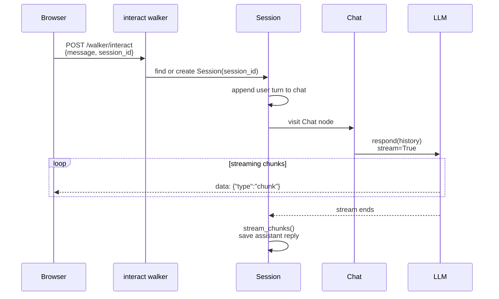
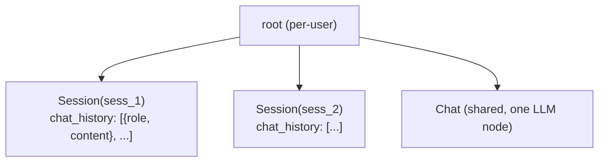

# Part 2: Persistent Sessions

Add persistent sessions and user authentication to the chatbot from Part 1. Each user's conversation history survives page refreshes and server restarts stored in the graph with no external database. The frontend gains a session sidebar, login/register pages, and Markdown rendering.

**Prerequisites:** Complete [Part 1](part1-simple-chat.md) first.

---

## What You're Building

A multi-user chat app where each user's history is stored in `Session` nodes in the graph. Jac's built-in auth scopes each user to their own root, so sessions are isolated automatically.



The graph shape after a few conversations:



---

## Project Layout

```
step-2-auth-sessions/
├── services/
│   ├── server.jac
│   ├── server.impl/
│   │   └── chat.impl.jac        # Session.chat + Chat.reply bodies
│   └── jacService.cl.jac        # Client-side walker call wrappers
├── hooks/
│   ├── useAuth.cl.jac
│   └── useChat.cl.jac
├── components/
│   ├── Sidebar.cl.jac
│   ├── ChatMessage.cl.jac       # Now with Markdown rendering
│   └── ChatInput.cl.jac         ← unchanged from Step 1
├── pages/
│   ├── ChatPage.cl.jac
│   ├── LoginPage.cl.jac
│   └── RegisterPage.cl.jac
├── utils/
│   └── ProtectedRoute.cl.jac
└── frontend.cl.jac
```

---

## Backend

### The Session Node

```jac
import from datetime { datetime }

"""Persistent chat session - stores the full conversation history."""
node Session {
    has id: str;
    has chat_history: list[dict] = [];
    has created_at: str = "";
    has updated_at: str = "";

    can chat with interact entry;
}
```

**`node Session`** like any node attached to `root`, it persists across server restarts. No external database needed.

**`chat_history`** a list of `{"role": "user"|"assistant", "content": "..."}` dicts. Every turn gets appended here.

**`can chat with interact entry`** when the `interact` walker visits a `Session`, this ability fires. Its body lives in `impl Session.chat`.

### Updated `interact` Walker

The walker now carries a `session_id` and resolves the right session before calling the LLM:

```jac
"""Main chat walker: resolves the session, then calls the LLM."""
walker interact {
    has message: str;
    has session_id: str;
    has user_email: str = "";
    has chat_history: list[dict] = [];

    can init_session with Root entry {
        found = [-->(?:Session, id == self.session_id)];
        if found {
            visit found;
        } else {
            now = datetime.now().isoformat();
            visit here ++> Session(
                id=self.session_id,
                chat_history=[],
                created_at=now,
                updated_at=now
            );
        }
    }
}
```

**`[-->(?:Session)]`** a graph query: follow outgoing edges from root, filter by node type. Returns a plain list.

**`visit found`** move the walker to the existing session. `Session.chat` fires next.

**`visit here ++> Session(...)`** no match? Create a new session, connect it to root, and visit it immediately.

### Reply Implementation (`server.impl/chat.impl.jac`)

When the walker arrives at a `Session`, `Session.chat` appends the user message and passes the full history to `Chat`:

```jac
impl Session.chat {
    self.chat_history.append({"role": "user", "content": visitor.message});
    self.updated_at = datetime.now().isoformat();
    visitor.chat_history = self.chat_history;

    # Find or create the global Chat node
    chat_nodes = [root-->(?:Chat)];
    if len(chat_nodes) > 0 {
        visit chat_nodes[0];
    } else {
        visit root ++> Chat();
    }
}

impl Chat.reply {
    report stream_chunks(
        self.respond(message=visitor.message, chat_history=visitor.chat_history),
        visitor.session_id
    );
}
```

**`self`** inside a node ability, `self` is the node being visited (the `Session`).

**`visitor.chat_history = self.chat_history`** copies the full history onto the walker. `Chat.reply` reads it via `visitor.chat_history` to pass the whole context to the LLM.

**`messages=chat_history`** byLLM injects the history list directly into the API payload. The LLM sees the full prior exchange.

### Streaming with Persistence

`stream_chunks` now saves the completed response back to the session after streaming finishes:

```jac
def:pub stream_chunks(gen: any, session_id: str) -> any {
    full_response = "";
    for chunk in gen {
        full_response += chunk;
        yield f"data: {json.dumps({'type': 'chunk', 'content': chunk})}\n\n";
    }
    # Persist the assistant turn after streaming completes
    all_sessions = [root-->(?:Session)];
    for s in all_sessions {
        if s.id == session_id {
            s.chat_history.append({"role": "assistant", "content": full_response});
            s.updated_at = datetime.now().isoformat();
            break;
        }
    }
}
```

Chunks stream to the client as they arrive. When the loop ends, the full text is written back to the graph. The next request sees the complete prior exchange.

### Session Management Walkers

Four small walkers let the frontend create, list, load, and delete sessions. The delete walker introduces a new graph pattern:

```jac
walker delete_session {
    has session_id: str;

    can remove with Root entry {
        matches = [-->(?:Session, id == self.session_id)];
        if matches {
            here del--> matches[0];
            del matches[0];
            report {"deleted": True, "session_id": self.session_id};
        } else {
            report {"deleted": False, "session_id": self.session_id};
        }
    }
}
```

**`[-->(?:Session, id == self.session_id)]`** an inline filter inside the graph query. No loop needed.

**`here del--> matches[0]`** removes the edge from root to the session. **`del matches[0]`** deletes the node itself. Both steps are needed to fully remove it from the graph.

---

## Frontend

### Authentication Hook (`hooks/useAuth.cl.jac`)

```jac
import from "@jac/runtime" { useNavigate, jacLogin, jacSignup, jacLogout, jacIsLoggedIn }

def:pub useAuth() -> any {
    navigate = useNavigate();

    has username: str = "";
    has password: str = "";
    has error: str = "";
    has loading: bool = False;

    async def handleLogin(e: any) -> None {
        e.preventDefault();
        loading = True;
        try {
            success = await jacLogin(username, password);
            if success { navigate("/"); }
            else { error = "Invalid username or password"; }
        } except Exception { error = "An error occurred during login"; }
        finally { loading = False; }
    }
    ...
}
```

**`jacLogin / jacSignup / jacLogout`** built-in Jac runtime functions. They hit auto-generated `/user/login` and `/user/register` endpoints and store the JWT in `localStorage`. You don't write any user management code.

**`has loading: bool = False`** `has` inside a `def:pub` function creates reactive state. Any change triggers a re-render.

### Backend Service Layer (`services/jacService.cl.jac`)

```jac
async def:pub createSession(sessionId: str = "") -> any {
    response = root spawn new_session(session_id=sessionId);
    result = response.reports[response.reports.length - 1] ...;
    return {"success": True, "session_id": result.session_id or sessionId, ...};
}
```

**`root spawn walkerName(...)`** the client-side pattern for calling backend walkers. `root` is the graph entry point; `spawn` runs the named walker. The response includes a `reports` array the last entry is the final result.

### Chat State Hook (`hooks/useChat.cl.jac`)

```jac
def:pub useChat() -> any {
    has messages: list = [];
    has sessionId: str = "";
    has isLoading: bool = False;
    has chatSessions: list = [];
    ...
}
```

This hook owns everything: message list, active session ID, loading state, and the sidebar session list. `handleSendMessage` streams chunks into the bot bubble. `handleLoadSession` fetches a previous session from the graph and restores the messages.

### Protected Routes (`utils/ProtectedRoute.cl.jac`)

```jac
import from "@jac/runtime" { Navigate, jacIsLoggedIn }

def:pub ProtectedRoute(props: any) -> JsxElement {
    if not jacIsLoggedIn() {
        return <Navigate to="/login" />;
    }
    return props.children;
}
```

**`Navigate`** from `@jac/runtime` triggers a client-side redirect without a page reload. Wrap any route element in `<ProtectedRoute>` to gate it behind auth.

### App Entry Point (`frontend.cl.jac`)

```jac
def:pub app() -> JsxElement {
    theme = createTheme({...});
    return <MantineProvider theme={theme} defaultColorScheme="dark">
        <Router>
            <Routes>
                <Route path="/" element={<ProtectedRoute><ChatPage /></ProtectedRoute>} />
                <Route path="/login" element={<LoginPage />} />
                <Route path="/register" element={<RegisterPage />} />
            </Routes>
        </Router>
    </MantineProvider>;
}
```

**`<ProtectedRoute>`** wraps `ChatPage`. Unauthenticated users get redirected to `/login` before the page renders.

**`MantineProvider`** wraps the entire app so every Mantine component picks up the custom dark theme.

---

## Run It

??? note "Complete `services/server.jac`"

    ```jac
    """Step 2: Chat backend with authentication and persistent sessions."""

    import json;
    import from byllm.lib { Model }
    import from dotenv { load_dotenv }
    import from datetime { datetime }
    import from jaclang.project.config { get_config }

    with entry {
        load_dotenv();
    }

    glob _jac_config = get_config();
    glob _cfg: dict = _jac_config._raw_data.get("config", {}) if _jac_config else {};
    glob llm = Model(model_name=_cfg.get("llm_model", "gpt-4.1-mini"));

    """Persistent chat session - stores the full conversation history."""
    node Session {
        has id: str;
        has chat_history: list[dict] = [];
        has created_at: str = "";
        has updated_at: str = "";

        can chat with interact entry;
    }

    """LLM personality node - holds the respond method."""
    node Chat {
        def respond(message: str, chat_history: list[dict]) -> str by llm(
            method="Reason",
            messages=chat_history,
            stream=True
        );

        can reply with interact entry;
    }

    sem Chat.respond = "General-purpose conversational agent for answering questions and handling interactions.";

    """Main chat walker: resolves the session, then calls the LLM."""
    walker interact {
        has message: str;
        has session_id: str;
        has user_email: str = "";
        has chat_history: list[dict] = [];

        can init_session with Root entry {
            found = [-->(?:Session, id == self.session_id)];
            if found {
                visit found;
            } else {
                now = datetime.now().isoformat();
                visit here ++> Session(id=self.session_id, chat_history=[], created_at=now, updated_at=now);
            }
        }
    }

    def:pub stream_chunks(gen: any, session_id: str) -> any {
        full_response = "";
        for chunk in gen {
            full_response += chunk;
            yield f"data: {json.dumps({'type': 'chunk', 'content': chunk})}\n\n";
        }
        all_sessions = [root-->(?:Session)];
        for s in all_sessions {
            if s.id == session_id {
                s.chat_history.append({"role": "assistant", "content": full_response});
                s.updated_at = datetime.now().isoformat();
                break;
            }
        }
    }

    walker new_session {
        has session_id: str = "";

        can create_session with Root entry {
            if not self.session_id {
                import time;
                self.session_id = f"session_{int(time.time())}";
            }
            now = datetime.now().isoformat();
            here ++> Session(id=self.session_id, chat_history=[], created_at=now, updated_at=now);
            report {"session_id": self.session_id, "status": "created", "chat_history": []};
        }
    }

    walker list_sessions {
        can get_all with Root entry {
            sessions = [];
            for s in [-->(?:Session)] {
                first_msg = "";
                for item in s.chat_history {
                    if item["role"] == "user" { first_msg = item["content"]; break; }
                }
                sessions.append({"id": s.id, "first_message": first_msg, "created_at": s.created_at, "updated_at": s.updated_at});
            }
            report {"sessions": sessions};
        }
    }

    walker delete_session {
        has session_id: str;

        can remove with Root entry {
            matches = [-->(?:Session, id == self.session_id)];
            if matches {
                here del--> matches[0];
                del matches[0];
                report {"deleted": True, "session_id": self.session_id};
            } else {
                report {"deleted": False, "session_id": self.session_id};
            }
        }
    }

    walker get_session {
        has session_id: str;

        can get_history with Root entry {
            for s in [-->(?:Session)] {
                if s.id == self.session_id {
                    report {"session_id": s.id, "chat_history": s.chat_history, "found": True};
                    return;
                }
            }
            report {"session_id": self.session_id, "chat_history": [], "found": False};
        }
    }
    ```

??? note "Complete `services/server.impl/chat.impl.jac`"

    ```jac
    """Ability implementations for Session and Chat nodes."""

    impl Session.chat {
        self.chat_history.append({"role": "user", "content": visitor.message});
        self.updated_at = datetime.now().isoformat();
        visitor.chat_history = self.chat_history;

        # Find or create the global Chat node
        chat_nodes = [root-->(?:Chat)];
        if len(chat_nodes) > 0 {
            visit chat_nodes[0];
        } else {
            visit root ++> Chat();
        }
    }

    impl Chat.reply {
        report stream_chunks(
            self.respond(message=visitor.message, chat_history=visitor.chat_history),
            visitor.session_id
        );
    }
    ```

??? note "Complete `hooks/useAuth.cl.jac`"

    ```jac
    """Authentication hook - manages login/register form state and actions."""

    import from "@jac/runtime" { useNavigate, jacLogin, jacSignup, jacLogout, jacIsLoggedIn }

    def:pub useAuth() -> any {
        navigate = useNavigate();

        has username: str = "";
        has password: str = "";
        has confirmPassword: str = "";
        has email: str = "";
        has error: str = "";
        has loading: bool = False;

        def handleUsernameChange(e: any) -> None { username = e.target.value; }
        def handlePasswordChange(e: any) -> None { password = e.target.value; }
        def handleConfirmPasswordChange(e: any) -> None { confirmPassword = e.target.value; }
        def handleEmailChange(e: any) -> None { email = e.target.value; }

        async def handleLogin(e: any) -> None {
            e.preventDefault();
            error = "";
            if not username or not password { error = "Please fill in all fields"; return; }
            loading = True;
            try {
                success = await jacLogin(username, password);
                if success { localStorage.removeItem("jac_gpt_sessions"); navigate("/"); }
                else { error = "Invalid username or password"; }
            } except Exception as ex { error = "An error occurred during login"; }
            finally { loading = False; }
        }

        async def handleRegister(e: any) -> None {
            e.preventDefault();
            error = "";
            if not username or not password or not email { error = "Please fill in all fields"; return; }
            if password != confirmPassword { error = "Passwords do not match"; return; }
            if password.length < 6 { error = "Password must be at least 6 characters"; return; }
            loading = True;
            try {
                success = await jacSignup(username, password);
                if success {
                    loginOk = await jacLogin(username, password);
                    navigate(("/" if loginOk else "/login"));
                } else { error = "Registration failed. Username may already exist."; }
            } except Exception as ex { error = "An error occurred during registration"; }
            finally { loading = False; }
        }

        def handleLogout() -> None {
            localStorage.removeItem("jac_gpt_sessions");
            jacLogout();
            navigate("/login");
        }

        return {
            "username": username, "password": password,
            "confirmPassword": confirmPassword, "email": email,
            "error": error, "loading": loading,
            "handleUsernameChange": handleUsernameChange,
            "handlePasswordChange": handlePasswordChange,
            "handleConfirmPasswordChange": handleConfirmPasswordChange,
            "handleEmailChange": handleEmailChange,
            "handleLogin": handleLogin, "handleRegister": handleRegister,
            "handleLogout": handleLogout
        };
    }

    """Decode the username from the JWT stored in localStorage."""
    def:pub getUsernameFromToken() -> str {
        token = localStorage.getItem("jac_token");
        result = "User";
        if token {
            try {
                parts = token.split(".");
                if parts.length > 1 {
                    payload = JSON.parse(atob(parts[1]));
                    result = payload.username or payload.email or "User";
                }
            } except Exception { }
        }
        return result;
    }
    ```

??? note "Complete `services/jacService.cl.jac`"

    ```jac
    """Client-side service layer - wraps backend walker calls."""

    def:pub generateSessionId() -> str {
        return "session_" + String(Date.now()) + "_" + Math.random().toString(36).substring(2, 9);
    }

    async def:pub createSession(sessionId: str = "") -> any {
        if not sessionId { sessionId = generateSessionId(); }
        try {
            response = root spawn new_session(session_id=sessionId);
            result = response.reports[response.reports.length - 1] if response.reports and response.reports.length > 0 else {};
            return {"success": True, "session_id": result.session_id or sessionId, "chat_history": result.chat_history or []};
        } except Exception as e { return {"success": False, "error": String(e), "session_id": sessionId}; }
    }

    async def:pub listSessions() -> any {
        try {
            response = root spawn list_sessions();
            result = response.reports[response.reports.length - 1] if response.reports and response.reports.length > 0 else {};
            return {"success": True, "sessions": result.sessions or []};
        } except Exception as e { return {"success": False, "error": String(e), "sessions": []}; }
    }

    async def:pub deleteSession(sessionId: str) -> any {
        try {
            response = root spawn delete_session(session_id=sessionId);
            result = response.reports[response.reports.length - 1] if response.reports and response.reports.length > 0 else {};
            return {"success": True, "deleted": result.deleted or False};
        } except Exception as e { return {"success": False, "error": String(e), "deleted": False}; }
    }

    async def:pub getSession(sessionId: str) -> any {
        try {
            response = root spawn get_session(session_id=sessionId);
            result = response.reports[response.reports.length - 1] if response.reports and response.reports.length > 0 else {};
            return {"success": True, "session_id": sessionId, "chat_history": result.chat_history or [], "found": result.found or False};
        } except Exception as e { return {"success": False, "error": String(e), "chat_history": [], "found": False}; }
    }

    """Send a message and stream the response back via SSE."""
    async def:pub sendMessage(
        message: str, sessionId: str, userEmail: str = "",
        onChunk: any = None, abortSignal: any = None
    ) -> any {
        try {
            token = localStorage.getItem("jac_token");
            response = await fetch("/walker/interact", {
                "method": "POST",
                "headers": {"Content-Type": "application/json", "Authorization": ("Bearer " + token if token else "")},
                "body": JSON.stringify({"message": message, "session_id": sessionId, "user_email": userEmail}),
                "signal": abortSignal
            });
            reader = response.body.getReader();
            decoder = Reflect.construct(TextDecoder, ["utf-8"]);
            buffer = "";
            doubleNewline = String.fromCharCode(10) + String.fromCharCode(10);
            while True {
                read_result = await reader.read();
                if read_result.done { break; }
                buffer += decoder.decode(read_result.value, {"stream": True});
                events = buffer.split(doubleNewline);
                buffer = events.pop() or "";
                for event in events {
                    if not event.startsWith("data:") { continue; }
                    try {
                        parsed = JSON.parse(event.replace("data:", "").trim());
                        if parsed.type == "chunk" and onChunk { onChunk(parsed.content); }
                    } except Exception { }
                }
            }
            return {"success": True};
        } except Exception as e {
            if e.name == "AbortError" { return {"success": False, "aborted": True}; }
            return {"success": False, "error": String(e)};
        }
    }
    ```

??? note "Complete `hooks/useChat.cl.jac`"

    ```jac
    """Step 2: useChat hook - manages chat state, sessions, and SSE streaming."""

    import from react { useRef, useEffect }
    import from "@jac/runtime" { jacIsLoggedIn }
    import from ..services.jacService { getSession, listSessions, deleteSession, sendMessage, generateSessionId }
    import from .useAuth { getUsernameFromToken }

    def:pub useChat() -> any {
        has messages: list = [];
        has sessionId: str = "";
        has isLoading: bool = False;
        has chatSessions: list = [];

        messagesEndRef = useRef(None);
        abortControllerRef = useRef(None);
        prevMessageCountRef = useRef(0);
        isAuthenticated = jacIsLoggedIn();

        useEffect(lambda -> None {
            currentCount = messages.length;
            if currentCount > prevMessageCountRef.current {
                if messagesEndRef.current {
                    messagesEndRef.current.scrollIntoView({"behavior": "smooth"});
                }
            }
            prevMessageCountRef.current = currentCount;
        }, [messages]);

        useEffect(lambda -> None {
            async def loadSessions() -> None {
                result = await listSessions();
                if result.success {
                    chatSessions = result.sessions.map(lambda s: any -> any {
                        title = (s.first_message.substring(0, 50) + ("..." if s.first_message.length > 50 else "")) if s.first_message else "New Chat";
                        return {"id": s.id, "title": title, "createdAt": s.created_at};
                    });
                }
            }
            loadSessions();
            initSession();
        }, []);

        def initSession() -> None {
            sessionId = generateSessionId();
        }

        async def handleSendMessage(content: str) -> None {
            if not content.trim() or isLoading { return; }
            isFirstMessage = messages.filter(lambda m: any -> bool { return m.isUser; }).length == 0;
            isLoading = True;
            messages = lambda prev: any -> any {
                return prev.concat([{"id": "user_" + String(Date.now()), "content": content.trim(), "isUser": True, "timestamp": Date()}]);
            };
            if isFirstMessage { updateSessionTitle(content.trim()); }
            botId = "bot_" + String(Date.now());
            messages = lambda prev: any -> any {
                return prev.concat([{"id": botId, "content": "", "isUser": False, "timestamp": Date()}]);
            };
            def onChunk(chunk: str) -> None {
                isLoading = False;
                messages = lambda prev: any -> any {
                    return prev.map(lambda m: any -> any {
                        if m.id == botId { return {"id": m.id, "content": m.content + chunk, "isUser": False, "timestamp": m.timestamp}; }
                        return m;
                    });
                };
            }
            try {
                abortControllerRef.current = Reflect.construct(AbortController, []);
                userEmail = (getUsernameFromToken() if isAuthenticated else "");
                result = await sendMessage(content.trim(), sessionId, userEmail, onChunk, abortControllerRef.current.signal);
                if not result.success {
                    if result.aborted {
                        messages = lambda prev: any -> any { return prev.filter(lambda m: any -> bool { return m.id != botId; }); };
                    } else {
                        messages = lambda prev: any -> any {
                            return prev.map(lambda m: any -> any {
                                if m.id == botId { return {"id": m.id, "content": "Sorry, something went wrong.", "isUser": False, "timestamp": m.timestamp}; }
                                return m;
                            });
                        };
                    }
                }
                abortControllerRef.current = None;
            } except Exception as e {
                console.error("Send error:", e);
                isLoading = False;
            }
        }

        def updateSessionTitle(firstMessage: str) -> None {
            title = firstMessage.substring(0, 50) + (("..." if firstMessage.length > 50 else ""));
            idx = chatSessions.findIndex(lambda s: any -> bool { return s.id == sessionId; });
            if idx >= 0 {
                chatSessions = lambda prev: any -> any {
                    updated = prev.map(lambda s: any, i: int -> any {
                        return ({"id": s.id, "title": title, "createdAt": s.createdAt} if i == idx else s);
                    });
                    localStorage.setItem("jac_gpt_sessions", JSON.stringify(updated));
                    return updated;
                };
            } else {
                newSession = {"id": sessionId, "title": title, "createdAt": String(Date.now())};
                chatSessions = lambda prev: any -> any {
                    updated = [newSession].concat(prev);
                    localStorage.setItem("jac_gpt_sessions", JSON.stringify(updated));
                    return updated;
                };
            }
        }

        async def handleNewChat() -> None { messages = []; await initSession(); }

        async def handleLoadSession(loadId: str) -> None {
            isLoading = True;
            try {
                result = await getSession(loadId);
                if result.success and result.found {
                    sessionId = loadId;
                    newMessages = [];
                    for item in result.chat_history {
                        newMessages.push({"id": "msg_" + String(Date.now()) + "_" + String(Math.random()), "content": item.content, "isUser": item.role == "user", "timestamp": Date()});
                    }
                    messages = lambda prev: any -> any { return newMessages; };
                }
            } except Exception as e { console.error("Load session error:", e); }
            finally { isLoading = False; }
        }

        async def handleDeleteSession(deleteId: str) -> None {
            await deleteSession(deleteId);
            chatSessions = lambda prev: any -> any { return prev.filter(lambda s: any -> bool { return s.id != deleteId; }); };
            if deleteId == sessionId { handleNewChat(); }
        }

        def handleStopGeneration() -> None {
            if abortControllerRef.current {
                try { abortControllerRef.current.abort(); } except Exception { }
                abortControllerRef.current = None;
            }
            isLoading = False;
        }

        return {
            "messages": messages, "sessionId": sessionId,
            "isLoading": isLoading, "chatSessions": chatSessions,
            "messagesEndRef": messagesEndRef,
            "handleSendMessage": handleSendMessage, "handleNewChat": handleNewChat,
            "handleLoadSession": handleLoadSession, "handleDeleteSession": handleDeleteSession,
            "handleStopGeneration": handleStopGeneration
        };
    }
    ```

??? note "Complete `components/ChatMessage.cl.jac`"

    ```jac
    """Step 2: ChatMessage - adds Markdown rendering via react-markdown."""

    import from "react-markdown" { default as ReactMarkdown }
    import from "@mantine/core" { Box, Text, Group, Paper, ActionIcon, Tooltip, Code }
    import from "@tabler/icons-react" { IconCopy, IconCheck }

    def:pub CodeBlock(language: str, code: str) -> JsxElement {
        has copied: bool = False;

        def handleCopy() -> None {
            navigator.clipboard.writeText(code);
            copied = True;
            setTimeout(lambda { copied = False; }, 2000);
        }

        lang = (language if language else "code");

        return <Box my="sm">
            <Paper radius="md" style={{"background": "rgba(0,0,0,0.42)", "border": "1px solid rgba(255,255,255,0.10)", "overflow": "hidden"}}>
                <Group justify="space-between" px="md" py="xs" style={{"borderBottom": "1px solid rgba(255,255,255,0.06)", "background": "rgba(0,0,0,0.25)"}}>
                    <Text size="xs" c="dimmed" ff="monospace">{lang}</Text>
                    <Tooltip label={(("Copied!" if copied else "Copy"))}>
                        <ActionIcon onClick={handleCopy} variant="subtle" color={(("green" if copied else "gray"))} size="sm">
                            {((<IconCheck size={14} />) if copied else (<IconCopy size={14} />))}
                        </ActionIcon>
                    </Tooltip>
                </Group>
                <Box px="md" py="sm" style={{"overflowX": "auto"}}>
                    <pre style={{"margin": "0", "padding": "0", "fontSize": "13px", "lineHeight": "1.6", "fontFamily": "JetBrains Mono, Consolas, Monaco, monospace", "whiteSpace": "pre-wrap", "color": "#e4e4e7"}}>
                        <code>{code}</code>
                    </pre>
                </Box>
            </Paper>
        </Box>;
    }

    def:pub ChatMessage(message: str, isUser: bool) -> JsxElement {
        ACCENT = "#3b82f6";

        if isUser {
            return <Box py="4px" px="xs">
                <Group justify="flex-end">
                    <div style={{"padding": "12px 16px", "maxWidth": "80%", "background": "rgba(255,255,255,0.06)", "borderRadius": "18px", "fontSize": "14px", "lineHeight": "1.6", "color": "#ffffff", "whiteSpace": "pre-wrap"}}>
                        {message}
                    </div>
                </Group>
            </Box>;
        }

        components = {
            "code": lambda props: any -> any {
                className = props.className or "";
                isBlock = className.includes("language-");
                language = "";
                if isBlock { parts = className.split("language-"); if parts.length > 1 { language = parts[1].split(" ")[0]; } }
                codeStr = String(props.children);
                if codeStr.endsWith("\n") { codeStr = codeStr.slice(0, -1); }
                if isBlock and language { return <CodeBlock language={language} code={codeStr} />; }
                return <Code style={{"background": "rgba(59,130,246,0.15)", "color": "#93c5fd", "padding": "2px 6px", "borderRadius": "4px", "fontSize": "13px"}}>{props.children}</Code>;
            },
            "p":      lambda props: any -> any { return <Text size="sm" c="gray.3" my="xs" style={{"lineHeight": "1.7"}}>{props.children}</Text>; },
            "h1":     lambda props: any -> any { return <Text size="lg" fw={700} c="white" mt="md" mb="xs">{props.children}</Text>; },
            "h2":     lambda props: any -> any { return <Text size="md" fw={700} c="white" mt="sm" mb="xs">{props.children}</Text>; },
            "h3":     lambda props: any -> any { return <Text size="sm" fw={700} c="white" mt="sm" mb="xs">{props.children}</Text>; },
            "ul":     lambda props: any -> any { return <Box component="ul" my="xs" pl="md" style={{"listStyleType": "disc"}}>{props.children}</Box>; },
            "ol":     lambda props: any -> any { return <Box component="ol" my="xs" pl="md" style={{"listStyleType": "decimal"}}>{props.children}</Box>; },
            "li":     lambda props: any -> any { return <Text component="li" size="sm" c="gray.3" style={{"lineHeight": "1.7", "marginBottom": "4px"}}>{props.children}</Text>; },
            "strong": lambda props: any -> any { return <strong style={{"fontWeight": "700", "color": "#ffffff"}}>{props.children}</strong>; },
            "a":      lambda props: any -> any { return <Text component="a" href={props.href} target="_blank" rel="noopener noreferrer" style={{"color": ACCENT, "cursor": "pointer"}}>{props.children}</Text>; }
        };

        return <Box py="sm" px="xs">
            {(
                <ReactMarkdown components={components}>{message}</ReactMarkdown>
                if message
                else <Text size="sm" c="dimmed" fs="italic">thinking...</Text>
            )}
        </Box>;
    }
    ```

??? note "Complete `components/Sidebar.cl.jac`"

    ```jac
    """Step 2: Sidebar - session history + auth controls."""

    import from "@jac/runtime" { useNavigate, jacIsLoggedIn, jacLogout }
    import from "@mantine/core" { Box, Text, Button, Stack, Group, Divider, ScrollArea, ActionIcon, Tooltip }
    import from "@tabler/icons-react" { IconPlus, IconMessage, IconTrash, IconLogout, IconUser }
    import from ..hooks.useAuth { getUsernameFromToken }

    def:pub Sidebar(
        chatSessions: list = [],
        currentSessionId: str = "",
        onNewChat: any = None,
        onLoadSession: any = None,
        onDeleteSession: any = None
    ) -> JsxElement {
        navigate = useNavigate();
        isAuthenticated = jacIsLoggedIn();
        currentUser = (getUsernameFromToken() if isAuthenticated else "");

        BG = "#141414"; BORDER = "#374151"; TEXT = "#ffffff"; MUTED = "#9ca3af";

        def handleLogout() -> None { jacLogout(); navigate("/login"); }

        sessionItems = <Text size="xs" c={MUTED} ta="center" py="md">No chat history yet</Text>;
        if chatSessions.length > 0 {
            sessionItems = <Stack gap={2}>
                {chatSessions.map(lambda s: any -> any {
                    isActive = s.id == currentSessionId;
                    itemBg = ("rgba(59,130,246,0.12)" if isActive else "transparent");
                    return <Group key={s.id} justify="space-between"
                        style={{"background": itemBg, "borderRadius": "8px", "padding": "6px 8px", "cursor": "pointer"}}
                    >
                        <Group gap="xs" style={{"flex": "1", "minWidth": "0"}} onClick={lambda -> None { onLoadSession(s.id); }}>
                            <IconMessage size={14} color={MUTED} />
                            <Text size="xs" c={TEXT} style={{"flex": "1", "overflow": "hidden", "textOverflow": "ellipsis", "whiteSpace": "nowrap"}}>{s.title}</Text>
                        </Group>
                        <Tooltip label="Delete" position="right">
                            <ActionIcon variant="subtle" size="xs" color="gray"
                                onClick={lambda e: any -> None { e.stopPropagation(); onDeleteSession(s.id); }}>
                                <IconTrash size={12} />
                            </ActionIcon>
                        </Tooltip>
                    </Group>;
                })}
            </Stack>;
        }

        authSection = None;
        if isAuthenticated {
            authSection = <Box px="md" py="sm">
                <Group gap="xs" mb="xs" px="xs">
                    <IconUser size={14} color={MUTED} />
                    <Text size="xs" c={MUTED} style={{"overflow": "hidden", "textOverflow": "ellipsis", "whiteSpace": "nowrap"}}>{currentUser}</Text>
                </Group>
                <Button variant="subtle" fullWidth leftSection={<IconLogout size={16} />} onClick={handleLogout}
                    style={{"color": MUTED, "justifyContent": "flex-start"}}>Sign Out</Button>
            </Box>;
        } else {
            authSection = <Box px="md" py="sm">
                <Stack gap="xs">
                    <Button fullWidth size="sm"
                        styles={{"root": {"background": "linear-gradient(135deg, #3b82f6 0%, #1d4ed8 100%)"}}}
                        onClick={lambda -> None { navigate("/register"); }}>Sign Up</Button>
                    <Button variant="subtle" fullWidth size="sm" color="gray"
                        onClick={lambda -> None { navigate("/login"); }}>Sign In</Button>
                </Stack>
            </Box>;
        }

        return <Box style={{
            "position": "fixed", "left": "0", "top": "0", "height": "100vh", "width": "260px",
            "background": BG, "borderRight": "1px solid " + BORDER,
            "display": "flex", "flexDirection": "column", "zIndex": "50"
        }}>
            <Box px="md" py="md" style={{"borderBottom": "1px solid " + BORDER}}>
                <Text fw={700} c={TEXT} size="md">DocBot</Text>
                <Text size="xs" c={MUTED}>Chat history</Text>
            </Box>
            <Box px="md" pt="md" pb="sm">
                <Button fullWidth leftSection={<IconPlus size={16} />} onClick={onNewChat}
                    styles={{"root": {"background": "rgba(59,130,246,0.15)", "border": "1px solid rgba(59,130,246,0.3)", "color": TEXT}}}>
                    New Chat
                </Button>
            </Box>
            <ScrollArea style={{"flex": "1"}} px="md">
                <Text size="xs" fw={600} c={MUTED} tt="uppercase" mb="xs">Recent Chats</Text>
                {sessionItems}
            </ScrollArea>
            <Divider color={BORDER} />
            {authSection}
        </Box>;
    }
    ```

??? note "Complete `pages/LoginPage.cl.jac`"

    ```jac
    """Step 2: Login page using Mantine UI."""

    import from react { useEffect }
    import from "@jac/runtime" { Link, useNavigate, jacIsLoggedIn }
    import from "@mantine/core" { Box, Paper, Text, TextInput, PasswordInput, Button, Stack, Anchor, Alert, Divider, Group }
    import from "@tabler/icons-react" { IconUser, IconLock, IconAlertCircle }
    import from ..hooks.useAuth { useAuth }

    def:pub LoginPage() -> JsxElement {
        hook = useAuth();
        navigate = useNavigate();

        BG = "#0b0b0f"; BORDER_SOFT = "rgba(255,255,255,0.06)"; TEXT = "#ffffff"; MUTED = "#9ca3af";
        INPUT_BG = "rgba(255,255,255,0.04)"; INPUT_BORDER = "rgba(255,255,255,0.10)";
        ACCENT = "#3b82f6"; ACCENT_DARK = "#1d4ed8";

        useEffect(lambda -> None { if jacIsLoggedIn() { navigate("/"); } }, []);

        errorAlert = None;
        if hook.error {
            errorAlert = <Alert icon={<IconAlertCircle size={16} />} color="red" variant="light" mb="md"
                styles={{"root": {"background": "rgba(239,68,68,0.08)", "border": "1px solid rgba(239,68,68,0.25)"}, "message": {"color": "#fecaca"}}}
            >{hook.error}</Alert>;
        }

        return <Box style={{
            "minHeight": "100vh",
            "background": "radial-gradient(circle at 20% 10%, rgba(59,130,246,0.10) 0%, transparent 40%), linear-gradient(135deg, " + BG + " 0%, #0f0f15 50%, " + BG + " 100%)",
            "display": "flex", "alignItems": "center", "justifyContent": "center", "padding": "20px"
        }}>
            <Paper p="xl" radius="lg" style={{
                "width": "100%", "maxWidth": "420px",
                "background": "rgba(20,20,20,0.92)", "border": "1px solid " + BORDER_SOFT,
                "backdropFilter": "blur(10px)", "boxShadow": "0 20px 60px rgba(0,0,0,0.55)"
            }}>
                <Stack gap="lg">
                    <Box ta="center">
                        <Box style={{
                            "width": "56px", "height": "56px", "margin": "0 auto 14px", "borderRadius": "14px",
                            "background": "linear-gradient(135deg, " + ACCENT + " 0%, " + ACCENT_DARK + " 100%)",
                            "display": "flex", "alignItems": "center", "justifyContent": "center"
                        }}>
                            <span style={{"fontSize": "22px", "color": "#fff", "fontWeight": "700"}}>D</span>
                        </Box>
                        <Text size="xl" fw={700} c={TEXT} mb={4}>Welcome Back</Text>
                        <Text size="sm" c={MUTED}>Sign in to continue</Text>
                    </Box>

                    <form onSubmit={hook.handleLogin}>
                        <Stack gap="md">
                            <TextInput label="Username" placeholder="Enter your username"
                                value={hook.username} onChange={hook.handleUsernameChange}
                                disabled={hook.loading} leftSection={<IconUser size={16} />}
                                styles={{"label": {"color": MUTED}, "input": {"background": INPUT_BG, "border": "1px solid " + INPUT_BORDER, "color": TEXT}, "section": {"color": MUTED}}} />
                            <PasswordInput label="Password" placeholder="Enter your password"
                                value={hook.password} onChange={hook.handlePasswordChange}
                                disabled={hook.loading} leftSection={<IconLock size={16} />}
                                styles={{"label": {"color": MUTED}, "input": {"background": INPUT_BG, "border": "1px solid " + INPUT_BORDER, "color": TEXT}, "section": {"color": MUTED}}} />
                            {errorAlert}
                            <Button type="submit" fullWidth loading={hook.loading} size="md" mt="xs"
                                styles={{"root": {"background": "linear-gradient(135deg, " + ACCENT + " 0%, " + ACCENT_DARK + " 100%)"}}}>
                                {(("Signing in..." if hook.loading else "Sign In"))}
                            </Button>
                        </Stack>
                    </form>

                    <Text ta="center" size="sm" c={MUTED}>
                        {"Don't have an account? "}
                        <Anchor component={Link} to="/register" fw={700} style={{"color": ACCENT, "textDecoration": "none"}}>Sign up</Anchor>
                    </Text>
                    <Divider color="rgba(255,255,255,0.08)" />
                    <Group justify="center">
                        <Anchor component={Link} to="/" size="sm" style={{"color": "rgba(255,255,255,0.45)", "textDecoration": "none"}}>Continue as Guest</Anchor>
                    </Group>
                </Stack>
            </Paper>
        </Box>;
    }
    ```

??? note "Complete `pages/RegisterPage.cl.jac`"

    ```jac
    """Step 2: Register page using Mantine UI."""

    import from react { useEffect }
    import from "@jac/runtime" { Link, useNavigate, jacIsLoggedIn }
    import from "@mantine/core" { Box, Paper, Text, TextInput, PasswordInput, Button, Stack, Anchor, Alert }
    import from "@tabler/icons-react" { IconUser, IconMail, IconLock, IconAlertCircle }
    import from ..hooks.useAuth { useAuth }

    def:pub RegisterPage() -> JsxElement {
        hook = useAuth();
        navigate = useNavigate();

        BG = "#0b0b0f"; BORDER_SOFT = "rgba(255,255,255,0.06)"; TEXT = "#ffffff"; MUTED = "#9ca3af";
        INPUT_BG = "rgba(255,255,255,0.04)"; INPUT_BORDER = "rgba(255,255,255,0.10)";
        ACCENT = "#3b82f6"; ACCENT_DARK = "#1d4ed8";

        useEffect(lambda -> None { if jacIsLoggedIn() { navigate("/"); } }, []);

        errorAlert = None;
        if hook.error {
            errorAlert = <Alert icon={<IconAlertCircle size={16} />} color="red" variant="light" mb="md"
                styles={{"root": {"background": "rgba(239,68,68,0.08)", "border": "1px solid rgba(239,68,68,0.25)"}, "message": {"color": "#fecaca"}}}
            >{hook.error}</Alert>;
        }

        return <Box style={{
            "minHeight": "100vh",
            "background": "radial-gradient(circle at 20% 10%, rgba(59,130,246,0.10) 0%, transparent 40%), linear-gradient(135deg, " + BG + " 0%, #0f0f15 50%, " + BG + " 100%)",
            "display": "flex", "alignItems": "center", "justifyContent": "center", "padding": "20px"
        }}>
            <Paper p="xl" radius="lg" style={{
                "width": "100%", "maxWidth": "420px",
                "background": "rgba(20,20,20,0.92)", "border": "1px solid " + BORDER_SOFT,
                "backdropFilter": "blur(10px)", "boxShadow": "0 20px 60px rgba(0,0,0,0.55)"
            }}>
                <Stack gap="lg">
                    <Box ta="center">
                        <Box style={{
                            "width": "56px", "height": "56px", "margin": "0 auto 14px", "borderRadius": "14px",
                            "background": "linear-gradient(135deg, #3b82f6 0%, #1d4ed8 100%)",
                            "display": "flex", "alignItems": "center", "justifyContent": "center"
                        }}>
                            <span style={{"fontSize": "22px", "color": "#fff", "fontWeight": "700"}}>D</span>
                        </Box>
                        <Text size="xl" fw={700} c={TEXT} mb={4}>Create Account</Text>
                        <Text size="sm" c={MUTED}>Join to save your chat history</Text>
                    </Box>

                    <form onSubmit={hook.handleRegister}>
                        <Stack gap="md">
                            <TextInput label="Username" placeholder="Choose a username"
                                value={hook.username} onChange={hook.handleUsernameChange}
                                disabled={hook.loading} leftSection={<IconUser size={16} />}
                                styles={{"label": {"color": MUTED}, "input": {"background": INPUT_BG, "border": "1px solid " + INPUT_BORDER, "color": TEXT}, "section": {"color": MUTED}}} />
                            <TextInput label="Email" placeholder="Enter your email"
                                value={hook.email} onChange={hook.handleEmailChange}
                                disabled={hook.loading} leftSection={<IconMail size={16} />}
                                styles={{"label": {"color": MUTED}, "input": {"background": INPUT_BG, "border": "1px solid " + INPUT_BORDER, "color": TEXT}, "section": {"color": MUTED}}} />
                            <PasswordInput label="Password" placeholder="Create a password (min 6 chars)"
                                value={hook.password} onChange={hook.handlePasswordChange}
                                disabled={hook.loading} leftSection={<IconLock size={16} />}
                                styles={{"label": {"color": MUTED}, "input": {"background": INPUT_BG, "border": "1px solid " + INPUT_BORDER, "color": TEXT}, "section": {"color": MUTED}}} />
                            <PasswordInput label="Confirm Password" placeholder="Repeat your password"
                                value={hook.confirmPassword} onChange={hook.handleConfirmPasswordChange}
                                disabled={hook.loading} leftSection={<IconLock size={16} />}
                                styles={{"label": {"color": MUTED}, "input": {"background": INPUT_BG, "border": "1px solid " + INPUT_BORDER, "color": TEXT}, "section": {"color": MUTED}}} />
                            {errorAlert}
                            <Button type="submit" fullWidth loading={hook.loading} size="md" mt="xs"
                                styles={{"root": {"background": "linear-gradient(135deg, #3b82f6 0%, #1d4ed8 100%)"}}}>
                                {(("Creating account..." if hook.loading else "Create Account"))}
                            </Button>
                        </Stack>
                    </form>

                    <Text ta="center" size="sm" c={MUTED}>
                        {"Already have an account? "}
                        <Anchor component={Link} to="/login" fw={700} style={{"color": ACCENT, "textDecoration": "none"}}>Sign in</Anchor>
                    </Text>
                </Stack>
            </Paper>
        </Box>;
    }
    ```

??? note "Complete `utils/ProtectedRoute.cl.jac`"

    ```jac
    """Redirect unauthenticated users to /login."""

    import from "@jac/runtime" { Navigate, jacIsLoggedIn }

    def:pub ProtectedRoute(props: any) -> JsxElement {
        if not jacIsLoggedIn() {
            return <Navigate to="/login" />;
        }
        return props.children;
    }
    ```

??? note "Complete `frontend.cl.jac`"

    ```jac
    """Step 2: Auth + sessions - frontend entry point."""

    import from "@jac/runtime" { Router, Routes, Route }
    import from "@mantine/core" { MantineProvider, createTheme }
    import from .pages.ChatPage { ChatPage }
    import from .pages.LoginPage { LoginPage }
    import from .pages.RegisterPage { RegisterPage }
    import from .utils.ProtectedRoute { ProtectedRoute }
    import "@mantine/core/styles.css";

    def:pub app() -> JsxElement {
        theme = createTheme({
            "primaryColor": "blue",
            "defaultRadius": "md",
            "fontFamily": "Inter, -apple-system, BlinkMacSystemFont, Segoe UI, Roboto, sans-serif"
        });

        return <MantineProvider theme={theme} defaultColorScheme="dark">
            <Router>
                <Routes>
                    <Route path="/" element={<ProtectedRoute><ChatPage /></ProtectedRoute>} />
                    <Route path="/login" element={<LoginPage />} />
                    <Route path="/register" element={<RegisterPage />} />
                </Routes>
            </Router>
        </MantineProvider>;
    }
    ```

??? note "Complete `pages/ChatPage.cl.jac`"

    ```jac
    """Step 2: ChatPage - now protected, with a session sidebar."""

    import from "@jac/runtime" { jacIsLoggedIn }
    import from ..hooks.useChat { useChat }
    import from ..components.ChatMessage { ChatMessage }
    import from ..components.ChatInput { ChatInput }
    import from ..components.Sidebar { Sidebar }

    def:pub ChatPage() -> JsxElement {
        chat = useChat();

        hasMessages = chat.messages.length > 0;

        welcomeScreen = <div style={{"flex": "1", "display": "flex", "flexDirection": "column", "alignItems": "center", "justifyContent": "center", "gap": "8px"}}>
            <p style={{"fontSize": "26px", "fontWeight": "600", "color": "#ffffff", "margin": "0"}}>How can I help you today?</p>
            <p style={{"fontSize": "14px", "margin": "0", "color": "#9ca3af"}}>
                {(("Your conversations are saved automatically." if jacIsLoggedIn() else "Sign in to save your chat history."))}
            </p>
        </div>;

        return <div style={{"display": "flex", "height": "100vh", "background": "#141414", "color": "#ffffff", "fontFamily": "system-ui, -apple-system, sans-serif"}}>
            <Sidebar
                chatSessions={chat.chatSessions}
                currentSessionId={chat.sessionId}
                onNewChat={chat.handleNewChat}
                onLoadSession={chat.handleLoadSession}
                onDeleteSession={chat.handleDeleteSession}
            />
            <div style={{"width": "260px", "flexShrink": "0"}} />
            <div style={{"flex": "1", "display": "flex", "flexDirection": "column", "minWidth": "0"}}>
                <div style={{"padding": "14px 20px", "borderBottom": "1px solid #374151", "fontSize": "16px", "fontWeight": "600"}}>DocBot</div>
                <div style={{"flex": "1", "overflowY": "auto", "padding": "16px", "display": "flex", "flexDirection": "column"}}>
                    {(welcomeScreen if not hasMessages else None)}
                    {chat.messages.map(lambda msg: any -> any {
                        return <ChatMessage key={msg.id} message={msg.content} isUser={msg.isUser} />;
                    })}
                    <div ref={chat.messagesEndRef} />
                </div>
                <ChatInput onSendMessage={chat.handleSendMessage} isLoading={chat.isLoading} onStop={chat.handleStopGeneration} />
            </div>
        </div>;
    }
    ```

??? note "Complete `jac.toml`"

    ```toml
    [project]
    name = "step-2-auth-sessions"
    version = "1.0.0"
    description = "Tutorial Step 2: Adds Jac auth + persistent chat sessions"
    entry-point = "main.jac"

    [dependencies]
    python-dotenv = ">=0.0.0"

    [dev-dependencies]
    watchdog = "~=6.0"

    [dependencies.npm]
    jac-client-node = "1.0.4"
    react-markdown = "^9.0.0"
    rehype-highlight = "^7.0.0"
    "highlight.js" = "^11.9.0"
    "@mantine/core" = "^7.15.0"
    "@mantine/hooks" = "^7.15.0"
    "@tabler/icons-react" = "^3.28.0"
    "@emotion/react" = "^11.14.0"

    [dependencies.npm.dev]
    "@jac-client/dev-deps" = "1.0.0"

    [serve]
    base_route_app = "app"

    # ── App configuration ──────────────────────────────────────────────────────────
    # Edit these values to customise the chatbot without touching source code.
    # OPENAI_API_KEY must still be provided via a .env file or environment variable.
    [config]
    chatbot_name = "DocBot"
    llm_model    = "gpt-4.1-mini"

    [plugins.client]
    ```

```bash
cd step-2-auth-sessions
cp .env.example .env   # add your OPENAI_API_KEY
jac install            # install Python + npm dependencies
jac start              # start the server
```

Open [http://localhost:8000](http://localhost:8000). Register an account. Send a few messages, then refresh history persists. Open a second tab logged in as a different user to see sessions are fully isolated.

!!! tip "Resetting the environment"
    `jac clean` removes data files (e.g. the persisted graph). `jac clean --all` removes compiled files and data too - run `jac install` again afterwards to reinstall dependencies.

---

## What You Learned

**Backend:**

- **`node Session`** - graph node that persists `chat_history: list[dict]` across requests and restarts
- **`[-->(?:Session)]`** - graph query: follow edges from root, filter by node type
- **`[-->(?:Session, id == val)]`** - filtered graph query with an inline condition
- **`visit here ++> Session(...)`** - create a node, connect it to root, and visit it in one step
- **`visitor.field = value`** - write to the walker's state from inside a node ability
- **`here del--> node`** / **`del node`** - remove edge then delete node permanently
- **`messages=chat_history`** - byLLM injects the history list directly into the API call

**Frontend:**

- **`jacLogin / jacSignup / jacLogout / jacIsLoggedIn`** - Jac runtime auth functions; JWT stored in `localStorage`
- **`root spawn walkerName(args)`** - the client pattern for calling backend walkers; returns `{ reports: [...] }`
- **`has` reactive state** - declare inside any `def:pub` to get component-local reactive state
- **`ReactMarkdown` + custom `components`** - swap each HTML element for a Mantine renderer; detect fenced code blocks via the `language-*` class
- **`ProtectedRoute`** - wrap a route element to gate it behind auth; `Navigate` redirects without a page reload
- **`MantineProvider + createTheme`** - sets the dark color scheme and custom font for the whole app

---

## Next Step

The bot answers from its training data. In [Part 3](part3-rag-docs.md) you'll add a FAISS vector store that lets it search your own documentation and answer questions it couldn't otherwise know.
