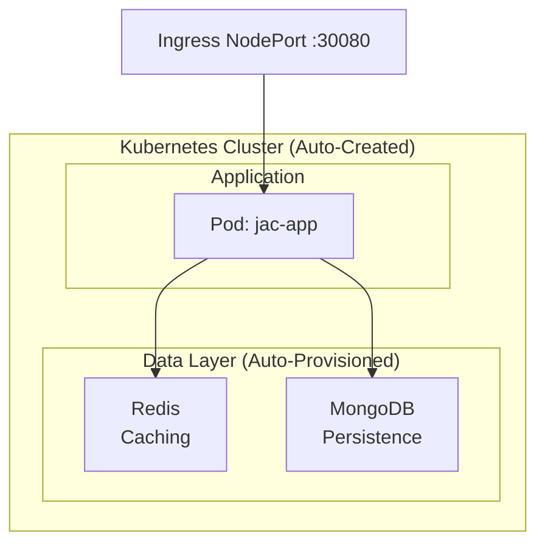

# Kubernetes Deployment

Moving from a local API server to a production Kubernetes deployment typically requires writing Dockerfiles, Kubernetes manifests, configuring databases, and setting up monitoring. The `jac-scale` plugin eliminates this boilerplate: `jac start --scale` generates and applies all the necessary Kubernetes resources automatically -- your application, a MongoDB instance for graph persistence, Redis for caching, and optionally Prometheus/Grafana for monitoring.

This tutorial prioritizes deploying to a local Kubernetes cluster with MicroK8s on Ubuntu (recommended). Docker Desktop, Minikube, and cloud providers (EKS, GKE, AKS) are also supported when `kubectl` is properly configured.

> **Prerequisites**
>
> - Completed: [Local API Server](local.md)
> - Kubernetes cluster running (MicroK8s recommended; Docker Desktop, Minikube, or cloud provider also supported)
> - `kubectl` configured
> - jac-scale installed and enabled:
>
>   ```bash
>   pip install jac-scale
>   ```
>
> - Time: ~10 to 20 minutes (depends on internet speed and machine resources)

---

## Overview

`jac start --scale` handles everything automatically:

- Deploys your application to Kubernetes
- Auto-provisions Redis (caching) and MongoDB (persistence)
- Creates all necessary Kubernetes resources
- Exposes your application through NGINX ingress NodePort on local clusters



---

## Quick Start

### 1. Prepare Your Application

```jac
# main.jac
node Todo {
    has title: str;
    has done: bool = False;
}

walker:pub add_todo {
    has title: str;

    can create with Root entry {
        todo = here ++> Todo(title=self.title);
        report {"title": todo[0].title, "done": todo[0].done};
    }
}

walker:pub list_todos {
    can fetch with Root entry {
        todos = [-->][?:Todo];
        report [{"title": t.title, "done": t.done} for t in todos];
    }
}

walker:pub health {
    can check with Root entry {
        report {"status": "healthy"};
    }
}
```

### 2. Deploy to Kubernetes

!!! note
    `main.jac` is the default entry point for `jac start`. If your entry point has a different name (e.g., `app.jac`), pass it explicitly: `jac start app.jac --scale`.

```bash
jac start --scale
```

!!! tip
    Ensure your Kubernetes cluster is running before deploy.

    - If MicroK8s is not installed yet, install it first (see [Option A: MicroK8s](#option-a-microk8s-ubuntu-recommended)).
    - If MicroK8s is already installed, start/check readiness before deploy:

    ```bash
    microk8s start
    microk8s status --wait-ready
    ```

That's it. Your application is now running on Kubernetes.

**Access your application (default local setup):**

- API: <http://localhost:30080>
- Swagger docs: <http://localhost:30080/docs>

---

## Deployment Modes

### Development Mode (Default)

Deploys without building a Docker image. Fastest for iteration.

```bash
jac start --scale
```

### Production Mode

Builds a Docker image and pushes to DockerHub before deploying.

```bash
jac start --scale --build
```

**Requirements for production mode:**

Create a `.env` file with your Docker credentials:

```env
DOCKER_USERNAME=your-dockerhub-username
DOCKER_PASSWORD=your-dockerhub-password-or-token
```

---

## Configuration

Configure deployment in `jac.toml`:

```toml
[plugins.scale.kubernetes]
app_name = "jaseci"
namespace = "default"
ingress_node_port = 30080
```

### Application Settings

| Key | Description | Default |
|----------|-------------|---------|
| `app_name` | Name of your application | `jaseci` |
| `namespace` | Kubernetes namespace | `default` |
| `ingress_node_port` | Local ingress NodePort for app access | `30080` |
| `container_port` | Container port exposed by the app | `8000` |
| `docker_image_name` | Docker image name (defaults to `{app_name}:latest`) | `""` |
| `docker_username` | DockerHub username for image push | `""` |
| `docker_password` | DockerHub password/token for image push | `""` |

### Resource Limits

| Key | Description | Default |
|----------|-------------|---------|
| `cpu_request` | CPU request | `null` |
| `cpu_limit` | CPU limit | `null` |
| `memory_request` | Memory request | `null` |
| `memory_limit` | Memory limit | `null` |

### Health Checks

| Key | Description | Default |
|----------|-------------|---------|
| `readiness_initial_delay` | Readiness probe delay (seconds) | `10` |
| `readiness_period` | Readiness probe interval (seconds) | `20` |
| `liveness_initial_delay` | Liveness probe delay (seconds) | `10` |
| `liveness_period` | Liveness probe interval (seconds) | `20` |
| `liveness_failure_threshold` | Consecutive liveness failures before restart | `80` |

### Database Options

| Key | Description | Default |
|----------|-------------|---------|
| `mongodb_enabled` | Enable MongoDB deployment | `true` |
| `redis_enabled` | Enable Redis deployment | `true` |
| `mongodb_storage_size` | MongoDB PVC size | `1Gi` |
| `pvc_size` | Shared/default PVC size | `5Gi` |

### Scaling and Ingress

| Key | Description | Default |
|----------|-------------|---------|
| `min_replicas` | Minimum HPA replicas | `1` |
| `max_replicas` | Maximum HPA replicas | `3` |
| `cpu_utilization_target` | HPA CPU target (%) | `50` |
| `ingress_limit_rps` | Ingress request rate limit per client | `20` |
| `ingress_limit_burst_multiplier` | Burst multiplier for rate limiting | `5` |
| `ingress_limit_connections` | Max concurrent connections per client | `20` |
| `ingress_session_affinity` | Enable sticky sessions | `true` |

### TLS and Service Account (Optional)

| Key | Description | Default |
|----------|-------------|---------|
| `domain` | Domain used for ingress/TLS setup | `""` |
| `cert_manager_email` | Email for cert-manager ACME issuer | `""` |
| `service_account_name` | Pre-created ServiceAccount to run pods as | `""` |

### Kubernetes-Only Runtime Env Behavior

These are runtime environment behaviors used in Kubernetes mode:

- `KUBERNETES_SERVICE_HOST`: signals in-cluster Kubernetes runtime.
- `POD_NAMESPACE`: used to resolve in-cluster namespace for service DNS.
- `.env` pass-through: `jac start --scale` loads `.env`; for Kubernetes deploys,
  `.env` keys are injected into app pod environment variables.

---

## Remote Clusters and Image Registry

Local clusters (Docker Desktop, Minikube, k3d, kind) load the built image directly into the cluster's container runtime. **Remote clusters (EKS, GKE, AKS, anything you reach over the network) cannot do this** -- they pull images from a registry the cluster has IAM/auth to read.

For a remote cluster, set `image_registry` in `jac.toml` so the build pipeline pushes there before applying manifests:

```toml
[plugins.scale.kubernetes]
image_registry = "${ECR_REGISTRY}"   # e.g. 123456789012.dkr.ecr.us-east-2.amazonaws.com
```

`${ENV_VAR}` interpolation lets you keep the registry URL out of source control -- export it from `.env` or your CI runner. The build pipeline tags the image as `<registry>/<app_name>:dev-<sha12>` and pushes before `kubectl apply`. Image tags are content-addressed (the `<sha12>` suffix changes whenever the source does), so subsequent rebuilds trigger an automatic rolling update.

You also need to give your CI runner or developer machine permission to push to the registry. For ECR, that's typically `aws ecr get-login-password | docker login` plus an IAM policy granting `ecr:*` on the repo.

---

## Cross-Service Shared Filesystem

When two services need to read and write the same files (e.g. an IDE backend and a build worker that both touch a project workspace), declare a shared volume that gets mounted on both pods:

```toml
[[plugins.scale.microservices.shared_volumes]]
name = "workspace"
mount_path = "/data/workspace"
services = ["builder_sv", "build_worker"]

# Cloud K8s (RWX storage class - EFS / Filestore / Azure Files):
size = "10Gi"
access_mode = "ReadWriteMany"
storage_class = "efs-sc"

# OR for local dev clusters (k3d/kind/minikube), use a hostPath instead:
# host_path = "/var/lib/myapp-workspace"
```

Each entry is an array-of-tables (note the double brackets), so you can declare multiple shared volumes in the same project. The microservice target creates one PersistentVolumeClaim per entry and adds the corresponding `volumeMount` to every service named in `services`. PVCs and mounts come up in the right order during `apply_manifests`, so pods do not crash-loop with "PVC not found".

> **Note on EFS access points.** EFS CSI access points enforce a POSIX UID on every file. The shipped image marks `*` as a [git safe.directory](https://git-scm.com/docs/git-config#Documentation/git-config.txt-safedirectory) so in-pod `git` commands inside the shared volume do not trip CVE-2022-24765 ownership checks when the EFS UID differs from the pod's running UID. If you bake your own image, add `RUN git config --system --add safe.directory '*'`.

---

## Pre-Bound ServiceAccount

By default microservice + gateway pods run as the namespace's `default` ServiceAccount, which has no RBAC. Apps that talk to the cluster API at runtime (sandbox-spawning, operator-style controllers, K8s Job / CronJob managers) need a ServiceAccount pre-bound with the right Role / ClusterRole. The microservice target does not create the SA -- it only references one you provide:

```toml
[plugins.scale.kubernetes]
service_account_name = "myapp-sa"
```

The SA must already exist in the target namespace, and any RoleBindings or ClusterRoleBindings it needs must already be applied (typically by your platform team or a separate Helm/Terraform run that owns cluster-scoped policy). Once set, every microservice pod and the gateway pod run under that SA, and any in-pod K8s API client picks up the SA's token automatically from the projected volume at `/var/run/secrets/kubernetes.io/serviceaccount/`.

Auto-creating the SA + RoleBindings from `jac.toml` is on the roadmap but not yet shipped -- treat the SA as a prerequisite that lives outside the project repo for now.

---

## Managing Your Deployment

### Check Status

Use `jac status main.jac` to see the health of all deployment components at a glance:

```bash
jac status main.jac
```

This displays a table showing each component's status (Running, Degraded, Pending, Restarting, or Not Deployed), pod readiness counts, and service URLs.

For lower-level debugging, you can also use `kubectl` directly:

```bash
kubectl get pods
kubectl get services
```

All jac-scale resources are labeled with `managed: jac-scale`, so you can list everything it owns:

```bash
kubectl get all -l managed=jac-scale
```

### View Logs

```bash
kubectl logs -l app=jaseci -f
```

### Clean Up

Remove all Kubernetes resources created by jac-scale:

```bash
jac destroy main.jac
```

This removes:

- Application deployments and pods
- Redis and MongoDB StatefulSets
- Services and persistent volumes
- ConfigMaps and secrets

---

## How It Works

When you run `jac start --scale`, the following happens automatically:

1. **Namespace Setup** - Creates or uses the specified Kubernetes namespace
2. **Database Provisioning** - Deploys Redis and MongoDB as StatefulSets with persistent storage (first run only)
3. **Application Deployment** - Creates a deployment for your Jac application
4. **Service Exposure** - Exposes the application via NodePort

Subsequent deployments only update the application - databases persist across deployments.

---

## Setting Up Kubernetes

### Option A: MicroK8s (Ubuntu Recommended)

Official docs:

- [MicroK8s Home](https://microk8s.io/)
- [MicroK8s Getting Started](https://microk8s.io/docs/getting-started)

```bash
# Install MicroK8s from snap.
sudo snap install microk8s --classic

# Add current user to the microk8s group (needed to run microk8s without sudo).
sudo usermod -a -G microk8s $USER

# Apply new group membership in the current shell (or log out and back in).
newgrp microk8s

# Wait until MicroK8s reports the cluster as ready.
microk8s status --wait-ready

# Ensure required addons are enabled for deployment.
microk8s enable dns ingress hostpath-storage
```

### Option B: Docker Desktop

1. Install [Docker Desktop](https://www.docker.com/products/docker-desktop/)
2. Open Settings > Kubernetes
3. Check "Enable Kubernetes"
4. Click "Apply & Restart"

### Option C: Minikube

```bash
# Install minikube
brew install minikube  # macOS
# or see https://minikube.sigs.k8s.io/docs/start/

# Start cluster
minikube start

# For minikube, access via service helper:
minikube service jaseci -n default
# Or use the same ingress entry used in this guide:
# http://localhost:30080
```

---

## Troubleshooting

### Application not accessible

```bash
# Check all component statuses at once
jac status main.jac

# Or use kubectl for more detail
microk8s kubectl get pods
microk8s kubectl get svc

# Default local ingress access
# http://localhost:30080
```

### Database connection issues

```bash
# Check StatefulSets
kubectl get statefulsets

# Check persistent volumes
kubectl get pvc

# View database logs
kubectl logs -l app=mongodb
kubectl logs -l app=redis
```

### Build failures (--build mode)

- Ensure Docker daemon is running
- Verify `.env` has correct `DOCKER_USERNAME` and `DOCKER_PASSWORD`
- Check disk space for image building

### General debugging

```bash
# Quick overview of all components
jac status main.jac

# Describe a pod for events
kubectl describe pod <pod-name>

# Get all jac-scale managed resources
kubectl get all -l managed=jac-scale

# Check events
kubectl get events --sort-by='.lastTimestamp'
```

---

## Example: Full-Stack App with Auth

```bash
# Create a new full-stack project
jac create todo --use client
cd todo

# Deploy to Kubernetes
jac start --scale
```

Access:

- Frontend: http://localhost:30080/cl/app
- Backend API: http://localhost:30080
- Swagger docs: http://localhost:30080/docs

---

## Next Steps

- [Local API Server](local.md) - Development without Kubernetes
- [Authentication](../fullstack/auth.md) - Add user authentication
- [jac-scale Reference](../../reference/plugins/jac-scale.md) - Full configuration options
