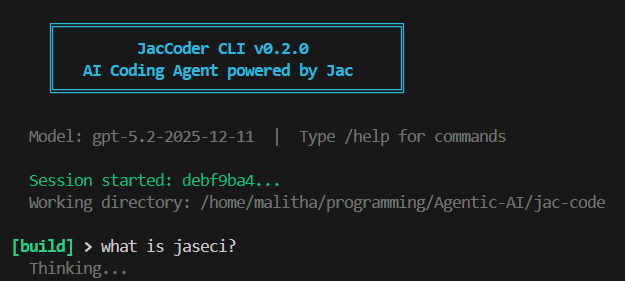
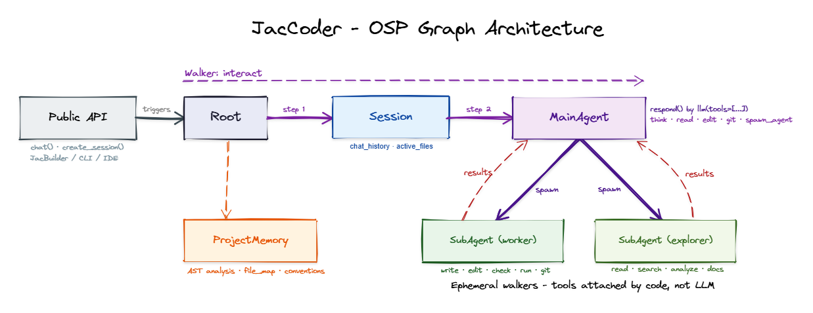

# JacCoder



AI coding agent for the Jaseci stack, built entirely in [Jac](https://github.com/jaseci-labs/jaseci) using Object-Spatial Programming. Features an orchestrator-worker architecture with compiler-level Jac Intelligence, self-correcting code writes, and in-process SubAgent delegation.

## Architecture



## Features

- **Orchestrator-Worker Architecture** - MainAgent handles tasks directly or delegates to focused SubAgents (WorkerRunner / ExplorerRunner)
- **Jac Intelligence** - compiler-level AST analysis via jaclang (`analyze_project`, `find_symbol`)
- **22 Built-in Tools** - filesystem, search, git, shell, web, Jac compiler, scaffolding, delegation
- **Self-Correcting Writes** - automatic `jac check` on `.jac` file writes with error feedback
- **In-Process SubAgents** - no subprocess overhead, shared event system, capability-scoped tools
- **Multi-Provider LLM** - 100+ models via [byllm](https://github.com/jaseci-labs/byllm)
- **Public API** - clean interface for external apps (JacBuilder, IDE extensions)
- **Context Management** - smart compaction keeps conversations under token budget

## Prerequisites

- Python 3.12+
- jaclang, byllm, jac-super

```bash
pip install jaclang byllm jac-super python-dotenv
```

## Quick Start

```bash
# Set API key
export OPENAI_API_KEY="sk-..."

# Interactive REPL
jac cli.jac

# Single prompt (non-interactive)
jac cli.jac run "build a hello world jac app at /tmp/myapp"

# Resume a session
jac cli.jac session <id-prefix>
```

## Architecture

```
Root → Session → MainAgent
                    ├── handles simple tasks directly (read, search, edit, git)
                    └── spawn_agent() → WorkerRunner (read+write) or ExplorerRunner (read-only)
                                         └── runs in-process, returns result to MainAgent
```

- **MainAgent (node)** - orchestrator with 25 tools. Handles simple tasks directly, delegates complex work.
- **WorkerRunner (obj)** - in-process SubAgent with 18 tools (can write/edit/run). Full Jac syntax rules.
- **ExplorerRunner (obj)** - in-process SubAgent with 10 tools (read-only). For investigation tasks.
- **Session (node)** - persistent chat state, history, active files, errors.
- **ProjectMemory (node)** - AST-derived codebase knowledge (nodes, walkers, edges, imports).

## Tools

| Tool | Description |
|------|-------------|
| `read_file` | Read files with line numbers and pagination |
| `write_code` | Write file with auto `jac_check` validation |
| `edit_code` | Find-and-replace with auto `jac_check` validation |
| `find_files` | Find files by glob pattern |
| `grep_search` | Regex search across files |
| `list_files` | List directory contents |
| `run_command` | Execute shell commands (permission-guarded) |
| `jac_check` | Type-check `.jac` files |
| `jac_run` | Run `.jac` files |
| `jac_docs` | Search Jac language reference and examples |
| `analyze_project` | Full AST analysis of a Jac project |
| `find_symbol` | Find symbol definitions, usages, and imports |
| `git_status` | Show working tree status |
| `git_diff` | Show uncommitted changes |
| `git_log` | Show recent commit history |
| `git_commit` | Stage and commit changes |
| `think` | Explicit reasoning step before acting |
| `spawn_agent` | Delegate task to a SubAgent (worker/explorer) |
| `web_fetch` | Fetch URL content |
| `web_search` | Web search via DuckDuckGo |
| `scaffold_project` | Generate project templates |
| `ask_question` | Prompt user for input |
| `update_todos` | Track multi-step task progress |

## Public API

External apps import only from `jac_coder.api`:

```python
from jac_coder.api import initialize, create_session, chat, close_session

initialize("web")
session = create_session("/path/to/project", title="My App")
result = chat(session["session_id"], "build a calculator")
print(result["response"])
```

## Configuration

Config sources (highest priority first):

1. Environment: `MODEL`, `TEMPERATURE`, `MAX_TOKENS`, `MAX_REACT_ITERATIONS`
2. Project: `./jaccoder.json`
3. Global: `~/.jaccoder/config.json`

## Testing

```bash
python -m pytest tests/ -v    # 58 tests
```

## Project Structure

```
jac-code/
├── cli.jac                   # CLI entry point (REPL + subcommands)
├── jac_coder/                # Core package
│   ├── api.jac               # Public API (the only module external apps import)
│   ├── nodes.jac             # MainAgent, WorkerRunner, ExplorerRunner, Session, ProjectMemory
│   ├── walkers.jac           # Walker definitions (interact, new_session, etc.)
│   ├── config.jac            # Multi-source config + LLM init
│   ├── context.jac           # Smart context compaction
│   ├── events.jac            # Tool event system + turn summaries
│   ├── memory.jac            # AST-based project memory
│   ├── permission.jac        # Permission rule engine
│   ├── tool/                 # 22 tools organized by domain
│   │   ├── delegation.jac    # spawn_agent (in-process SubAgent execution)
│   │   ├── think.jac         # Chain-of-thought reasoning
│   │   ├── git.jac           # Git operations
│   │   ├── jac_analyzer.jac  # AST-based Jac Intelligence
│   │   └── ...
│   ├── data/                 # Jac syntax rules (build_rules, client_rules, server_rules)
│   └── impl/                 # Implementation files
├── tests/                    # 58 tests (pytest + jac)
└── docs/                     # Architecture, roadmap, progress
```
