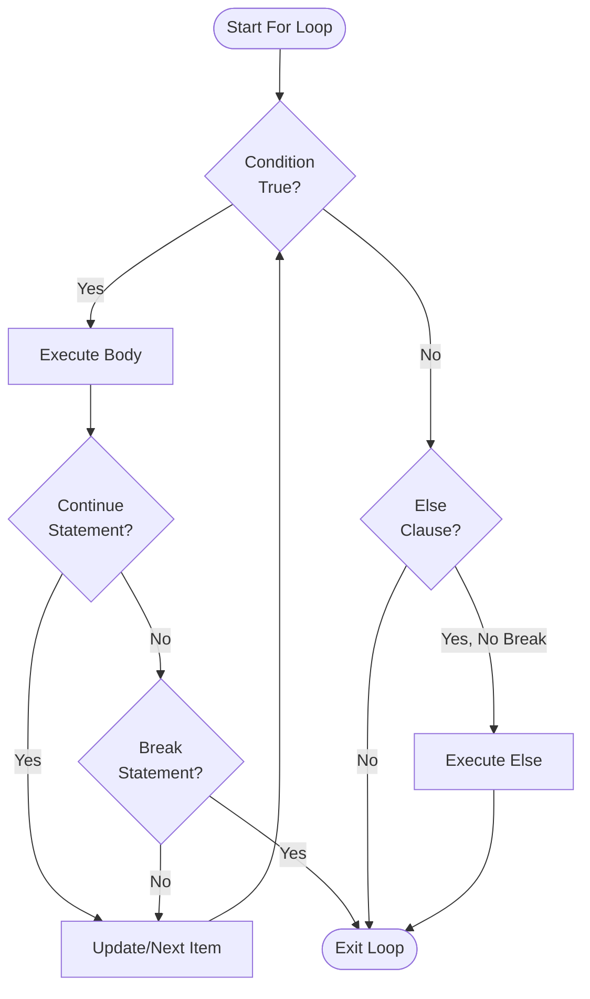

**For Statements in Jac**

For loops provide iteration over collections and sequences. Jac offers two distinct loop styles: the `for-in` pattern for iterating collections, and the `for-to-by` pattern for explicit counter control.

**Basic For-In Loop**

The simplest iteration pattern uses `for-in` to loop through collections (lines 5-7):

The loop variable `x` takes each value from the list in sequence. This works with any iterable: lists, tuples, sets, dictionaries, strings, and ranges.

**For-In with Range**

Lines 10-12 demonstrate using `range()` to generate numeric sequences. This produces values 0 through 4. The `range()` function is lazy, generating values on demand rather than creating a full list in memory.

**For-To-By Loop (Jac's C-Style Loop)**

Lines 15-17 show Jac's unique three-part loop syntax. This loop has three components:

- **Initialization** (`i=0`): Sets the starting value
- **Condition** (`to i<5`): Loop continues while true
- **Increment** (`by i+=1`): Executed after each iteration

This provides explicit control similar to C's `for(int i=0; i<5; i++)` but with more readable syntax.

**Counting Down**

Line 20-22 shows decrementing with `for-to-by`. The loop starts at 10, continues while `i>0`, and decrements by 1 each iteration.

**Custom Step Values**

Lines 25-27 demonstrate non-unit steps. This produces even numbers: 0, 2, 4, 6, 8.

**For-Else Clause**

Lines 30-34 introduce the `else` clause, which executes only if the loop completes normally (without `break`). This pattern is useful for search operations: if you break when finding an item, the else clause indicates "not found."

**Breaking Out of Loops**

Lines 37-44 show how `break` exits the loop immediately and skips the else clause. Output: 0, 1, 2 (the else block doesn't execute).

**Continue Statement**

Lines 47-52 demonstrate `continue`, which skips to the next iteration. This prints only odd numbers: 1, 3.

**Nested Loops**

Lines 55-59 show loops within loops. Both `for-in` and `for-to-by` loops can be nested and mixed freely.

**Iterating Strings**

Lines 62-64 demonstrate character iteration. Strings are iterable sequences of characters.

**Dictionary Iteration**

Lines 67-70 show that iterating a dictionary yields its keys. Use `.values()` for values or `.items()` for key-value pairs.

**Mixed Loop Types**

Lines 73-77 demonstrate combining different loop styles. The outer loop uses `for-in` while the inner uses `for-to-by`.

**Tuple Unpacking**

Line 87 introduces tuple unpacking in for loops:

```jac
for (a, b) in pairs {
    print(f"a={a}, b={b}");
}
```

When iterating over a collection of tuples, you can unpack each tuple directly into multiple variables. This is particularly useful for key-value pairs, coordinates, or any structured data.

**List Unpacking**

Line 96 shows list unpacking:

```jac
for (x, y, z) in matrix {
    print(f"x={x}, y={y}, z={z}");
}
```

Note: In Jac, both list and tuple unpacking use parentheses `()` in the transpiled code. Each element of the matrix is unpacked into three variables `x`, `y`, and `z`.

**Nested Unpacking**

Line 105 demonstrates unpacking nested structures:

```jac
for (name, (x, y)) in nested {
    print(f"{name}: x={x}, y={y}");
}
```

The outer tuple contains a name and an inner tuple of coordinates. Jac recursively unpacks both levels, giving you access to `name`, `x`, and `y` directly.

**Star Unpacking (Rest of Elements)**

Line 114 introduces star unpacking with `*rest`:

```jac
for (first, *rest) in items {
    print(f"first={first}, rest={rest}");
}
```

The first element goes to `first`, and all remaining elements are collected into a list called `rest`. This is useful when you only care about the first few elements but want to capture the remainder.

**Star Unpacking in Middle**

Line 123 shows that star unpacking can appear in the middle of the pattern:

```jac
for (first, *middle, last) in sequences {
    print(f"first={first}, middle={middle}, last={last}");
}
```

Here, `first` gets the first element, `last` gets the final element, and `middle` collects everything in between as a list.

**Dictionary Items Unpacking**

Line 136 demonstrates unpacking dictionary items:

```jac
for (key, value) in data.items() {
    print(f"{key}: {value}");
}
```

The `.items()` method returns key-value pairs as tuples, which are unpacked into `key` and `value` variables. This is the idiomatic way to iterate dictionaries when you need both keys and values.

**Enumerate with Unpacking**

Line 145 combines `enumerate()` with unpacking:

```jac
for (i, (x, y)) in enumerate(coords) {
    print(f"Point {i}: ({x}, {y})");
}
```

The `enumerate()` function returns `(index, item)` pairs. When items are themselves tuples, you can unpack both the index and the tuple elements in a single pattern: `(i, (x, y))`.

**Zip with Unpacking**

Line 155 shows `zip()` with unpacking:

```jac
for (x, y) in zip(xs, ys) {
    print(f"x={x}, y={y}");
}
```

The `zip()` function pairs up elements from multiple iterables. Each pair is unpacked into separate variables, making it easy to iterate multiple sequences in parallel.

**Complex Unpacking**

Line 166 demonstrates the most complex pattern: combining `enumerate()`, `zip()`, and nested unpacking:

```jac
for (i, (a, b, c)) in enumerate(zip(as_, bs, cs)) {
    print(f"Index {i}: a={a}, b={b}, c={c}");
}
```

This gives you the index and three unpacked values from three zipped lists, all in a single elegant loop.

**Loop Control Flow Summary**

| Statement | Effect | Else Clause Behavior |
|-----------|--------|---------------------|
| `break` | Exit loop immediately | Skipped |
| `continue` | Skip to next iteration | Not affected |
| Normal completion | Loop finishes naturally | Executes (if present) |

**For Loop Variations**

| Form | Syntax | Use Case |
|------|--------|----------|
| for-in | `for var in iterable` | Iterate collections |
| for-to-by | `for i=start to cond by step` | Explicit counter control |
| for-else | `for ... { } else { }` | Detect uninterrupted completion |
| tuple unpack | `for (a, b) in pairs` | Unpack structured data |
| nested unpack | `for (a, (b, c)) in data` | Unpack nested structures |
| star unpack | `for (a, *rest) in items` | Capture remaining elements |

**Unpacking Patterns Summary**

| Pattern | Example | Result |
|---------|---------|--------|
| Simple tuple | `for (a, b) in pairs` | `a`, `b` from each pair |
| Nested | `for (name, (x, y)) in data` | `name`, `x`, `y` unpacked |
| Star at end | `for (first, *rest) in items` | `first` + list of rest |
| Star in middle | `for (a, *mid, z) in items` | `a`, list, `z` |
| Dict items | `for (k, v) in d.items()` | Key-value pairs |
| Enumerate | `for (i, val) in enumerate(lst)` | Index and value |
| Zip | `for (x, y) in zip(xs, ys)` | Paired elements |

**Loop Flow Visualization**



**Common Patterns**

Filtering during iteration:

```jac
for x in items {
    if x > 10 {
        print(x);
    }
}
```

Aggregating values:

```jac
glob total = 0;
with entry {
    for x in [1, 2, 3, 4, 5] {
        total += x;
    }
}
```

Finding with for-else:

```jac
for item in items {
    if item == target {
        print("Found!");
        break;
    }
} else {
    print("Not found");
}
```

Processing paired data:

```jac
for (name, score) in students {
    print(f"{name}: {score}");
}
```

**Key Differences from Python**

1. **Braces required**: Jac uses `{ }` for loop bodies, not indentation
2. **Semicolons required**: Each statement ends with `;`
3. **For-to-by syntax**: Unique to Jac, provides C-style explicit control
4. **Same else clause**: Works identically to Python
5. **Same unpacking**: Tuple, list, and star unpacking work exactly like Python
6. **Parentheses in unpacking**: Jac transpiler uses `(a, b)` for all unpacking patterns

**Tuple Unpacking**

Line 87 introduces tuple unpacking in for loops:

```jac
for (a, b) in pairs {
    print(f"a={a}, b={b}");
}
```

When iterating over a collection of tuples, you can unpack each tuple directly into multiple variables. This is particularly useful for key-value pairs, coordinates, or any structured data.

**List Unpacking**

Line 96 shows list unpacking:

```jac
for (x, y, z) in matrix {
    print(f"x={x}, y={y}, z={z}");
}
```

Note: In Jac, both list and tuple unpacking use parentheses `()` in the transpiled code. Each element of the matrix is unpacked into three variables `x`, `y`, and `z`.

**Nested Unpacking**

Line 105 demonstrates unpacking nested structures:

```jac
for (name, (x, y)) in nested {
    print(f"{name}: x={x}, y={y}");
}
```

The outer tuple contains a name and an inner tuple of coordinates. Jac recursively unpacks both levels, giving you access to `name`, `x`, and `y` directly.

**Star Unpacking (Rest of Elements)**

Line 114 introduces star unpacking with `*rest`:

```jac
for (first, *rest) in items {
    print(f"first={first}, rest={rest}");
}
```

The first element goes to `first`, and all remaining elements are collected into a list called `rest`. This is useful when you only care about the first few elements but want to capture the remainder.

**Star Unpacking in Middle**

Line 123 shows that star unpacking can appear in the middle of the pattern:

```jac
for (first, *middle, last) in sequences {
    print(f"first={first}, middle={middle}, last={last}");
}
```

Here, `first` gets the first element, `last` gets the final element, and `middle` collects everything in between as a list.

**Dictionary Items Unpacking**

Line 136 demonstrates unpacking dictionary items:

```jac
for (key, value) in data.items() {
    print(f"{key}: {value}");
}
```

The `.items()` method returns key-value pairs as tuples, which are unpacked into `key` and `value` variables. This is the idiomatic way to iterate dictionaries when you need both keys and values.

**Enumerate with Unpacking**

Line 145 combines `enumerate()` with unpacking:

```jac
for (i, (x, y)) in enumerate(coords) {
    print(f"Point {i}: ({x}, {y})");
}
```

The `enumerate()` function returns `(index, item)` pairs. When items are themselves tuples, you can unpack both the index and the tuple elements in a single pattern: `(i, (x, y))`.

**Zip with Unpacking**

Line 155 shows `zip()` with unpacking:

```jac
for (x, y) in zip(xs, ys) {
    print(f"x={x}, y={y}");
}
```

The `zip()` function pairs up elements from multiple iterables. Each pair is unpacked into separate variables, making it easy to iterate multiple sequences in parallel.

**Complex Unpacking**

Line 166 demonstrates the most complex pattern: combining `enumerate()`, `zip()`, and nested unpacking:

```jac
for (i, (a, b, c)) in enumerate(zip(as_, bs, cs)) {
    print(f"Index {i}: a={a}, b={b}, c={c}");
}
```

This gives you the index and three unpacked values from three zipped lists, all in a single elegant loop.

**Loop Control Flow Summary**

| Statement | Effect | Else Clause Behavior |
|-----------|--------|---------------------|
| `break` | Exit loop immediately | Skipped |
| `continue` | Skip to next iteration | Not affected |
| Normal completion | Loop finishes naturally | Executes (if present) |

**For Loop Variations**

| Form | Syntax | Use Case |
|------|--------|----------|
| for-in | `for var in iterable` | Iterate collections |
| for-to-by | `for i=start to cond by step` | Explicit counter control |
| for-else | `for ... { } else { }` | Detect uninterrupted completion |
| tuple unpack | `for (a, b) in pairs` | Unpack structured data |
| nested unpack | `for (a, (b, c)) in data` | Unpack nested structures |
| star unpack | `for (a, *rest) in items` | Capture remaining elements |

**Unpacking Patterns Summary**

| Pattern | Example | Result |
|---------|---------|--------|
| Simple tuple | `for (a, b) in pairs` | `a`, `b` from each pair |
| Nested | `for (name, (x, y)) in data` | `name`, `x`, `y` unpacked |
| Star at end | `for (first, *rest) in items` | `first` + list of rest |
| Star in middle | `for (a, *mid, z) in items` | `a`, list, `z` |
| Dict items | `for (k, v) in d.items()` | Key-value pairs |
| Enumerate | `for (i, val) in enumerate(lst)` | Index and value |
| Zip | `for (x, y) in zip(xs, ys)` | Paired elements |

**Common Patterns**

Filtering during iteration:

```jac
for x in items {
    if x > 10 {
        print(x);
    }
}
```

Aggregating values:

```jac
glob total = 0;
with entry {
    for x in [1, 2, 3, 4, 5] {
        total += x;
    }
}
```

Finding with for-else:

```jac
for item in items {
    if item == target {
        print("Found!");
        break;
    }
} else {
    print("Not found");
}
```

Processing paired data:

```jac
for (name, score) in students {
    print(f"{name}: {score}");
}
```

**Key Differences from Python**

1. **Braces required**: Jac uses `{ }` for loop bodies, not indentation
2. **Semicolons required**: Each statement ends with `;`
3. **For-to-by syntax**: Unique to Jac, provides C-style explicit control
4. **Same else clause**: Works identically to Python
5. **Same unpacking**: Tuple, list, and star unpacking work exactly like Python
6. **Parentheses in unpacking**: Jac transpiler uses `(a, b)` for all unpacking patterns
