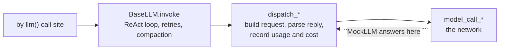

# Testing byLLM

How the byLLM suite fakes a model, which helper to reach for, and the rules a new test
follows. The helpers live in [`support.jac`](support.jac).

## Running it

```bash
# Once per binary: the dependencies CI installs for this suite.
jac install "litellm>=1.75.2,<=1.82.6" "pillow>=12.0.0,<13.0.0" \
  "httpx>=0.27.0" "loguru>=0.7.2,<0.8.0" --global

# The suite, as CI's byllm lane runs it.
JAC_TEST_STRICT=1 jac test jac/jaclang/byllm/tests \
  --ignore jac/jaclang/byllm/tests/test_mtir_integration.jac

# One file, or one test in it.
JAC_TEST_STRICT=1 jac test jac/jaclang/byllm/tests/test_usage.jac -t "usage_step fires for the recovery call"

# The MTIR file, from a copy outside the checkout, as the sealed lane runs it.
cp -r jac/jaclang/byllm/tests /tmp/byllm-tests
JAC_TEST_STRICT=1 jac test /tmp/byllm-tests/test_mtir_integration.jac
```

`JAC_TEST_STRICT=1` fails a file whose optional dependency is missing instead of skipping
it; CI always sets it.

`test_mtir_integration.jac` runs in place too, but three of its tests skip there. A file
inside the jaclang package compiles into the compiler's own program, so the MTIR a
fixture registers never reaches `JacRuntime.program`, which is what those tests read.
`need_outside_jaclang()` asks the compiler where a fixture goes and skips when it is the
compiler's own program.

## What is fake and what is real

`MockLLM` replaces only the network call. Everything above it runs as it does in
production: the request byLLM builds, the reply it parses, retries, compaction, usage and
cost.



Because the model name is only a label, `MockLLM(model_name="gpt-4o-mini")` prices its
calls exactly as the real model would.

## Scripting a model

Queue the replies, then read back what was sent.

```jac
llm = MockLLM(outputs=[call("lookup", {"q": "x"}), say("done")]);
def task(q: str) -> str by llm(tools=[lookup]);
assert task("x") == "done";
assert "lookup" in tool_names(llm.seen[0]);
```

| Queue entry | The model... |
|---|---|
| a value (`42`, `Person(...)`, `Level.HIGH`) | answers with that typed value |
| `say(text, usage=, finish_reason=)` | answers with text; `finish_reason="length"` truncates it |
| `call(name, args, call_id=, usage=)` | calls one tool; `args` is a dict or a JSON string |
| `calls([(name, args, id), ...])` | calls several tools in one turn |
| `finish(output, usage=)` | calls `finish_tool` with `output` |
| `fail(error, content=, after=)` | raises `error`; a stream delivers `content` first |
| `(entry, {"prompt_tokens": ...})` | answers with `entry` and reports that usage |

When a queue cannot say it:

| Need | Use |
|---|---|
| a real `Model` or `LocalLLM`, with its own request shaping | `with scripted(model, replies) { ... }` |
| the model the provider reports differs from the one asked for | `ProviderLLM(served_as="...")` |
| a stream carrying litellm's `logging_obj` | `ProviderLLM(logging_obj=...)` |
| a stream that drops after its chunks | `ProviderLLM(breaks={call_index: error})` |
| tool-call fragments with no id or name | `ProviderLLM(unnamed_args=True)` |
| a routing prompt answered by reading its candidates | `RoutingLLM(pick=...)` |

## Reading what happened

| Question | Helper |
|---|---|
| what went out on call `n` | `llm.sent(key)[n]`, `sent_messages(llm, n)` |
| message roles, in order | `roles(llm, n)` |
| the user turn's content blocks and media | `user_blocks(llm, n)`, `media_blocks(llm, n)`, `data_url(block)` |
| did some text reach the model at all | `prompt_text(llm, n)` |
| which tools were offered | `tool_names(params)` |
| the routing candidates offered | `routing_candidates(params)` |
| the events of a `logging=True` stream | `stream_events(stream)`, `events_of(events, kind)`, `event_types(events)` |
| the answer text of a stream | `chunk_text(events)` |
| what byLLM logged | `with capture_logs() as logs`, `with capture_loguru() as logs`, then `logs.text()` |
| every queued reply was used | `llm.exhausted()` |

Lower level:

| Need | Helper |
|---|---|
| an `MTRuntime` to hand a dispatch method directly | `mk_run(resp_type=, tools=, stream=, call_params=, messages=, finish=)` |
| one litellm text chunk | `text_chunk(text)` |
| skip when an optional dependency is missing | `need("PIL", "Pillow")` |

## Fixtures

Everything under `fixtures/` is input, never a test. A `.jac` fixture declares the
`by llm()` functions and types a test needs and nothing else: no model assignment, no
`with entry`, no `print`, no `assert`.

| Kind | Examples | A test uses it by |
|---|---|---|
| program | `basic.jac`, `scope_main.jac`, `enum_no_value.jac` | `load_fixture(name)`, or `JacProgram().compile(fixture_path(file))` |
| graph | `routing_graph.jac`, `agent_graph.jac` | a static `import from fixtures.routing_graph { ... }` |
| config | `compaction_config/`, `jac_toml_gemini/`, `system_prompt_override/` | `get_byllm_config(Path(fixture_path(dir)))` |
| media | `image.jpg`, `SampleVideo_1280x720_2mb.mp4` | `Image(fixture_path(file))` |

## Rules

**Fake the network, not byLLM.** Never patch `model_call_*`, `dispatch_*` or other
byLLM internals to fake a reply; queue it on `MockLLM`, `scripted()` or `ProviderLLM`.
Patch litellm itself (`litellm.completion`, a Router) only when that boundary is what the
test is about.

**Assert on what reached the model or what came back.** Read `llm.sent(...)`, the return
value, the events or the captured log. Never scrape stdout; the one exception is a test
whose subject is that byLLM prints nothing.

**Every test owns its fake.** `load_fixture()` returns a cached module, so a model a
fixture holds is shared by every test that loads it.

**A fixture's model global is `glob llm: any = None;`.** A test assigns its own model
after import. Without `: any` the global infers `NoneType` and the assignment fails
`jac check`.

**Graph fixtures are imported statically.** A module from `load_fixture()` is untyped, so
`root ++> g.Desk()` fails strict checking. Spawn on a node the test creates; never spawn
from `root` or assert on `[root -->]`, which accumulates across tests.

**One test per behavior; variations are rows.** Loop over a table of cases and put the
case label in every assert message.

**Helpers are defined once, here.** A helper two files need goes into `support.jac`.
