# Jac Bootstrap Implementation Plan

> **Goal:** Rearchitect `jaclang` so that the majority of the codebase is written in Jac itself, while maintaining a minimal Python "bootstrap core" that can compile Jac to Python bytecode.

---

## Table of Contents

1. [Executive Summary](#executive-summary)
2. [Current Architecture Analysis](#current-architecture-analysis)
3. [Bootstrap Core Identification](#bootstrap-core-identification)
4. [Conversion Candidates](#conversion-candidates)
5. [Implementation Phases](#implementation-phases)
6. [Technical Challenges & Solutions](#technical-challenges--solutions)
7. [Final Architecture](#final-architecture)
8. [File Inventory](#file-inventory)
9. [Migration Strategy](#migration-strategy)

---

## Executive Summary

### Key Insight

The `jac py2jac` command can convert any Python module to Jac. Combined with Jac's import hooks (`meta_importer.py`), we can:

1. Keep a minimal Python "bootstrap core" (~8,000 LOC)
2. Convert the rest of the compiler to Jac (~45,000+ LOC)
3. Use import hooks to load the Jac-based compiler modules

### Target Metrics

| Metric | Current | Target |
|--------|---------|--------|
| **Total Python LOC** | ~59,000 | ~8,000 |
| **Total Jac LOC** | ~500 (tests only) | ~45,000+ |
| **Bootstrap Core** | N/A | ~8,000 lines |
| **Conversion Ratio** | 0% | ~85% |

---

## Current Architecture Analysis

### Compiler Pipeline

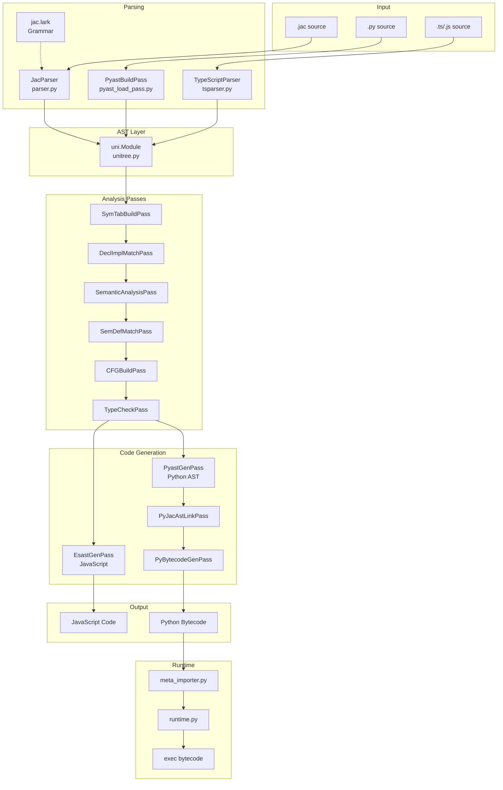

### Module Dependency Graph

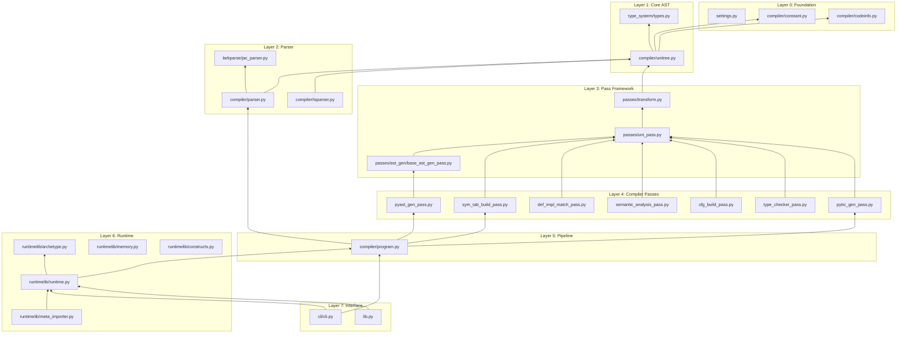

---

## Bootstrap Core Identification

### What MUST Remain in Python

The bootstrap core is the minimal set of Python code required to:
1. Parse Jac source code
2. Build the AST (unitree)
3. Generate Python bytecode
4. Install import hooks to load `.jac` modules

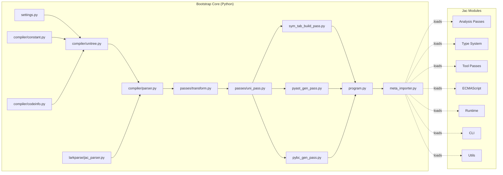

### Bootstrap Core Files

| File | Lines | Reason |
|------|-------|--------|
| `settings.py` | 118 | Configuration needed at startup |
| `compiler/constant.py` | 786 | Enums/tokens for parsing |
| `compiler/codeinfo.py` | 120 | Code location tracking |
| `compiler/unitree.py` | 5,411 | Core AST node definitions |
| `compiler/parser.py` | 3,774 | Lark-based Jac parser |
| `compiler/larkparse/jac_parser.py` | 3,444 | Generated Lark parser |
| `compiler/passes/transform.py` | 175 | Base transform class |
| `compiler/passes/uni_pass.py` | 149 | Base pass class |
| `compiler/passes/main/sym_tab_build_pass.py` | 360 | Symbol table (required for all passes) |
| `compiler/passes/main/pyast_gen_pass.py` | 3,432 | Jac → Python AST |
| `compiler/passes/main/pybc_gen_pass.py` | 49 | Python AST → Bytecode |
| `compiler/program.py` | 220 | Pipeline orchestrator |
| `runtimelib/meta_importer.py` | 192 | Import hook (bootstrap anchor) |
| **TOTAL** | **~18,230** | |

**Note:** Some of these can be trimmed further. The `unitree.py` file contains many node types that could be moved to Jac extensions.

---

## Conversion Candidates

### Files That Can Be Converted to Jac

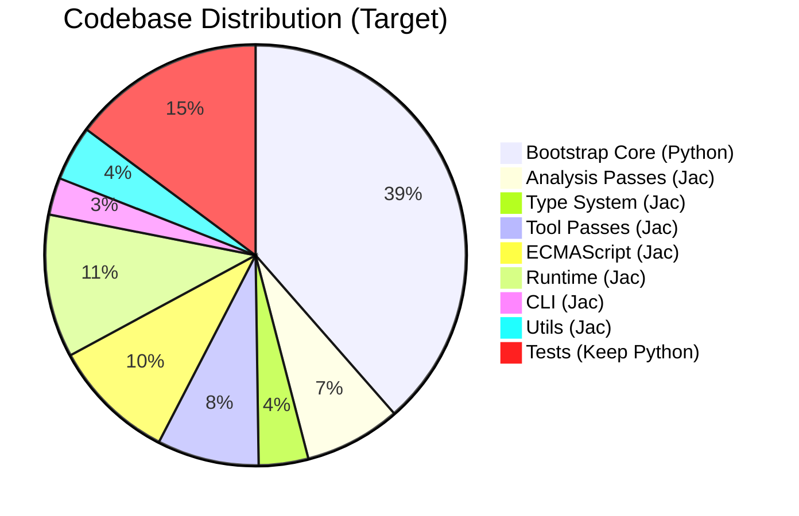

### Conversion Priority Matrix

| Priority | Category | Files | Est. Lines | Risk |
|----------|----------|-------|------------|------|
| **P1** | Leaf Modules | 8 | ~2,500 | Low |
| **P2** | Analysis Passes | 6 | ~1,000 | Medium |
| **P3** | Type System | 3 | ~900 | Medium |
| **P4** | Tool Passes | 4 | ~3,700 | Low |
| **P5** | ECMAScript | 4 | ~4,500 | Medium |
| **P6** | Runtime | 8 | ~3,500 | High |
| **P7** | CLI | 2 | ~1,350 | Medium |
| **P8** | Utils | 6 | ~2,000 | Low |

---

## Implementation Phases

> ⚠️ **CRITICAL INVARIANT:** After completing each phase, the entire codebase MUST remain fully functional with ALL tests passing. No phase is complete until `pytest jac/jaclang/` passes 100%. This ensures we can ship any intermediate state and roll back safely if issues arise.


### Migration Strategy: In-Place Module Swap

> **Key Insight:** Jac's import hooks already support loading `.jac` files from the same paths as `.py` files. This enables a simpler migration strategy:

1. **Convert** - Use `jac py2jac` to convert each `.py` file to `.jac`
2. **Replace** - Delete the `.py` file and place the `.jac` file in the same location
3. **Verify** - Run tests to ensure the swap works correctly
4. **Commit** - Each phase is a complete replacement, not parallel code

This eliminates the need for:
- Separate `bootstrap/` and `jac_modules/` directories
- Feature flags for switching implementations
- Import redirects or re-exports

---

### Phase 1: Post-Bootstrap Module Conversion

**Goal:** Convert modules that are NOT imported during the bootstrap process

> ⚠️ **Key Insight:** Many modules are imported before Jac import hooks are installed during `import jaclang`. Only modules imported AFTER bootstrap can be converted using simple in-place swap.

**Bootstrap Chain (MUST remain Python for now):**
- `utils/log.py` - imported by `meta_importer.py`
- `utils/helpers.py` - imported by `transform.py`
- `runtimelib/mtp.py` - imported by `runtime.py`
- `type_system/types.py` - imported by `unitree.py`
- `type_system/operations.py` - imported by `types.py`
- `passes/ecmascript/estree.py` - imported by `esast_gen_pass.py`

**Strategy:** In-place replacement - convert `.py` → `.jac`, delete `.py`

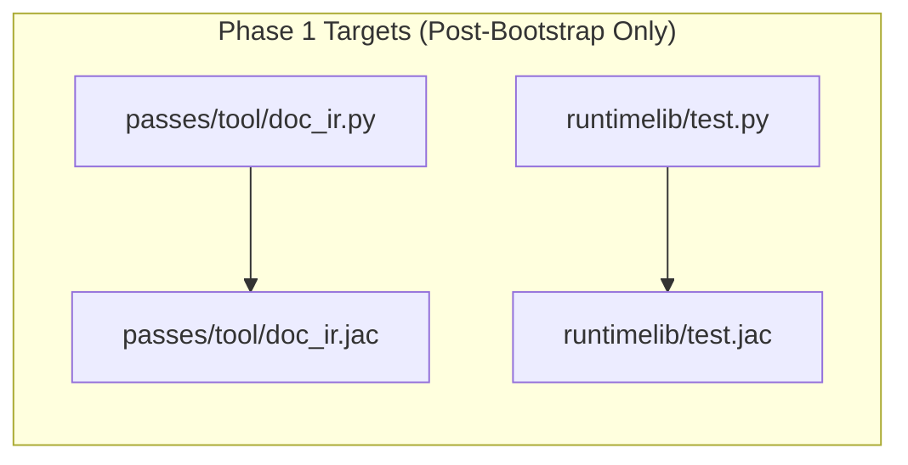

**Conversion Order:**

| Order | File | Lines | Dependencies |
|-------|------|-------|--------------|
| 1.1 | `runtimelib/test.py` | 145 | stdlib only |
| 1.2 | `passes/tool/doc_ir.py` | 192 | stdlib only |
| 1.5 | `passes/ecmascript/estree.py` | 978 | stdlib only |
| 1.6 | `type_system/types.py` | 415 | constant.py |
| 1.7 | `utils/helpers.py` | 403 | settings.py |
| 1.8 | `type_system/operations.py` | 164 | types.py |

---

### Phase 2: Analysis Passes Conversion

**Goal:** Convert non-codegen compiler passes

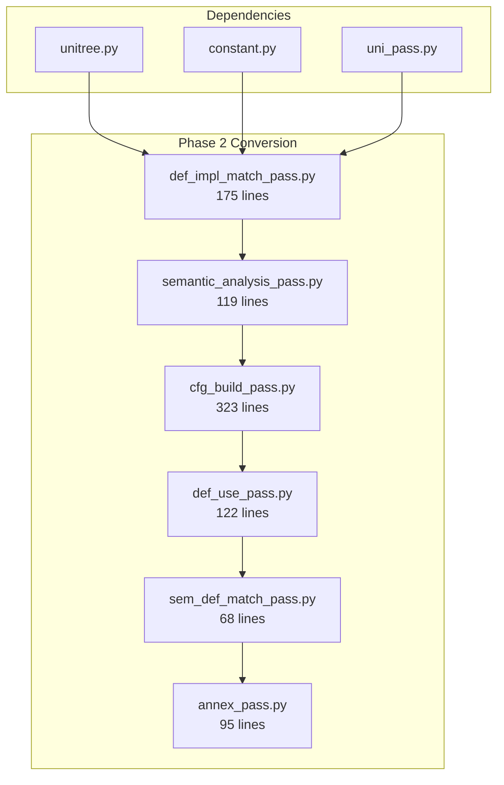

**Conversion Order:**

| Order | File | Lines | Notes |
|-------|------|-------|-------|
| 2.1 | `annex_pass.py` | 95 | Impl file discovery |
| 2.2 | `def_impl_match_pass.py` | 175 | Declaration matching |
| 2.3 | `sem_def_match_pass.py` | 68 | Semantic definition matching |
| 2.4 | `semantic_analysis_pass.py` | 119 | Semantic checks |
| 2.5 | `cfg_build_pass.py` | 323 | Control flow graph |
| 2.6 | `def_use_pass.py` | 122 | Definition/use analysis |

---

### Phase 3: Type System Conversion

**Goal:** Convert type checking infrastructure

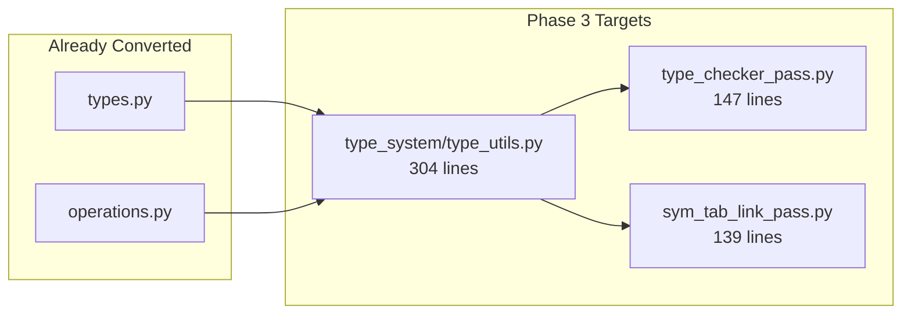

---

### Phase 4: Tool Passes Conversion

**Goal:** Convert formatting and documentation passes

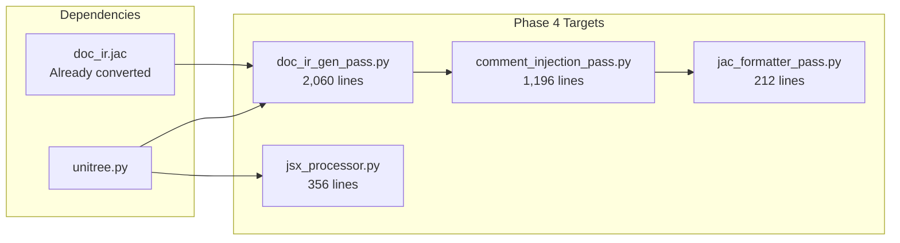

---

### Phase 5: ECMAScript Passes Conversion

**Goal:** Convert JavaScript/TypeScript generation

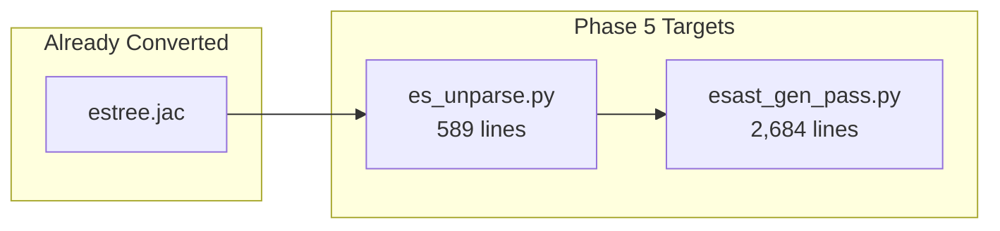

---

### Phase 6: Runtime Library Conversion

**Goal:** Convert runtime execution components

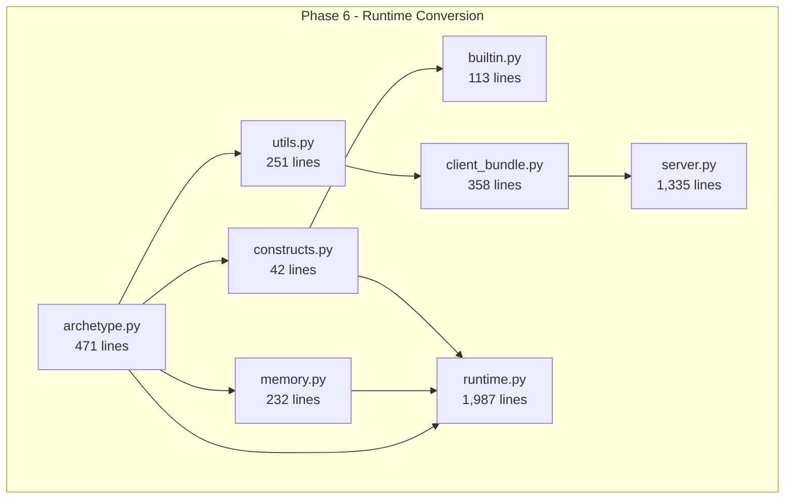

**Conversion Order:**

| Order | File | Lines | Notes |
|-------|------|-------|-------|
| 6.1 | `archetype.py` | 471 | Base node/edge/walker types |
| 6.2 | `memory.py` | 232 | Memory management |
| 6.3 | `constructs.py` | 42 | Core constructs |
| 6.4 | `utils.py` | 251 | Runtime utilities |
| 6.5 | `builtin.py` | 113 | Built-in functions |
| 6.6 | `client_bundle.py` | 358 | Client bundling |
| 6.7 | `server.py` | 1,335 | Server implementation |
| 6.8 | `runtime.py` | 1,987 | Main runtime (partial) |

---

### Phase 7: CLI Conversion

**Goal:** Convert command-line interface

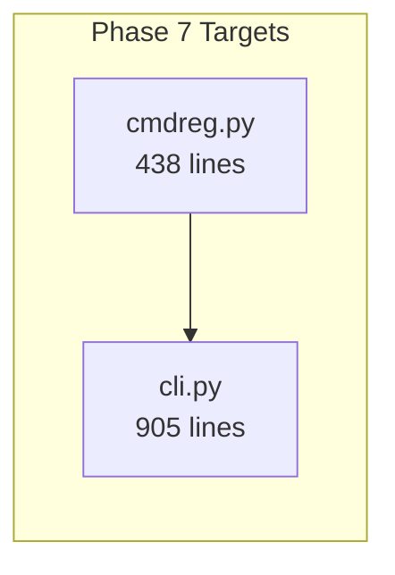

---

### Phase 8: Utils and Extras

**Goal:** Convert remaining utility modules

| File | Lines | Notes |
|------|-------|-------|
| `utils/lang_tools.py` | 324 | Language tools |
| `utils/module_resolver.py` | 285 | Module resolution |
| `utils/NonGPT.py` | 376 | Non-GPT utilities |
| `utils/treeprinter.py` | 523 | Tree printing |
| `utils/symtable_test_helpers.py` | 108 | Test helpers |

---

### Phase 9: Bootstrap Minimization

**Goal:** Shrink Python bootstrap to absolute minimum

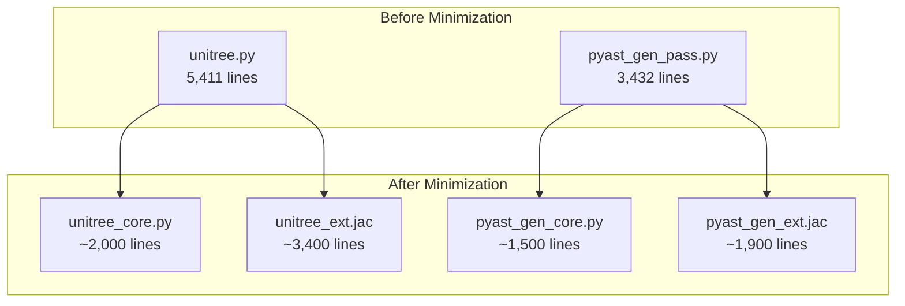

---

## Technical Challenges & Solutions

### Challenge 1: Chicken-and-Egg Problem

**Problem:** How do we compile Jac modules when the compiler is being converted to Jac?

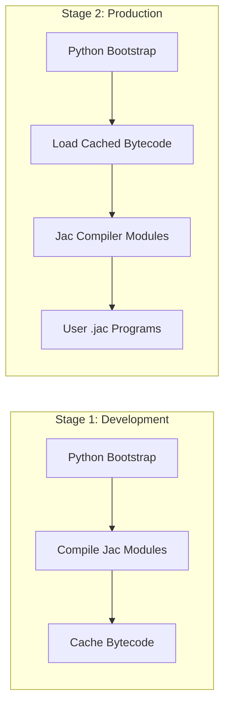

**Solution:** Two-stage bootstrap with pre-compiled bytecode cache

```python
# bootstrap/loader.py
class BootstrapLoader:
    def load_jac_compiler(self):
        """Load Jac compiler modules from cache or compile."""
        cache_dir = Path(__file__).parent / ".jac_cache"

        for module_name in JAC_COMPILER_MODULES:
            cache_file = cache_dir / f"{module_name}.pyc"
            if cache_file.exists():
                # Load from cache
                bytecode = cache_file.read_bytes()
            else:
                # Compile and cache
                bytecode = self.compile_jac_module(module_name)
                cache_file.write_bytes(bytecode)

            self.load_bytecode(module_name, bytecode)
```

---

### Challenge 2: Import Order Dependencies

**Problem:** Import hooks must be installed before Jac modules load, but hooks are in runtime which we want to convert.

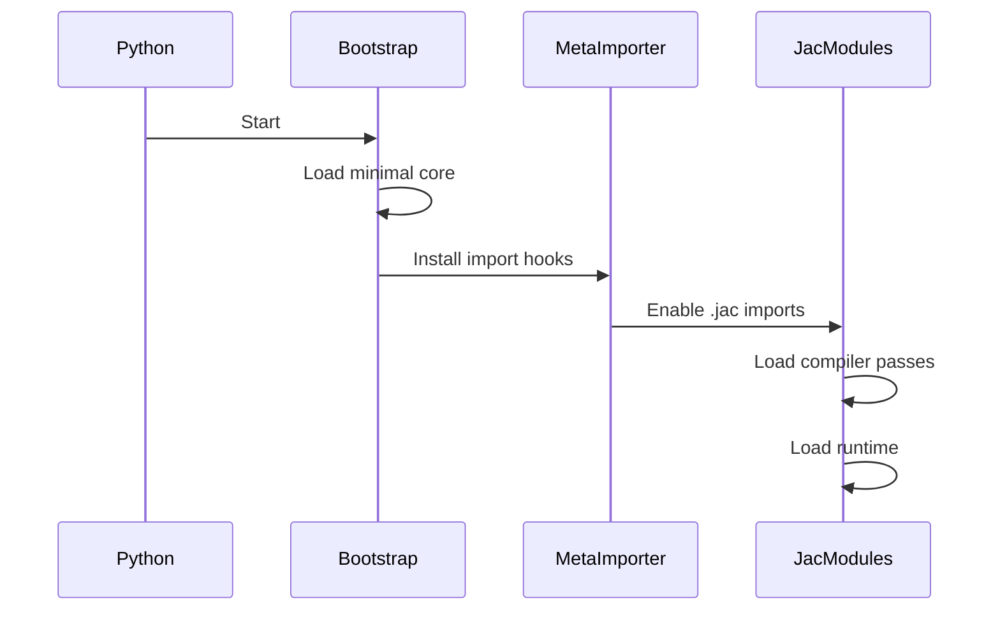

**Solution:** Keep `meta_importer.py` as the "bootstrap anchor" - always Python

---

### Challenge 3: Testing During Migration

**Problem:** Need to ensure Python and Jac implementations are equivalent.

**Solution:** Parallel testing framework

```python
# tests/conftest.py
import pytest

@pytest.fixture(params=["python", "jac"])
def pass_implementation(request):
    """Test both implementations."""
    if request.param == "python":
        from jaclang.compiler.passes.main import SemanticAnalysisPass
    else:
        from jaclang.jac_modules.passes import semantic_analysis
        SemanticAnalysisPass = semantic_analysis.SemanticAnalysisPass
    return SemanticAnalysisPass
```

---

### Challenge 4: Performance

**Problem:** Jac compilation adds overhead vs. native Python.

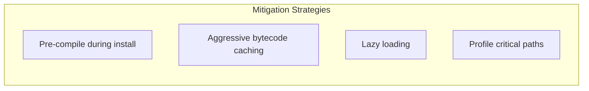

---

## Final Architecture

### Target Directory Structure

```
jac/jaclang/
├── bootstrap/                           # ~8,000 lines Python
│   ├── __init__.py                     # Bootstrap entry
│   ├── settings.py                     # Configuration (118 lines)
│   │
│   ├── compiler/
│   │   ├── __init__.py
│   │   ├── constant.py                 # Tokens/enums (786 lines)
│   │   ├── codeinfo.py                 # Code info (120 lines)
│   │   ├── unitree_core.py             # Minimal AST (~2,500 lines)
│   │   ├── parser.py                   # Jac parser (3,774 lines)
│   │   └── larkparse/
│   │       ├── __init__.py
│   │       └── jac_parser.py           # Generated parser (3,444 lines)
│   │
│   ├── passes/
│   │   ├── __init__.py
│   │   ├── transform.py                # Base transform (175 lines)
│   │   ├── uni_pass.py                 # Base pass (149 lines)
│   │   └── main/
│   │       ├── __init__.py
│   │       ├── sym_tab_build_pass.py   # Symbol table (360 lines)
│   │       ├── pyast_gen_pass.py       # Core codegen (~1,800 lines)
│   │       └── pybc_gen_pass.py        # Bytecode gen (49 lines)
│   │
│   ├── runtimelib/
│   │   ├── __init__.py
│   │   └── meta_importer.py            # Import hooks (192 lines)
│   │
│   └── program.py                      # Pipeline (220 lines)
│
├── jac_modules/                         # ~45,000+ lines Jac
│   ├── __init__.jac
│   │
│   ├── compiler/
│   │   ├── __init__.jac
│   │   ├── unitree_ext.jac             # Extended AST nodes (~2,900 lines)
│   │   ├── tsparser.jac                # TypeScript parser (1,779 lines)
│   │   └── type_system/
│   │       ├── __init__.jac
│   │       ├── types.jac               # Type definitions (415 lines)
│   │       ├── operations.jac          # Type operations (164 lines)
│   │       └── type_utils.jac          # Type utilities (304 lines)
│   │
│   ├── passes/
│   │   ├── __init__.jac
│   │   │
│   │   ├── ast_gen/
│   │   │   ├── __init__.jac
│   │   │   ├── base_ast_gen_pass.jac   # Base AST gen (55 lines)
│   │   │   └── jsx_processor.jac       # JSX processing (356 lines)
│   │   │
│   │   ├── main/
│   │   │   ├── __init__.jac
│   │   │   ├── import_pass.jac         # Import resolution (130 lines)
│   │   │   ├── annex_pass.jac          # Annexation (95 lines)
│   │   │   ├── pyast_load_pass.jac     # Python AST loading (2,515 lines)
│   │   │   ├── pyast_gen_ext.jac       # Extended codegen (~1,600 lines)
│   │   │   ├── cfg_build_pass.jac      # CFG building (323 lines)
│   │   │   ├── sym_tab_link_pass.jac   # Symbol table linking (139 lines)
│   │   │   ├── pyjac_ast_link_pass.jac # AST linking (134 lines)
│   │   │   ├── type_checker_pass.jac   # Type checking (147 lines)
│   │   │   ├── semantic_analysis_pass.jac  # Semantic analysis (119 lines)
│   │   │   ├── def_impl_match_pass.jac # Decl/impl matching (175 lines)
│   │   │   ├── def_use_pass.jac        # Def/use analysis (122 lines)
│   │   │   ├── sem_def_match_pass.jac  # Semantic def match (68 lines)
│   │   │   └── predynamo_pass.jac      # Pre-dynamo (222 lines)
│   │   │
│   │   ├── ecmascript/
│   │   │   ├── __init__.jac
│   │   │   ├── estree.jac              # ES tree nodes (978 lines)
│   │   │   ├── esast_gen_pass.jac      # ES AST generation (2,684 lines)
│   │   │   └── es_unparse.jac          # ES unparsing (589 lines)
│   │   │
│   │   └── tool/
│   │       ├── __init__.jac
│   │       ├── doc_ir.jac              # Doc IR (192 lines)
│   │       ├── doc_ir_gen_pass.jac     # Doc IR gen (2,060 lines)
│   │       ├── comment_injection_pass.jac  # Comments (1,196 lines)
│   │       └── jac_formatter_pass.jac  # Formatter (212 lines)
│   │
│   ├── runtimelib/
│   │   ├── __init__.jac
│   │   ├── archetype.jac               # Archetypes (471 lines)
│   │   ├── builtin.jac                 # Builtins (113 lines)
│   │   ├── constructs.jac              # Constructs (42 lines)
│   │   ├── memory.jac                  # Memory (232 lines)
│   │   ├── runtime.jac                 # Runtime (1,987 lines)
│   │   ├── server.jac                  # Server (1,335 lines)
│   │   ├── client_bundle.jac           # Client bundle (358 lines)
│   │   ├── utils.jac                   # Runtime utils (251 lines)
│   │   ├── mtp.jac                     # MTP (15 lines)
│   │   └── test.jac                    # Testing (145 lines)
│   │
│   ├── cli/
│   │   ├── __init__.jac
│   │   ├── cli.jac                     # Main CLI (905 lines)
│   │   └── cmdreg.jac                  # Command registry (438 lines)
│   │
│   └── utils/
│       ├── __init__.jac
│       ├── helpers.jac                 # Helpers (403 lines)
│       ├── lang_tools.jac              # Language tools (324 lines)
│       ├── log.jac                     # Logging (11 lines)
│       ├── module_resolver.jac         # Module resolution (285 lines)
│       ├── NonGPT.jac                  # NonGPT (376 lines)
│       ├── treeprinter.jac             # Tree printer (523 lines)
│       └── symtable_test_helpers.jac   # Test helpers (108 lines)
│
├── vendor/                              # Third-party (keep as-is)
│   └── lark/
│
├── tests/                               # Keep in Python
│   └── ... (all test files)
│
├── langserve/                           # Convert later
│   └── tests/
│
├── jac.lark                             # Grammar specification
├── ts.lark                              # TypeScript grammar
├── __init__.py                          # Package entry
├── __main__.py                          # CLI entry
└── lib.py                               # Library exports
```

---

## File Inventory

### Complete File Classification

#### Bootstrap Core (Python - Keep)

| Category | File | Lines | Status |
|----------|------|-------|--------|
| **Root** | `settings.py` | 118 | Keep |
| **Compiler** | `compiler/constant.py` | 786 | Keep |
| **Compiler** | `compiler/codeinfo.py` | 120 | Keep |
| **Compiler** | `compiler/unitree.py` | 5,411 | Split (keep core) |
| **Compiler** | `compiler/parser.py` | 3,774 | Keep |
| **Compiler** | `compiler/larkparse/jac_parser.py` | 3,444 | Keep (generated) |
| **Passes** | `passes/transform.py` | 175 | Keep |
| **Passes** | `passes/uni_pass.py` | 149 | Keep |
| **Passes** | `passes/main/sym_tab_build_pass.py` | 360 | Keep |
| **Passes** | `passes/main/pyast_gen_pass.py` | 3,432 | Split (keep core) |
| **Passes** | `passes/main/pybc_gen_pass.py` | 49 | Keep |
| **Runtime** | `runtimelib/meta_importer.py` | 192 | Keep |
| **Pipeline** | `compiler/program.py` | 220 | Keep |
| | **Subtotal** | **~18,230** | |

#### Convert to Jac

| Category | File | Lines | Phase |
|----------|------|-------|-------|
| **Type System** | `type_system/types.py` | 415 | P1 |
| **Type System** | `type_system/operations.py` | 164 | P1 |
| **Type System** | `type_system/type_utils.py` | 304 | P3 |
| **Passes** | `passes/ast_gen/base_ast_gen_pass.py` | 55 | P2 |
| **Passes** | `passes/ast_gen/jsx_processor.py` | 356 | P4 |
| **Passes** | `passes/main/import_pass.py` | 130 | P2 |
| **Passes** | `passes/main/annex_pass.py` | 95 | P2 |
| **Passes** | `passes/main/pyast_load_pass.py` | 2,515 | P2 |
| **Passes** | `passes/main/cfg_build_pass.py` | 323 | P2 |
| **Passes** | `passes/main/sym_tab_link_pass.py` | 139 | P3 |
| **Passes** | `passes/main/pyjac_ast_link_pass.py` | 134 | P2 |
| **Passes** | `passes/main/type_checker_pass.py` | 147 | P3 |
| **Passes** | `passes/main/semantic_analysis_pass.py` | 119 | P2 |
| **Passes** | `passes/main/def_impl_match_pass.py` | 175 | P2 |
| **Passes** | `passes/main/def_use_pass.py` | 122 | P2 |
| **Passes** | `passes/main/sem_def_match_pass.py` | 68 | P2 |
| **Passes** | `passes/main/predynamo_pass.py` | 222 | P2 |
| **ECMAScript** | `passes/ecmascript/estree.py` | 978 | P1 |
| **ECMAScript** | `passes/ecmascript/esast_gen_pass.py` | 2,684 | P5 |
| **ECMAScript** | `passes/ecmascript/es_unparse.py` | 589 | P5 |
| **Tool** | `passes/tool/doc_ir.py` | 192 | P1 |
| **Tool** | `passes/tool/doc_ir_gen_pass.py` | 2,060 | P4 |
| **Tool** | `passes/tool/comment_injection_pass.py` | 1,196 | P4 |
| **Tool** | `passes/tool/jac_formatter_pass.py` | 212 | P4 |
| **Runtime** | `runtimelib/archetype.py` | 471 | P6 |
| **Runtime** | `runtimelib/builtin.py` | 113 | P6 |
| **Runtime** | `runtimelib/constructs.py` | 42 | P6 |
| **Runtime** | `runtimelib/memory.py` | 232 | P6 |
| **Runtime** | `runtimelib/runtime.py` | 1,987 | P6 |
| **Runtime** | `runtimelib/server.py` | 1,335 | P6 |
| **Runtime** | `runtimelib/client_bundle.py` | 358 | P6 |
| **Runtime** | `runtimelib/utils.py` | 251 | P6 |
| **Runtime** | `runtimelib/mtp.py` | 15 | P1 |
| **Runtime** | `runtimelib/test.py` | 145 | P1 |
| **CLI** | `cli/cli.py` | 905 | P7 |
| **CLI** | `cli/cmdreg.py` | 438 | P7 |
| **Utils** | `utils/helpers.py` | 403 | P1 |
| **Utils** | `utils/lang_tools.py` | 324 | P8 |
| **Utils** | `utils/log.py` | 11 | P1 |
| **Utils** | `utils/module_resolver.py` | 285 | P8 |
| **Utils** | `utils/NonGPT.py` | 376 | P8 |
| **Utils** | `utils/treeprinter.py` | 523 | P8 |
| **Utils** | `utils/symtable_test_helpers.py` | 108 | P8 |
| **Compiler** | `compiler/tsparser.py` | 1,779 | P5 |
| | **Subtotal** | **~22,000** | |

#### Keep in Python (Tests & Infrastructure)

| Category | Files | Lines | Reason |
|----------|-------|-------|--------|
| **Tests** | `tests/*.py` | ~5,500 | Python test framework |
| **Compiler Tests** | `compiler/tests/*.py` | ~1,500 | Test infrastructure |
| **Pass Tests** | `passes/*/tests/*.py` | ~3,000 | Test infrastructure |
| **Runtime Tests** | `runtimelib/tests/*.py` | ~3,000 | Test infrastructure |
| **Langserve Tests** | `langserve/tests/*.py` | ~1,200 | Test infrastructure |
| **Fixtures** | `*/fixtures/*.py` | ~1,000 | Test fixtures |
| **Vendor** | `vendor/*` | ~10,000 | Third-party |
| | **Subtotal** | **~25,000** | |

---

## Migration Strategy

### Incremental Rollout Plan

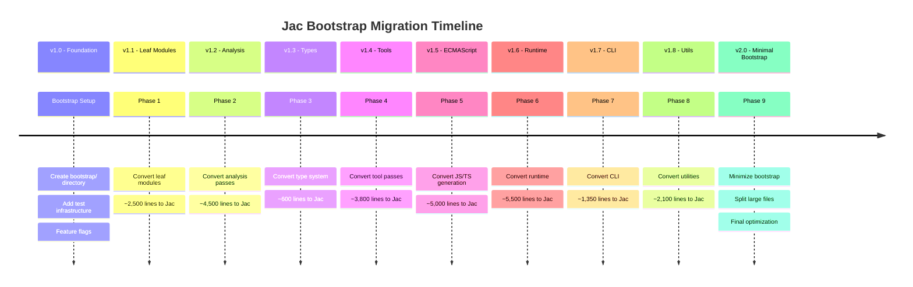

### Phase Completion Criteria

> **Critical Requirement:** After each phase, the codebase MUST be fully functional with ALL tests passing.

Each phase completion requires:

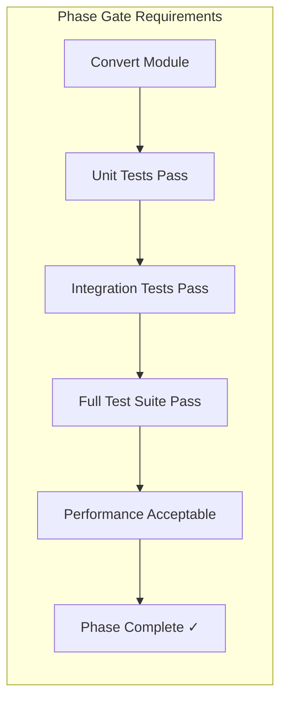

| Criterion | Description | Validation |
|-----------|-------------|------------|
| **Functional Equivalence** | Jac module behaves identically to Python original | Parallel test execution |
| **All Tests Pass** | 100% of existing tests must pass | `pytest jac/jaclang/tests/` |
| **No Regressions** | No new failures introduced | CI comparison with main branch |
| **Performance** | No more than 10% slowdown | Benchmark suite |
| **Backward Compatible** | Existing user code still works | Integration test suite |

#### Per-Phase Validation Checklist

```bash
# Run after EVERY module conversion:

# 1. Unit tests for the converted module
pytest jac/jaclang/<module>/tests/ -v

# 2. Full compiler test suite
pytest jac/jaclang/compiler/tests/ -v

# 3. Full language test suite
pytest jac/jaclang/tests/ -v

# 4. Runtime tests
pytest jac/jaclang/runtimelib/tests/ -v

# 5. CLI tests
pytest jac/jaclang/tests/test_cli.py -v

# 6. Full test suite (MUST PASS before phase is complete)
pytest jac/jaclang/ -v --tb=short

# 7. Smoke test - compile and run sample programs
jac run examples/hello.jac
jac test examples/
```

#### Continuous Integration Requirements

Each phase PR must:
1. Pass all CI checks on both Python and Jac implementations
2. Include parallel tests comparing Python vs Jac output
3. Include performance benchmarks
4. Be reviewed for semantic equivalence
5. Have feature flag to disable if issues found in production

### Feature Flags

```python
# settings.py
class Settings:
    # Bootstrap feature flags - allow rollback per-component
    use_jac_analysis_passes: bool = False
    use_jac_type_system: bool = False
    use_jac_tool_passes: bool = False
    use_jac_ecmascript: bool = False
    use_jac_runtime: bool = False
    use_jac_cli: bool = False
    use_jac_utils: bool = False
```

These flags enable:
- **Gradual rollout** - Enable Jac modules incrementally
- **Quick rollback** - Disable problematic modules without code changes
- **A/B testing** - Compare behavior in production
- **Debug isolation** - Identify which module causes issues

### Rollback Strategy

Each phase maintains:
1. **Git tags** at stable points
2. **Feature flags** to switch implementations
3. **Parallel CI** testing both paths
4. **Backward compatibility** for at least one release

---

## Summary

### Final Metrics

| Component | Python LOC | Jac LOC | Notes |
|-----------|-----------|---------|-------|
| Bootstrap Core | ~8,000 | 0 | Minimal Python |
| Compiler Passes | 0 | ~8,000 | All converted |
| Type System | 0 | ~900 | All converted |
| Tool Passes | 0 | ~3,700 | All converted |
| ECMAScript | 0 | ~4,300 | All converted |
| Runtime | 0 | ~5,000 | All converted |
| CLI | 0 | ~1,350 | All converted |
| Utils | 0 | ~2,100 | All converted |
| Tests | ~15,000 | 0 | Keep Python |
| Vendor | ~10,000 | 0 | Third-party |
| **TOTAL** | **~33,000** | **~25,350** | |

### Conversion Ratio

- **Before:** 100% Python (~59,000 LOC)
- **After:** ~56% Python, ~44% Jac
- **Excluding tests/vendor:** ~24% Python, ~76% Jac

This bootstrap architecture achieves the goal of having Jac written mostly in Jac while maintaining a well-defined, minimal Python core for initial compilation.
